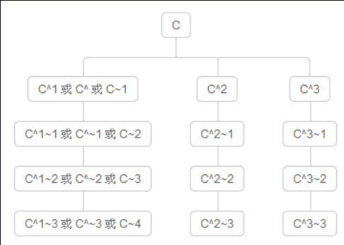

## 第 12 天：认识 Git 物件的相对名称

```c++
    在认识了 Git 物件的「绝对名称」与「参照名称」后，最后我们来介绍 Git 版控过程中也很常用到的「相对名称」.

        相对名称的表示法
          使用相对名称其实非常简单，这里有两个特殊符号你必须记得，一个是 ^ 另一个是 ~ 符号.
        
          如果要找到 HEAD 的前一版本，我们会使用 HEAD~ 或 HEAD~1 来表示「HEAD 这个 commit 物件的前一版」.

          如果你要找出另一个 f2e 分支的前两个版本 (不含 f2e 的 HEAD 版本)，你则可以用 f2e~2 或用 f2e~~ 来表示，这就是最基本的表示方法.

          在没有分支与合并的仓库中，关于 ^1 与 ~1 所表达的意思是完全相同的，都代表「前一版」。但事实上在有分支与合并的仓库中，他们有不同的意义.
    
        关于 commit 物件彼此间的连结
          比较常见的 Git 仓库，预设只会有一个「根 commit 物件」，也就是我们最一开始建立的那个版本，又称「初始送交」(Initial Commit)。你也至少要有第一个 commit 物件后才能开始分支，所以我们可以说：「在一个 Git 仓库中，所有的 commit 物件中，除了第一个 commit 物件外，任何其他的 commit 物件一定都会有一个以上的上层 commit 物件(parent commit)」。为什么有可能有「一个以上」的上层 commit 物件呢？因为你很有可能会合并两个以上的分支到另一个分支里，所以合并完成后的那个 commit 物件就会有多个 parent commit 物件。
        
         我们用个简单的例子来证明这点，我们用 git cat-file -p [object_id] 来取得最前面两笔 commit 物件的内容，藉此了解到每个 commit 物件确实一定会有 parent 属性，并指向上层 commit 物件的绝对名称，唯独第一笔 commit 物件不会有 parent 属性:

            $ git log
            commit edcb4a0cc586f36e562572a496a7b738c867cfdc (HEAD -> newbranch1, f2e)
            Author: 徐浩 <zyuhao7@yeah.net>
            Date:   Thu Jul 4 22:33:24 2024 +0800

                Add b.txt in newbranch1

            commit 2afb5aba0f210448f7ae3e48bc9b20b320987cce
            Author: 徐浩 <zyuhao7@yeah.net>
            Date:   Thu Jul 4 21:23:42 2024 +0800

                a.txt:set 1 as content

            commit 0dedb1d7654d7ff435f74f8cf45ac8ce724fcda9
            Author: 徐浩 <zyuhao7@yeah.net>
            Date:   Thu Jul 4 21:23:21 2024 +0800

                Initial commit

            $ git cat-file -p 0ded
            tree 382279b3d99e24b00b4a9b4822bf3dc11186ad4a
            author 徐浩 <zyuhao7@yeah.net> 1720099401 +0800
            committer 徐浩 <zyuhao7@yeah.net> 1720099401 +0800
    

            徐浩@LAPTOP-BJ0NJ578 MINGW64 /g/resource/上传远端/Github/GitLearn/git-branch-demo (newbranch1)
            $ git cat-file -p 2afb
            tree 02bdfa7bef60afbeb20ae09bb3145e2a4b1cb977
            parent 0dedb1d7654d7ff435f74f8cf45ac8ce724fcda9
            author 徐浩 <zyuhao7@yeah.net> 1720099422 +0800
            committer 徐浩 <zyuhao7@yeah.net> 1720099422 +0800

            a.txt:set 1 as content

        了解相对名称表示法 ^ 与 ~ 的差异
            关于 ~ 的意义, 代表 [第一个上层 commit物件] 的意思.
            关于 ^ 代表的意思则是 [拥有多个上层 commit物件时, 要代表第几个第一代的上层物件].

            如果你有一个[参照名称] 为 c, 若要找到它的上一层 commit 物件, 可以有如下表达方式:
            c^
            c^1
            c~
            c~1

            如果你要找到它的第二个上层 commit 物件, 则有如下表达:
            c^^
            c^2
            c~2
            c~~
            c~1~1

            但你不能用 C^2 来表达「第二个上层 commit 物件」！原因是在没有合并的情況下，这个 C 只有一个上层物件而已，你只能用 C^2 代表｢上一层物件的第二个上层物件」。

            上述讲起来有点抽象又有点绕口，如下图示，我们想找到 C 这个 commit 物件的相对路径下的其他 commit 物件(上层物件)，由于 C 这个 commit 物件有三个上层物件，这代表这个 commit 物件是通过合并而被建立的，那么你要通过「相对名称」找到每一个路径，就必须搭配组合 ^ 与 ~ 的使用技巧，才能定位到每个你想开启的版本.
```


