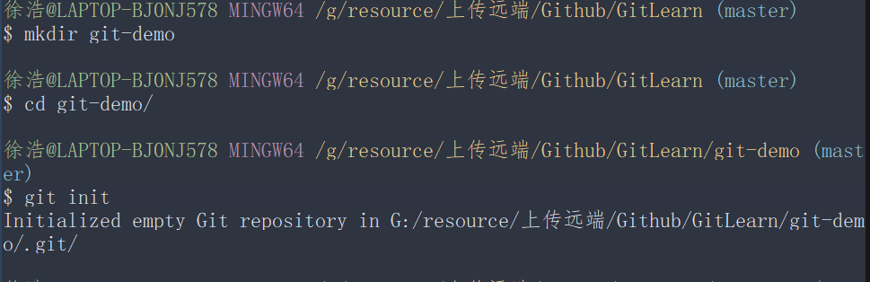

## 第 3 天：建立仓库
```c++
// 在本机建立本地的仓库 (local repository)
/*
    所以，我们可以直接在这里建立一个新目录,好当成我们的「工作目录」(working directory).
    我们可以输入指令 mkdir git-demo 把目录建立起来。然后再用 cd git-demo 进入该目录.
*/
```


```c++
// 在 GitHub 或其他 Git 平台建立远端的仓库 (remote repository)

// 先登入 GitHub，然后建立一个新的仓库

// 设定 GitHub 项目的相关信息并建立仓库

// 建立完成后，他会提示你要如何取得该项目，或将你本地现有的项目汇入到 GitHub

// 你也可以将远端 Git 仓库的网址复制 (Copy) 下来，然后执行 git clone [REPO_URL] 即可复制 (clone) 一份回来

// 今日小结:
1. git init
2. git clone [REPOSITORY_URL]

```