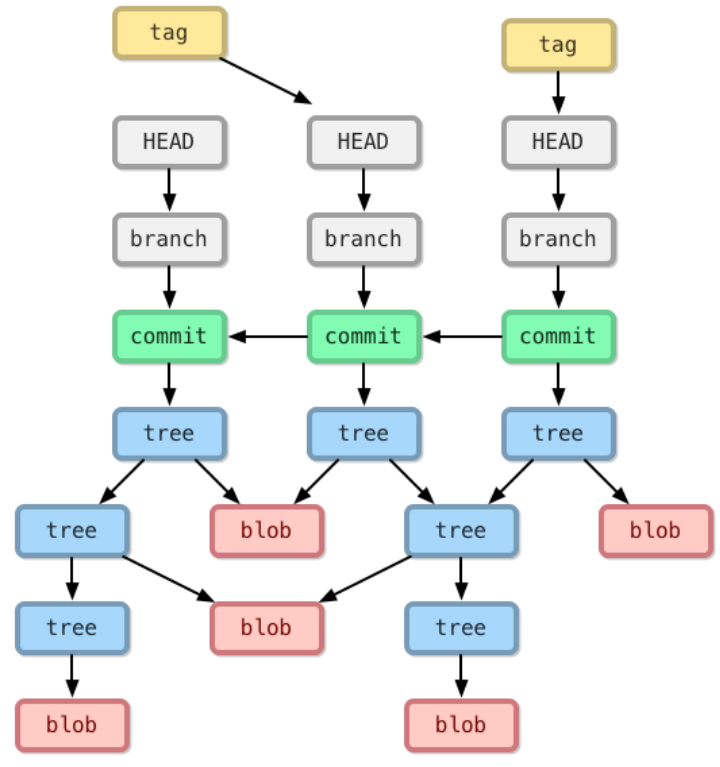

## 第 6 天：解析 Git 资料结构 - 物件结构

```c++
/*
    在 Git 的资料结构中，「物件」是一种「不可变的」 (immutable) 文件类型.
    所有储存在「物件储存区」的文件通常只进不出，也不会被修改内容.
    原因在于,如果你窜改了文件内容，新的内容所运算出来的 SHA1 哈希值将会与原有物件的档名不一样，这导致 Git 无法继续执行，相对地也对 Git 仓库产生了一定程度的保护作用.

    关于物件资料库
       无论 blob 物件与 tree 物件，这些都算是物件，这些物件都会储存在一个所谓的「物件储存区」 (object storage) 之中.

       然而 Git 仓库中的每一个「物件」，都是以「文件内容」进行 SHA1 哈希运算出一个 hash 值，并用这个 hash 值当作物件的名称 (档名).


    物件的类型
        1. blob物件: 工作目录中某些文件的"内容", 且只有内容而已, 当你执行 git add 指令的同时, 这些新增文件的内容就会立刻被写入成为 blob 物件. 
        档名则是物件内容的哈希运算结果, 没有任何其他信息, 像是文件时间,原本的档名或文件的其他信息,都会存储在其他类型的物件中(tree).
        2. tree物件: 这类物件会储存特定目录下的所有信息, 包括该目录下的档名、对应的 blob 物件名称、 文件连结或其他 tree物件等等.
        由于 tree 物件可以包含其他 tree 物件, 同[文件夹]. easy to say, tree 物件就是在特定版本下某个资料夹的快照.
        3. commit物件, 用来记录有哪些记录包含在版本中, 一个 commit 物件代表着 Git 的一次提交, 记录着特定版本有哪些 tree物件、以及版本提交的时间、
        记录消息等等, 通常还会记录上一层的 commit 物件名称.
        4. tag物件: 是一个容器, 通常用来关联特定一个 commit 物件,并额外存储一些参考信息.
        例如: tag名称. 使用 tag 物件最常用的情况是替特定一个版本的 commit 物件标识一个易懂的名称.
*/
```


```c++
// 物件结构的优点
//1. 有效率的处理大型项目
//  不仅仅是完整的版本库会复制(clone)一份在本机，由于所有的 blob 物件都是通过「内容」来做定址的 (content addressable),
//  因此，若在不同版本之间找寻相同的内容，效率是非常高的。

//2. 历史记录保护
//  Git 版控的过程，每次提交变更都会产生一个 commit 物件，而这个 commit 物件的名称又是通过 commit 物件的内容产生。
// 再者，commit 物件会关连到 tree 物件，tree 物件的名称又是通过 tree 物件的内容所产生。
// tree 物件又会关联到 blob 与 tree 物件，这些物件的名称也是通过内容产生。就这样一层一层的关联下去，如果你今天真的想窜改某个版本的历史记录，困难度也是挺高的！

// 由于 Git 仓库经常会被 clone 或 fork，只要是被 clone 过的仓库，来源的仓库只要任何一个物件被修改，这些 clone 出去的仓库就很难再合并回来，所以你几乎不可能任意窜改版本记录。

//3. 定期的封装物件
// 我们在 Git 中提到的 "物件" 其实就是代表版本库中的一个文件。
// 而在版本异动的过程中，项目中的代码或其他文件会被更新，每次更新时，只要文件内容不一样，就会建立一个新的 "物件"，这些不同内容的文件全部都会保留下来。

// 那些新增的文件还是会以单一文件的方式存在着，也代表一个 Git 版本库中的 "文件" 就是一个 Git "物件"，但每隔一段时间就会需要重新封装(repacking)。

// 照理说 Git 会自动执行重新封装等动作，但你依然可以自行下达指令执行。例如: git gc
// 如果你要检查 Git 维护的文件系统是否完整，可以执行以下指令: git fsck

```