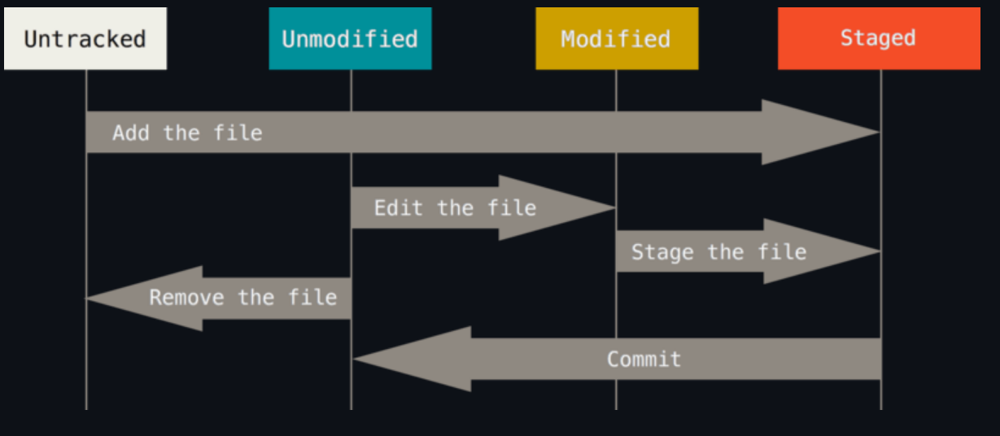

## 第七天 解析 Git 资料结构 - 索引结构

```c++
    关于索引

      简单来说，「索引」的目的主要用来记录「有哪些文件即将要被提交到下一个 commit 版本中」.
    
    操作索引的指令
```

```c++
    四种文件状态：
         untracked (未追踪的，代表尚未被加入 Git 仓库的文件状态)

        unmodified (未修改的，代表文件第一次被加入，或是文件内容与 HEAD 内容一致的状态)

        modified (已修改的，代表文件已经被编辑过，或是文件内容与 HEAD 内容不一致的状态)

        staged (等待被 commit 的，代表下次执行 git commit 会将这些文件全部送入版本库)

```

`git status`

        取得 工作目录 (working tree) 下的状态

        Git 仓库的运作，是将工作目录里的变化，通过更新索引的方式，将资料写入成 Git 物件。

`git add`
    
        git add 指令，是为了将目前「工作目录」的变更写入到「索引档」里.
        使用 git add -u 则可以仅将「更新」或「删除」的文件变更写入到「索引档」中.

`git rm`

        以 git rm 为例，当你直接在文件系统中删除一个文件，这只是从「工作目录」中删除而已，并没有更新到索引档，你可以利用 git status 看到这层改变，不过若要真正把「删除」的状态写进索引档的话，则要靠 git rm filename 更新索引档.

        在执行 git rm filename 的时候，除了更新索引档之外，连工作目录下的文件也会一并被删除.若你只想删除索引档中的该档，又要保留工作目录下的实体文件，那么你可以在指令列加上 --cached 参数，就能做到.

        $ git rm --cached a.txt

`git mv`

         使用 git mv oldname newname 可以将文件更名，执行此命令会同时更新索引与变更工作目录下的实体文件.

`git commit`

        这个指令，则是把「索引档」与「目前最新版」中的资料比对出差异，然后把差异部分提交变更成一个 commit 物件
        
`git ls-files`

        在索引档之中，预设就包含了 目前最新版 的所有文件，外加你在工作目录中新增文件且通过 git add 更新索引档后的那些文件。通过 git ls-files 命令，可以列出所有目前已经储存在「索引档」中的那些文件路径.


