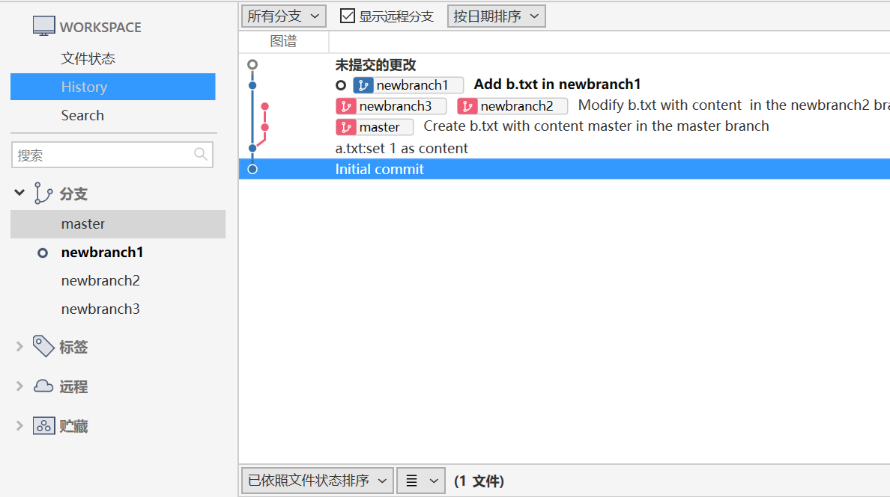

## Day8 关于分支的基本观念与使用方式
### 关于分支的基本观念

        由于 Git 属于「分布式版本控制机制」，在分散式版本管理的使用情境中，最不想做的事情就是「管理」，所以 Git 很少有所谓的管理机制或权限控制机制，它唯一想做的仅仅是让大家可以顺利的「分支」与「合并」而已.

### 准备工作目录

        我们通过以下指令快速建立一个拥有两个版本的 Git 仓库与工作目录

        mkdir git-branch-demo
        cd git-branch-demo
        git init

        echo. > a.txt
        git add .
        git commit -m "Initial commit"

        echo 1 > a.txt
        git add .
        git commit -m "a.txt: set 1 as content"
        
        
        接着使用 git log 取得版本信息如下

        $ git log
        commit 2afb5aba0f210448f7ae3e48bc9b20b320987cce (HEAD -> master)
        Author: 徐浩 <zyuhao7@yeah.net>
        Date:   Thu Jul 4 21:23:42 2024 +0800

            a.txt:set 1 as content

        commit 0dedb1d7654d7ff435f74f8cf45ac8ce724fcda9
        Author: 徐浩 <zyuhao7@yeah.net>
        Date:   Thu Jul 4 21:23:21 2024 +0800

            Initial commit

        接着我们通过 git branch 指令得知我们已经拥有一个名为 master 的分支，这是在 Git 仓库中的预设分支。如果你尝试通过 git branch -d master 删除这个分支，将会得到 error: Cannot delete the branch 'master' which you are currently on. 的错误消息，这意思是「当你目前工作目录分支设定为 master 时，不能删除目前这个分支」，也就是说，你必须先切换到「其他分支」才能删除这个分支.

        $ git branch
        * master
        $ git branch -d master
        error: cannot delete branch 'master' used by worktree at 'G:/resource/上传远端/Github/GitLearn/git-branch-demo'

### 建立分支
    
建立分支最常见有两种方法, 分别是:
            
        1. 建立分支，但目前工作目录维持在自己的分支: git branch 
        [BranchName]

        $ git branch newbranch1
        $ git branch
        * master
        newbranch1

        如果这时你在目前的工作目录建立版本，这时会建立在 master 分支里面，我们这时建立一个新文件，并且通过 git commit 建立版本，指令如下

        $ echo master > b.txt
        $ git add .
        $  git commit -m "Create b.txt with content "master" in the master branch"

        我们先在预设的 master 分支建立两个版本，然后建立一个分支，然后在 master 分支又建立了一个版本

        2. 建立分支，并将目前工作目录切换到新的分支: git checkout -b [BranchName]

        第二种方法建立分支，当执行 git checkout -b newbranch2 指令，不但会建立一个新分支，还会将目前工作目录切换到另一个分支，最后用 git branch 查看目前有多少分支，你会看到已经有三个，而且目前工作目录已经切换到刚刚建立的 newbranch2 分支上.

        $ git checkout -b newbranch2
        Switched to a new branch 'newbranch2'

        $ git branch
        master
        newbranch1
        * newbranch2

        如果这时你在目前的工作目录建立版本，这时会建立在 newbranch2 分支里面，我们这时建立一个新文件，并且通过 git commit 建立版本，指令如下:

         echo newbranch2 > b.txt
        git add .
        git commit -m "Modify b.txt with content 'newbranch2' in the newbranch2 branch"

        我们先在预设的 master 分支建立两个版本, 然后建立一个分支, 然后在 master 分支又建立了一个版本, 接着又把当下这份 master 分支的状态建立一个新的 newbranch2 分支, 并将工作目录到切换到 newbranch2 分支，然后再建立一个版本. 我们这时如果执行 git log 会显示出 4 个版本记录, 因为分支会自动继承来源分支的完整历史.

### 切换分支

    如果你想将工作目录切换到其他分支，你可以输入以下指令 (不含 -b 参数):

        git checkout [branch_name]
    
    假设我们想把工作目录切换到 newbranch1 分支, 这时可以输入 git checkout newbranch1 切换过去, 然后你可以立刻使用 git branch 检查目前工作目录是否切换过去，然后再用 git log 检查当下 newbranch1 分支的历史记录。因为这是我们第一次建立的分支，照理说这个分支状态应该只会有两笔历史记录而已.

        $ git checkout newbranch1
        Switched to branch 'newbranch1'

        $ git branch
        master
        * newbranch1
        newbranch2
        newbranch3

        $ git log
        commit 2afb5aba0f210448f7ae3e48bc9b20b320987cce (HEAD -> newbranch1)
        Author: 徐浩 <zyuhao7@yeah.net>
        Date:   Thu Jul 4 21:23:42 2024 +0800

            a.txt:set 1 as content

        commit 0dedb1d7654d7ff435f74f8cf45ac8ce724fcda9
        Author: 徐浩 <zyuhao7@yeah.net>
        Date:   Thu Jul 4 21:23:21 2024 +0800

            Initial commit

### 删除分支

        如果你想删除现有的分支，就如同我们在准备工作目录有提到过的指令.

        git branch -d [branch_name]

        先前也有提到，你不能删除目前工作目录所指定的分支，必须先切换到其他分支后，再删除你目前这个分支。举个例子来说，如果你想删除当下这个 newbranch1 分支，那么你必须先切换到其他分支，例如 master 分支，然后再下达 git branch -d newbranch1 指令，即可删除分支.

        $ git checkout master
        Switched to branch 'master'

        $ git branch -d newbranch1
        Deleted branch newbranch1 (was 2afb5ab).

        $ git branch
        * master
        newbranch2
        newbranch3

### 查看工作目录在哪个分支

        你可以通过 git branch 命令，查看目前所在分支

        $ git branch
        * master
        newbranch2
        newbranch3

        $ git checkout newbranch2
        Switched to branch 'newbranch2'

        $ git branch
        master
        * newbranch2
        newbranch3

        $ git status
        On branch newbranch2
        nothing to commit, working tree clean

### 查看 Git 仓库的完整分支图

        $ git log
        commit 95cb1da7bb878a08406b6e35efad16b70aa38b8b (HEAD -> master)
        Author: 徐浩 <zyuhao7@yeah.net>
        Date:   Thu Jul 4 21:30:58 2024 +0800

            Create b.txt with content master in the master branch

        commit 2afb5aba0f210448f7ae3e48bc9b20b320987cce
        Author: 徐浩 <zyuhao7@yeah.net>
        Date:   Thu Jul 4 21:23:42 2024 +0800

            a.txt:set 1 as content

        commit 0dedb1d7654d7ff435f74f8cf45ac8ce724fcda9
        Author: 徐浩 <zyuhao7@yeah.net>
        Date:   Thu Jul 4 21:23:21 2024 +0800

            Initial commit

        所以我的 commit 物件 id 为 2afb5aba0f210448f7ae3e48bc9b20b320987cce

        接着我先把工作目录切换到这个版本，通过 git checkout [commit_id] 即可完成这个任务：

        git checkout  2afb5aba0f210448f7ae3e48bc9b20b320987cce

        $ git checkout 2afb5aba0f210448f7ae3e48bc9b20b320987cce
        Note: switching to '2afb5aba0f210448f7ae3e48bc9b20b320987cce'.

        You are in 'detached HEAD' state. You can look around, make experimental
        changes and commit them, and you can discard any commits you make in this
        state without impacting any branches by switching back to a branch.

        If you want to create a new branch to retain commits you create, you may
        do so (now or later) by using -c with the switch command. Example:

        git switch -c <new-branch-name>

        Or undo this operation with:

        git switch -

        Turn off this advice by setting config variable advice.detachedHead to false

        HEAD is now at 2afb5ab a.txt:set 1 as content

        $ git log
        commit 2afb5aba0f210448f7ae3e48bc9b20b320987cce (HEAD)
        Author: 徐浩 <zyuhao7@yeah.net>
        Date:   Thu Jul 4 21:23:42 2024 +0800

            a.txt:set 1 as content

        commit 0dedb1d7654d7ff435f74f8cf45ac8ce724fcda9
        Author: 徐浩 <zyuhao7@yeah.net>
        Date:   Thu Jul 4 21:23:21 2024 +0800

            Initial commit

        首先，由于你将工作目录的版本切换到「旧的」版本，所以你会被提示这个工作目录已经进入了所谓的 detached HEAD 状态，这是一种「目前工作目录不在最新版」的提示，你可以随时切换到 Git 仓库的任意版本，但是由于这个版本已经有「下一版」，所以如果你在目前的「旧版」执行 git commit 的话，就会导致这个新版本无法被追踪变更，所以建议不要这么做.

        若你要在 detached HEAD 状态建立一个可被追踪的版本，那么正确的方法则是通过「建立分支」的方式来追踪，现在我们就要在这个版本建立一个新的 newbranch1 分支，并将工作目录切换过去.

        git checkout -b newbranch1

        $ git log
        commit 2afb5aba0f210448f7ae3e48bc9b20b320987cce (HEAD -> newbranch1)
        Author: 徐浩 <zyuhao7@yeah.net>
        Date:   Thu Jul 4 21:23:42 2024 +0800

            a.txt:set 1 as content

        commit 0dedb1d7654d7ff435f74f8cf45ac8ce724fcda9
        Author: 徐浩 <zyuhao7@yeah.net>
        Date:   Thu Jul 4 21:23:21 2024 +0800

            Initial commit

        后我们再建立一个新文件 b.txt，内容为 newbranch1，并建立一个新版本

        echo newbranch1 > b.txt
        git add .
        git commit -m "Add b.txt in newbranch1"

 

### 今日小结

        git branch
        git branch [branch_name]
        git checkout -b [branch_name]
        git checkout [branch_name]
        git branch -d [branch_name]
        git log

