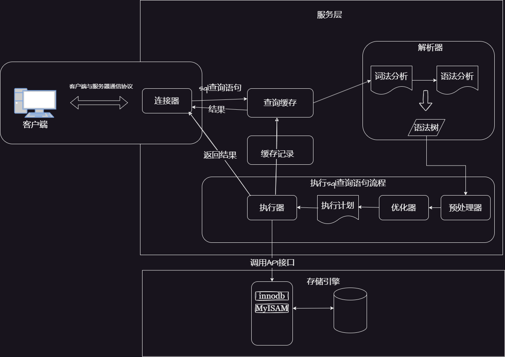

# 《高性能MySQL》
## 第一章 MySQL架构和历史




## 第二章 MySQL 基准测试

`sysbench`是一款非常优秀的MySQL基准测试工具.


### 集成式基准测试工具
#### ab
##### 一、工具概述
Apache Bench（简称ab）是一款轻量级的 命令行HTTP基准测试工具 ，最初为Apache服务器设计，现可用于测试任何HTTP服务器的性能 。作为集成式测试工具，它随Apache源码免费分发，基于Apache License开源协议，支持Windows、Linux、macOS等多平台 。
 ##### 二、核心功能
1. 
   性能指标评估 ：
   - 测量每秒请求数（RPS）、请求延迟、吞吐量等关键指标
   - 支持静态/动态页面、API接口等多种场景测试
2. 
   并发模拟 ：
   - 可指定并发用户数（-c参数）和总请求数（-n参数）
   - 支持HTTP Keep-Alive长连接测试
3. 
   请求类型支持 ：
   - GET/POST等HTTP方法
   - 自定义请求头、Cookie和POST数据
##### 三、安装方法
- Linux ：通过包管理器安装
  ```
  # Ubuntu/Debian
  sudo apt-get install apache2-utils
  # CentOS/RHEL
  sudo yum install httpd-tools
  ```

- Windows ：
1. 从 Apache Lounge 下载Apache服务器压缩包
2. 解压后在 bin 目录中找到 ab.exe

##### 四、常用参数与示例
参数 说明 示例
 -n 总请求数 -n 1000 （共发送1000个请求）
  -c 并发请求数 -c 100 （100个并发用户）
   -t 测试时长(秒) -t 60 （持续测试60秒）
    -k 启用Keep-Alive -k （复用TCP连接）
     -p POST数据文件 -p data.txt
      -T Content-Type头 -T application/json
**基础测试:**
```bash
# 100个并发，共1000次请求
ab -n 1000 -c 100 http://localhost:8080/
```
* post 示例
```bash
# POST请求，数据文件为data.txt
ab -n 1000 -c 100 -p data.txt -T application/json http://localhost:8080/
```
##### 五、结果解读
关键指标说明：
- **Requests per second**：每秒处理请求数（RPS，核心指标）
- **Time per request**：平均请求延迟（包括并发等待）
- **Transfer rate**：网络传输速率（MB/sec）
##### 六、工具对比
| 特性        | ab               | Jmeter           | http_load        |
|-------------|------------------|------------------|------------------|
| 易用性      | ★★★★★ (命令行)    | ★★★☆☆ (图形界面)  | ★★★★☆ (命令行)    |
| 功能丰富度  | ★★★☆☆ (基础测试)  | ★★★★★ (全场景)    | ★★★☆☆ (轻量测试)  |
| 资源占用    | 低               | 高               | 极低             |
| 跨平台支持  | 全平台           | 全平台           | Linux-only       |

#### Jmeter
#### http_load
http_load 是一款轻量级的 Linux 平台 Web 性能测试工具，主要用于评估 Web 服务器的吞吐量和负载能力。以下是其核心特性及使用指南：

##### 一、核心特点
- 轻量高效 ：解压后体积不足 100KB，单进程运行，资源占用低.
- 功能专一 ：专注于 HTTP/HTTPS 页面性能测试，不支持数据库等后端服务测试.
- 命令行操作 ：通过简洁参数控制并发数、访问次数等测试条件.
##### 二、安装方法（Linux 环境）
```
# 下载源码包
wget http://www.acme.com/software/http_load/http_load-12mar2006.tar.gz

# 解压并编译
tar zxvf http_load-12mar2006.tar.gz
cd http_load-12mar2006
make && make install
```
若出现 man 目录错误，可先执行 mkdir /usr/local/man 再重试安装。

### 三、关键参数说明
参数简写 全称 含义 使用场景示例
-p -parallel 并发用户进程数 -p 5 (同时发起五个请求)
-f -fetches 总访问次数 -f 1000 (共访问1000次)
-r -rate 每秒访问频率 -r 20 (每秒20次请求)
-s -seconds 总测试时长（秒）-s 60(持续测试60秒)

### 四、常用命令示例
1. 
   测试并发能力 ：
```
http_load -p 10 -s 30 urls.txt
```
- 含义：使用 10 个并发进程，持续 30 秒访问 urls.txt 中的 URL 列表 3
- urls.txt 格式：每行一个 URL，支持多个页面混合测试
2. 
   测试最大吞吐量 ：
```
http_load -r 50 -f 1000 urls.txt
```
- 含义：以每秒 50 次的频率，共访问 1000 次 5
### 五、测试结果解读
典型输出示例：

```
1000 fetches, 5 max parallel, 6e+06 bytes, in 58.1026 seconds
6000 mean bytes/connection
17.2109 fetches/sec, 103266 bytes/sec
msecs/connect: 0.403 mean, 68.603 max, 0.194 min
msecs/first-response: 284.133 mean, 5410.13 max, 55.735 min
HTTP response codes: code 200 — 1000
```
核心指标：

- fetches/sec ：每秒完成的请求数（吞吐量，本例为 17.2）
- msecs/connect ：平均连接建立时间（毫秒，本例为 0.403）
- HTTP response codes ：状态码分布（本例全部 200 正常响应） 1
#### 六、优缺点分析
- 优点 ：轻量、易用，适合快速评估 Web 服务基础性能 1
- 缺点 ：
  1. 
     仅支持 Linux 平台，无 Windows 版本
  2. 
     结果分析功能简单，缺乏高级报表
  3. 
     不支持 POST 请求及复杂场景模拟 
#### 七、适用场景
- 快速验证 Web 服务器的并发处理能力
- 对比不同配置下的性能差异（如 Nginx 调优前后）
- 配合监控工具定位性能瓶颈（需结合 CPU/内存使用率分析） 
        
### 单组件式基准测试工具
#### sysbench
sysbench 是一个跨平台、多线程的性能测试工具，常用于数据库（尤其是 MySQL）、CPU、内存、IO、线程等系统组件的基准测试。它由 Alexey Kuklin 开发，主要用于评估系统在高负载下的行为和瓶颈。

##### 一、sysbench 能测试什么？
sysbench 的测试模块主要包括以下几种：

模块	    功能说明
cpu	测试    CPU 的整数计算性能（如素数筛选）
memory	    内存分配与读写性能测试
threads	    线程调度性能测试
mutex	    互斥锁的争用性能测试
fileio	    文件随机/顺序 IO 性能测试（读写、同步等）
oltp	    数据库 OLTP 模拟压力测试（目前为 Lua 脚本驱动）

##### 二、安装 sysbench
 在 CentOS/RHEL 安装：
 ```bash
sudo yum install epel-release
sudo yum install sysbench
```
 从源码安装（最新版）：
  ```bash
git clone https://github.com/akopytov/sysbench.git
cd sysbench
./autogen.sh
./configure
make -j
sudo make install
```

##### 三、各模块测试用法详解
 CPU 性能测试
```bash
sysbench cpu --cpu-max-prime=20000 run
```
参数解释：
--cpu-max-prime：用于素数测试的最大素数值，值越大测试越重。
输出包括事件总数、响应时间、每秒处理事件数（events per second）等。

内存测试
```bash
sysbench memory --memory-block-size=1M --memory-total-size=10G run
```
参数解释：
--memory-block-size：每次传输的数据块大小。
--memory-total-size：总共传输的数据大小。

线程测试
```bash
sysbench threads --thread-yields=100 --thread-locks=2 run
```
参数解释：
--thread-yields：每个线程 yield 的次数。
--thread-locks：每个线程使用的锁数量。

文件 IO 测试
``` bash
#创建测试文件
sysbench fileio --file-total-size=5G prepare
# 运行测试
sysbench fileio --file-total-size=5G --file-test-mode=rndrw run

# 清理测试文件
sysbench fileio --file-total-size=5G cleanup
```
参数说明：
--file-test-mode 可选：
seqwr：顺序写
seqrd：顺序读
rndwr：随机写
rndrd：随机读
rndrw：随机读写

数据库测试（MySQL）
需要提前创建数据库用户和库：
```bash
CREATE DATABASE sbtest;
GRANT ALL ON sbtest.* TO 'sbtest'@'localhost' IDENTIFIED BY 'password';

#初始化测试数据
sysbench oltp_read_write \
  --db-driver=mysql \
  --mysql-user=sbtest \
  --mysql-password=password \
  --mysql-db=sbtest \
  --tables=10 \
  --table-size=100000 \
  prepare

sysbench oltp_read_write \
  --db-driver=mysql \
  --mysql-user=sbtest \
  --mysql-password=password \
  --mysql-db=sbtest \
  --threads=8 \
  --time=60 \
  run

sysbench oltp_read_write \
  --db-driver=mysql \
  --mysql-user=sbtest \
  --mysql-password=password \
  --mysql-db=sbtest \
  cleanup
  ```

##### 四、输出结果说明
sysbench 输出示例：
```
CPU speed:
    events per second:  12345.67
General statistics:
    total time:                          10.0001s
    total number of events:              123456
Latency (ms):
         min:                                  0.12
         avg:                                  0.34
         max:                                 12.45
         95th percentile:                      0.56
```
关键指标解释：

events per second：每秒处理的事务数，衡量吞吐能力。

total time：测试耗时。

Latency：响应时间，越低越好。

##### 五、实用建议
加线程压测：--threads=64 模拟高并发访问。
结合 top/iostat/htop 等工具查看系统瓶颈。
数据库压测前关闭 query cache、设置合适的 innodb_buffer_pool_size 以获得更真实的数据。

