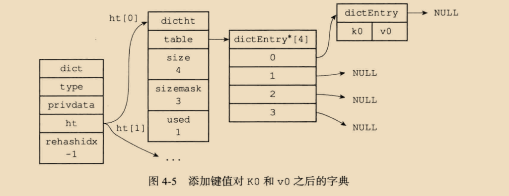
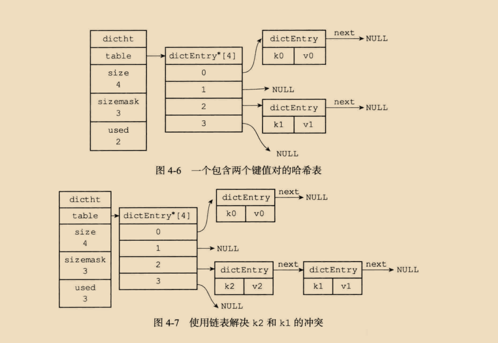
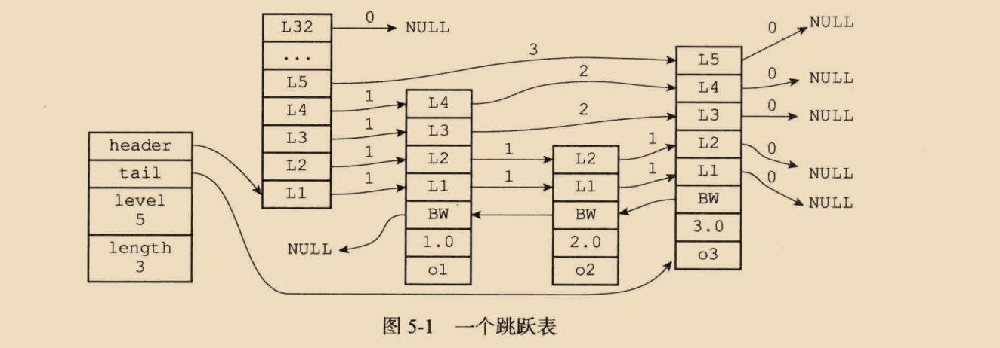
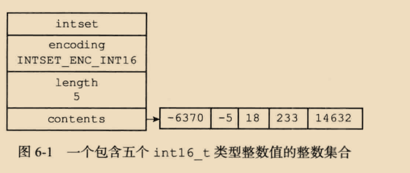

# Redis 设计与实现
` day-2024-9-8`

## 第二章 简单动态字符串
```c++
        1、 Redis 只会使用 C 字符串作为字面量, 在大多数情况下, Redis 使用 SDS(Simple Dynamic String, 简单动态字符串) 作为字符串表示.

        2、 比起 C 字符串, SDS 具有如下优点:
            1) 常数复杂度获取字符串长度
            2) 杜绝缓冲区溢出
            3) 减少修改字符串长度时所需的内存重分配次数
            4) 二进制安全
            5) 兼容部分 C 字符串函数
```

`day-2024-9-10`
## 第三章 链表
```c++
    1. 链表被广泛用于实现 Redis的各种功能,比如列表键、 发布与订阅、慢查询、监视器等
    2. 每个链表节点由一个 listNode 结构来表示, 每个节点都有一个指向前置节点和后置节点的指针, 所以 Redis 的链表实现是双端链表.
    3. 每个链表使用一个 list 结构来表示, 这个结构带有表头节点指针、 表尾节点指针以及链表长度等信息
    4. 因为链表表头节点的前置节点和表尾节点的后置节点都指向 NULL, 所以Redis的链表实现是无环链表
    5. 通过为链表设置不同的类型特定函数, Redis链表可以用于保存各种不同类型的值. 
```
`day-2024-9-11`
## 第四章 字典



```c++
    哈希表的负载因子可以通过公式:
    //负载因子 = 哈希表已保存节点数量 / 哈希表大小
    load_factor = ht[0].used / ht[0].size

    typedef struct dictht{
        // 哈希表数组
        dictEntry** table;

        // 哈希表大小
        unsigned long size;

        // 哈希表大小掩码, 用于计算索引, 总是等于 size - 1
        unsigned long sizemask;

        // 该哈希表已有节点的数量
        unsigned long used;
    } dictht;

    typedef struct dictEntry{
        // 键
        void* key;

        // 值
        union{
            void* val;
            uint64_t u64;
            int64_t s64;
        } v;

        // 指向下个哈希表节点, 形成链表
        struct dictEntry* next;
    }dictEntry;

    typedef struct dict{
        // 类型特定函数
        dictType* type;

        // 私有数据
        void* privdata;

        // 哈希表
        dictht ht[2];

        // rehash 索引
        // 当 rehash 不再进行时, 值为 -1
        // in trehashidx;
    } dict;

    typedef struct dictType{
        // 计算哈希值的函数
        unsigned int (* hashFunction)(const void* key);

        // 复制键的函数
        void* (*keyDup) (void* privdata, const void* key);

        // 复制值的函数
        void* (*valDup) (void* privdata, const void* obj);

        // 对比键的函数
        int (*keyCompare)(void* privdata, const void* key1, const void* key2);

        // 销毁键的函数
        void (*keyDestructor)(void* privdata, void* key);

        //销毁值的函数
        void (*valDestructor)(void* privdata, void* obj);
    } dictType;

    1. 字典被广泛用于实现 Redis 的各种功能, 其中包括数据库和哈希键.
    2. Redis 中的字典使用哈希表作为底层实现, 每个字典带有两个哈希表, 一个平时使用, 另一个在进行rehash 时使用.
    3. 当字典被用作数据库的底层实现时, 或者哈希键的底层实现时, Redis 使用 MurmurHash2 算法来计算键的哈希值.
    4. 哈希表使用链地址法来解决键冲突, 被分配到同一个索引上的多个键值对会连成一个单向链表.
    5. 在对哈希表进行扩展或收缩操作时, 程序需要将现有哈希表包含的所有键值对 rehash 到新哈希表中, 并且这个 rehash 过程并不是一次性完成的, 而是渐进式地完成的.
```

## 第五章 跳跃表

```c++
    跳跃表 skiplist 是一个有序的数据结构, 它通过在每个节点中维持多个指向其他节点的指针, 从而达到快速访问节点的目的.
    跳表支持平均 O(lgN) 最快 O(N) 复杂度的节点查找, 还可以通过顺序性操作来批量处理节点.
    大多数情况下, 跳表的效率可以和平衡树相媲美, 并且因为跳表的实现比平衡树要来的更简单, 所以不少程序使用跳表来代替平衡树.
    Redis 使用跳表作为有序集合的底层实现之一, 如果一个有序集合包含的元素数量比较多, 又或者有序集合元素的成员(member) 是比较长的字符串时, Redis 就会使用跳表来作为有序集合键的底层实现.

    typedef struct zskiplistNode{
        //层
        struct zskiplistLevel{
            // 前进指针
            struct zskiplistNode* forward;

            // 跨度
            unsigned int span;
        }level[];

        // 后退指针
        struct zskiplistNode* backward;

        // 分值
        double score;

        // 成员对象
        robj *obj;
    } zskiplistNode;

    typedef struct zskiplist{
        // 表头节点和表尾节点
        struct zskiplistNode* header, tail;

        //表中节点的数量
        unsigned long length;

        //表中层数最大的节点的层数
        int level;
    }zskiplist;

    1. 跳表是有序集合的底层实现之一
    2. Redis 的跳跃表实现由 zskiplist 和 zskiplistNode 两个结构组成, 其中 zskiplist 用于保存跳表信息(比如表头节点、表尾节点、 层数、长度), 而 zskiplistNode 则用于表示跳跃表节点
    3. 每个跳表的层高都是 1 至 32 之间的随机数
    4. 在同一个跳表中, 多个节点可以包含相同的分值, 但每个节点的成员对象必须是唯一的.
    5. 跳表中的节点按分值大小进行排序, 当分值相同时, 节点按照成员对象的大小进行排序.
```

## 第六章 整数集合

```c++
    整数集合(intset) 是集合键的底层实现之一, 当一个集合只包含整数值元素, 并且这个集合的元素数量不多时, Redis 就会使用整数集合作为集合键的底层实现.
    typedef struct intset{
         // 编码方式
         uint32_t encoding;
         // 集合包含的元素数量
         uint32_t length;
         // 保存元素的数组
         int8_t contents[];
    }intset;

    1.整数集合是集合键的底层实现之一
    2. 整数集合的底层实现为数组, 这个数组以有序、无重复的方式保存集合, 在有需要时,程序会根据新添加元素的类型,改变这个数组的类型
    3. 升级操作为整数集合带来了操作上的灵活性, 并且尽可能节约了内存
    4. 整数集合支持升级操作, 不支持降级操作.
```

`day-2024-9-14`
## 第七章 压缩列表
```c++
    压缩列表(ziplist) 是列表键和哈希键的底层实现之一. 当一个列表键只包含少量列表项, 并且每个列表项要么就是小整数值, 要么就是长度比较短字符串, 那么redis就会使用 压缩列表来做列表键的底层实现.

    1. 压缩列表是一种为节约内存而开发的顺序性数据结构.
    2. 压缩列表被用作列表键和哈希键的底层实现之一.
    3. 压缩列表可以包含多个节点, 每个节点可以保存一个字节数组或者整数值.
    4. 添加新节点到压缩队列, 或者从压缩队列中删除节点, 可能会引发连锁更新操作, 但这种操作出现的几率不高.
```
`day-2025-8-3`
## 第八章 对象
```c++
typedef struct redisObject
{
    unsigned type : 4;
    unsigned encoding : 4;
    unsigned lru : LRU_BITS; 
    int refcount;
    void *ptr;
} robj;

字符串对象:
    1. 字符串对象的编码可以是 REDIS_ENCODING_INT、REDIS_ENCODING_EMBSTR、REDIS_ENCODING_RAW 中的任意一种.
    2. 字符串对象的底层实现可以是 C 语言的 long 类型、C 语言的 double 类型、C 语言的 char* 类型.
    3. 字符串对象的长度可以是任意长度.

    REDIS_ENCODING_EMBSTR与REDIS_ENCODING_RAW的区别:
        1. 当字符串对象的长度小于等于 32 字节时, 字符串对象的编码就会被设置为 REDIS_ENCODING_EMBSTR.
            [                redisObject          ][      sdshdr      ]
            [  type  ][  encoding  ][  ptr  ][....][free:0][len:5][buf]
                          EMBSTR      ↓------------------>['H']['E']['L']['L']['O']
                            embstr编码的字符串对象

        2. 当字符串对象的长度大于 32 字节时, 字符串对象的编码就会被设置为 REDIS_ENCODING_RAW.
            [                redisObject          ][    sdshdr    ]
            [            type(REDIS_STRING)       ][    free 0    ]
            [    encoding(REDIS_ENCODING_RAW)     ][    len 37    ]
            [                ptr                  ][    buf       ] ['L']['O']['N']['G'].....['\0']
                            raw编码的字符串对象

列表对象:
    1. 列表对象的编码可以是 REDIS_ENCODING_ZIPLIST、REDIS_ENCODING_LINKEDLIST 中的任意一种.
    2. 列表对象的底层实现可以是压缩列表、双向链表.
    3. 列表对象的长度可以是任意长度.

    如果numbers键的值对象使用的是 ziplist编码, 那么这个值对象将会是如下结构:
            [                redisObject           ]
            [            type(REDIS_LIST)          ]
            [   encoding(REDIS_ENCODING_ZIPLIST)   ]
            [                ptr                   ]=>[zlbytes][zltail][zllen][1]["three"][5][zlend]
            [                ...                   ]
                        ziplist编码的 numbers列表对象

    如果是 linkedlist编码:
            [                redisObject           ]
            [            type(REDIS_LIST)          ]
            [ encoding(REDIS_ENCODING_LINKEDLIST)  ]
            [                ptr                   ]=>[StringObject 1][StringObject "three"][StringObject 5]
            [                ...                   ]
                        linkedlist编码的 numbers列表对象

哈希对象:
    1. 哈希对象的编码可以是 REDIS_ENCODING_HT、REDIS_ENCODING_ZIPLIST 中的任意一种.
    2. 哈希对象的底层实现可以是哈希表、压缩列表.
    3. 哈希对象的长度可以是任意长度.

    127.0.0.1:6379> hset profile name "xiaoming"
    (integer) 0
    127.0.0.1:6379> hset hs name "张三"
    (integer) 1
    127.0.0.1:6379> hset hs age 25
    (integer) 1
    127.0.0.1:6379> hset hs  career "Programmer"
    (integer) 1
            [                redisObject           ]
            [            type(REDIS_HASH)          ]
            [ encoding(REDIS_ENCODING_ZIPLIST)     ]
            [                ptr                   ]=>[压缩列表]
            [                ...                   ]
                        ziplist编码的哈希对象

    [zlbytes][zltail][zllen]["name"]["张三"][5]["age"][25]["career"]["Programmer"][zlend]
                        哈希对象 ziplist的底层实现

            [                redisObject           ]
            [            type(REDIS_HASH)          ]
            [ encoding(REDIS_ENCODING_HT)          ]
            [                ptr                   ]=>[       dict          ]
            [                ...                   ]  [StringObject "age"   ] => [StringObject 25]
                                                      [StringObject "career"] => [StringObject "Programmer"]
                                                      [StringObject "name"  ] => [StringObject "张三"]
                        hashtable编码的哈希对象
    
集合对象:
    1. 集合对象的编码可以是 intset或者hashtable
    2. 集合对象的底层实现可以是整数集合、哈希表.
    3. 集合对象的长度可以是任意长度.

            [                redisObject           ]
            [            type(REDIS_SET)           ]
            [ encoding(REDIS_ENCODING_INTSET)      ]
            [                ptr                   ]=>[       intset            ]
            [                ...                   ]  [encoding INTSET_ENC_INT16]
                                                      [       length 3          ]
                                                      [       contents          ] => [1][3][5]
                        intset编码的 numbers集合对象

            [                redisObject           ]
            [            type(REDIS_SET)           ]
            [ encoding(REDIS_ENCODING_HASHTABLE)   ]
            [                ptr                   ]=>[       dict          ]
            [                ...                   ]  [StringObject "cherry"] => NULL
                                                      [StringObject "apple" ] => NULL
                                                      [StringObject "banana"] => NULL
                        hashtable编码的 fruits 集合对象

有序集合:
    1. 有序集合对象的编码可以是 REDIS_ENCODING_ZIPLIST、REDIS_ENCODING_SKIPLIST 中的任意一种.
    2. 有序集合对象的底层实现可以是压缩列表、跳表.
    3. 有序集合对象的长度可以是任意长度.
    
    skiplist编码的有序集合使用 zset 结构作为底层实现，一个 zset结构同时包含一个字典和一个跳跃表:
    typedef struct zset{
        zskiplist* zsl;
        dict* dict;
    } zset;


```
`day-2025-8-12`
## 第九章 数据库
### 9.1 Redis服务器中的数据库
`Redis服务器将所有数据库都保存在服务器状态redis.h/redisServer结构的db数组中：`

```c
struct redisServer {
    // ...
    redisDb *db;        // 数据库数组
    int dbnum;          // 数据库数量
    // ...
};
/*
    dbnum属性由服务器配置的databases选项决定，默认值为16
    每个Redis客户端都有自己的目标数据库，默认使用0号数据库
    使用SELECT命令可以切换数据库
*/
```

### 9.2 数据库键空间
`Redis数据库使用redis.h/redisDb结构表示：`

```c
typedef struct redisDb {
    // ...
    dict *dict;                 // 键空间，保存所有键值对
    dict *expires;              // 过期字典，保存键的过期时间
    // ...
} redisDb;

/*
    键空间操作
    添加新键：将新键值对添加到键空间字典
    删除键：从键空间字典删除键值对
    更新键：更新键空间字典中键对应的值
    取值：从键空间字典获取键对应的值

    键空间维护操作
    读取键后：
    更新键的命中(hit)或不命中(miss)次数
    更新键的LRU时间
    检查键是否过期(惰性删除)

    写入键前：
    检查键是否过期
    必要时删除过期键

    其他操作：
    如果服务器开启了通知功能，操作后会发送相应通知
*/
```

### 9.3 键的过期处理
```c++
/*
    Redis通过expires字典保存键的过期时间：
        键：指向键空间中的某个键对象
        值：long long类型的UNIX时间戳(毫秒精度)

    设置过期时间
        Redis提供四种方式设置键的过期时间：
        EXPIRE <key> <ttl>：设置键的生存时间为ttl秒
        PEXPIRE <key> <ttl>：设置键的生存时间为ttl毫秒
        EXPIREAT <key> <timestamp>：设置键的过期时间为timestamp秒
        PEXPIREAT <key> <timestamp>：设置键的过期时间为timestamp毫秒
        实际上前三个命令都会转换为PEXPIREAT命令执行。

    过期键删除策略
        Redis使用两种策略结合的方式删除过期键：
            惰性删除(lazy expiration)：
                在访问键时检查是否过期，过期则删除
                优点：对CPU友好
                缺点：可能造成内存浪费

        定期删除(active expiration)：
            每隔一段时间主动检查并删除过期键
            采用自适应算法，根据情况调整检查频率和时长

        Redis定期删除策略实现
        每次从一定数量的数据库中随机检查一定数量的键
        删除所有发现的过期键
        如果检查的键中过期比例超过10%，则重复检查过程
*/
```
### 9.4 AOF、RDB和复制对过期键的处理
```c++
/*

    RDB持久化
    生成RDB文件时：已过期的键不会被保存到RDB文件
    载入RDB文件时：
        主服务器模式：检查键是否过期，过期则不载入
        从服务器模式：全部载入，等待主服务器同步删除

    AOF持久化
    AOF写入：键过期后会追加一条DEL命令到AOF文件
    AOF重写：已过期的键不会被写入重写后的AOF文件

    复制模式
    从服务器不会主动删除过期键，等待主服务器发来DEL命令
    主服务器删除过期键后，会显式向所有从服务器发送DEL命令
*/
```
### 9.5 数据库通知
`Redis 2.8引入通知功能，客户端可以订阅特定频道或模式来接收数据库变化。`

**通知类型**
1. **键空间通知(key-space notification)**：关注某个键执行了什么命令
    * 频道名：__keyspace@<db>__:<key>
    * 例如：__keyspace@0__:message
2. **键事件通知(key-event notification)**：关注某个命令被什么键执行了
    * 频道名：__keyevent@<db>__:<event>
    * 例如：__keyevent@0__:del

**配置通知**
```bash
notify-keyspace-events [options]
```
选项:
* K：启用键空间通知
* E：启用键事件通知
* g：通用命令通知(如DEL、EXPIRE等)
* $：字符串命令通知
* l：列表命令通知
* s：集合命令通知
* h：哈希命令通知
* z：有序集合命令通知
* x：过期事件(键过期时产生的事件)
* e：驱逐事件(键因内存不足被驱逐时产生的事件)
* A：所有类型(g$lshzxe的别名)


### 9.6 数据库相关命令实现
**SELECT命令实现**
```c
void selectCommand(redisClient *c) {
    int id = atoi(c->argv[1]->ptr);
    
    if (server.cluster_enabled && id != 0) {
        addReplyError(c,"SELECT is not allowed in cluster mode");
        return;
    }
    
    if (selectDb(c,id) == REDIS_ERR) {
        addReplyError(c,"invalid DB index");
    } else {
        addReply(c,shared.ok);
    }
}
```
**FLUSHDB/FLUSHALL命令实现**
* FLUSHDB：清空当前数据库
* FLUSHALL：清空所有数据库

实现方式：
1. 直接删除所有键空间中的键
2. 如果开启了AOF，会记录这些命令
3. 从Redis 4.0开始支持异步删除(避免阻塞)

**SWAPDB命令实现(REDIS 4.0+)**
```c
void swapdbCommand(redisClient *c) {
    int id1, id2;
    
    if (getIntFromObjectOrReply(c,c->argv[1],&id1,NULL) != C_OK) return;
    if (getIntFromObjectOrReply(c,c->argv[2],&id2,NULL) != C_OK) return;
    // 检查数据库索引是否有效
    if (id1 < 0 || id1 >= server.dbnum ||
        id2 < 0 || id2 >= server.dbnum) {
        addReplyError(c,"DB index is out of range");
        return;
    }
    
    if (id1 == id2) {
        addReply(c,shared.ok);
        return;
    }
    
    swapDb(id1, id2);
    addReply(c,shared.ok);
}
```

### 9.7 数据库内部操作
**键空间维护操作**
1. 键过期检查：
   * 每次访问键时检查expires字典
   * 定期随机检查并删除过期键

2. 内存回收：
   * 使用引用计数管理键对象
   * 当引用计数为0时释放内存

3. 键重命名：  
   * RENAME命令先检查新键是否存在，存在则先删除
   * 复制过期时间到新键

**数据库统计信息**
Redis提供**INFO**命令获取数据库统计信息，包括：

* keyspace_hits：键成功查找次数
* keyspace_misses：键失败查找次数
* expired_keys：已过期的键数量
* evicted_keys：因内存不足被驱逐的键数量
* db0：0号数据库的键数量和设置过期时间的键数量

`day-2025-8-13`
## 第十章 RDB 持久化
`day-2025-8-15`
## 第十一章 AOF持久化

`day-2025-8-16`
## 第十二章 事件
### Redis 事件介绍
Redis 是一个高性能的键值数据库，其事件处理机制是其高性能的核心之一。以下是关于 Redis 事件系统的详细介绍：

### Redis 事件类型
Redis 主要处理两种类型的事件：
  1. **文件事件(File Event)：** 处理客户端连接、命令请求和响应等网络通信
  2. **时间事件(Time Event)：** 处理定时任务，如过期键清理、持久化操作等

#### 文件事件(File Event)
Redis 基于 Reactor 模式实现了自己的网络事件处理器，主要特点包括：

* 使用 I/O 多路复用技术(select/epoll/kqueue/evport)监听多个套接字
* 根据套接字执行的任务关联不同的事件处理器
* 实现了单线程的高并发处理模型

##### 文件事件处理器组成
1. 套接字：客户端连接
2. I/O多路复用程序：监听多个套接字
3. 事件分派器：将就绪事件分发给对应处理器
4. 事件处理器：包括连接应答处理器、命令请求处理器、命令回复处理器等

#### 时间事件(Time Event)
Redis 的时间事件分为两类：
1. 定时事件：在指定时间后执行一次
2. 周期性事件：每隔指定时间执行一次

##### 主要时间事件
* 服务器常规操作(serverCron函数)，执行以下任务：
  *   更新统计信息
  *   清理过期键
  *   关闭超时连接
  *   尝试持久化操作(RDB/AOF)
  *   主从同步相关操作
  *   集群相关操作

##### 事件调度与执行
Redis 的事件调度由 aeProcessEvents 函数负责，流程如下：
1. 计算最近的时间事件距离现在还有多少时间
2. 根据这个时间决定文件事件的阻塞时间
3. 处理已就绪的文件事件
4. 处理已到达的时间事件

#### 高性能原因
Redis 事件处理的高性能源于：

1. 单线程避免了锁竞争和上下文切换
2. I/O多路复用技术高效处理大量连接
3. 事件处理机制避免了轮询带来的CPU浪费
4. 内存操作保证了极快的响应速度


`day-2025-8-17`
## 第十三章 客户端

`day-2025-8-19`
## 第十四章 服务器

`day-2025-8-23`
## 第十五章 复制
#### 一、核心概念

- **主服务器（Master）**：接受写请求、数据更新的服务器。
- **从服务器（Slave）**：复制主服务器数据的服务器。接受读请求，数据来自主服务器。
- **核心目标**：保持主从服务器数据库状态的一致。

#### 二、旧版复制（Redis 2.8以前）的实现与缺陷

旧版复制主要基于两个操作：**同步（SYNC）** 和**命令传播（Command Propagation）**。

1. **同步（SYNC）**
    - **目的**：让从服务器初始化，使其数据库状态更新至主服务器当前的数据库状态。
    - **过程**：
        - Slave向Master发送`SYNC`命令。
        - Master接收到`SYNC`后，开始执行`BGSAVE`，在后台生成一个**RDB快照文件**。
        - 同时，Master用一个缓冲区记录从开始`BGSAVE`起的所有写命令。
        - `BGSAVE`执行完毕后，Master将RDB文件发送给Slave。
        - Slave接收并载入这个RDB文件，将自己的数据库状态更新至Master执行`BGSAVE`时的状态。
        - 最后，Master将缓冲区里记录的写命令发送给Slave，Slave执行这些命令，最终达到与Master一致的状态。
2. **命令传播（Command Propagation）**
    - **目的**：在同步完成后，主服务器持续将接收到的写命令发送给从服务器，从而保持数据的一致性。
3. **旧版复制的缺陷：低效的断线重连**
    - 当主从连接中断后重连，从服务器会再次发送`SYNC`命令。
    - `SYNC`操作是非常消耗资源的：
        - Master执行`BGSAVE`会fork子进程，消耗大量CPU、内存和磁盘I/O。
        - 传输整个RDB文件会占用大量网络带宽。
    - 问题在于，**断线后可能只有少量数据不同步，但`SYNC`却要求进行一次全量复制**，这是非常不经济的。

#### 三、新版复制（Redis 2.8+）的优化：PSYNC

为了解决`SYNC`断线重连的低效问题，Redis 2.8引入了`PSYNC`命令来代替`SYNC`。`PSYNC`具有**完整重同步（Full Resynchronization）** 和**部分重同步（Partial Resynchronization）** 两种模式。

1. **部分重同步的实现基础**
    部分重同步解决了断线后只复制缺失数据的问题。它依赖于三个核心概念：
    - **复制偏移量（Replication Offset）**
        - 主从服务器都会维护一个复制偏移量。
        - 主每次向从传播N个字节的数据，自己的偏移量就增加N。
        - 从每次接收到主传播来的N个字节数据，自己的偏移量也增加N。
        - 通过对比偏移量，可以知道主从数据是否一致。
    - **主服务器的复制积压缓冲区（Replication Backlog）**
        - 主服务器维护的一个**固定长度、先进先出（FIFO）的队列**。
        - 主在命令传播时，不仅将命令发给所有从，还会将命令写入这个积压缓冲区。
        - 缓冲区会为其中的每个字节记录相应的复制偏移量。
    - **服务器的运行ID（Run ID）**
        - 每个Redis服务器，无论主从，都有自己的唯一运行ID。
        - ID在服务器启动时自动生成。
        - 从服务器初次复制主服务器时，会记录主的运行ID。断线重连后，从会将这个ID发给重连的主。如果ID匹配，说明是之前的主，可以尝试部分重同步；如果不匹配，则需要进行完整重同步。
2. **PSYNC的工作流程**
    - **初次复制**：从服务器没有保存主服务器的运行ID和复制偏移量，会执行`PSYNC ? -1`，触发**完整重同步**（过程同旧的SYNC）。
    - **断线后重连**：
        1. 从服务器向主服务器发送`PSYNC <runid> <offset>`，其中`runid`是上次主服务器的ID，`offset`是自己当前的复制偏移量。
        2. 主服务器收到命令后，检查`runid`是否与自己一致，并检查`offset`之后的数据是否还在自己的复制积压缓冲区中。
            - 如果 **`runid`不匹配或 **`offset`偏移量之后的数据已不在积压缓冲区中**，则主服务器回复`+FULLRESYNC <runid> <offset>`，进行 **完整重同步**。
            - 如果 **`runid`匹配** 且 **`offset`偏移量之后的数据仍在积压缓冲区中**，则主服务器回复`+CONTINUE`，进行 **部分重同步**。
        3. 主服务器将积压缓冲区中从`offset`到末尾的所有数据发送给从服务器。

#### 四、复制的详细步骤（新版PSYNC）

1. **设置主服务器的地址和端口**（`SLAVEOF`命令）
2. **建立套接字连接**
3. **发送PING命令**（检查套接字状态和主服务器能否处理请求）
4. **身份验证**（如果配置了`requirepass`和`masterauth`）
5. **发送端口信息**
6. **同步**（从服务器发送`PSYNC`命令，主服务器根据情况决定是全量还是部分同步）
7. **命令传播**（同步完成后，主服务器持续将写命令发送给从服务器）

#### 五、心跳检测与相关命令

在命令传播阶段，从服务器默认每秒一次向主服务器发送命令：`REPLCONF ACK <replication_offset>`。

- **作用1：检测主从网络连接状态**。如果主服务器超过一秒没收到`REPLCONF ACK`，就知道连接出问题了。
- **作用2：辅助实现min-slaves配置**。`min-slaves-to-write`和`min-slaves-max-lag`选项可以防止主服务器在不安全状态下（从服务器数量太少或延迟过高）执行写操作。
- **作用3：检测命令丢失**。如果主服务器传播给从服务器的命令半路丢失，从服务器发送的`REPLCONF ACK`命令中的偏移量会小于主的偏移量。主服务器察觉到后，会再次从积压缓冲区里找到丢失的数据并发给从服务器。（**注意**：这与`PSYNC`的部分重同步机制类似，但是在主从连接未断开的情况下进行的补偿）

------

### 总结对比

| 特性         | 旧版复制（SYNC）                         | 新版复制（PSYNC）                                            |
| :----------- | :--------------------------------------- | :----------------------------------------------------------- |
| **核心命令** | `SYNC`                                   | `PSYNC`                                                      |
| **重连机制** | 无论断开多久，一律**完整重同步**         | **智能判断**：根据偏移量和积压缓冲区决定是**部分重同步**还是**完整重同步** |
| **效率**     | **低效**，频繁断线重连会带来巨大资源消耗 | **高效**，断线后只需补发少量缺失数据，极大节省资源           |
| **依赖机制** | RDB持久化                                | 复制偏移量、复制积压缓冲区、服务器运行ID                     |

新版复制通过`PSYNC`机制有效地解决了旧版复制在断线重连时的性能瓶颈，是Redis生产环境中实现高可用和可扩展架构的基石。

## 第十六章 Sentinel

Sentinel是Redis的**高可用性（High Availability）解决方案**：它由一个或多个Sentinel实例组成的系统，用于监控主从服务器，并在主服务器发生故障时，**自动进行故障检测和故障转移**，选举出新的主服务器，让系统无需人工干预即可继续提供服务。


### 一、Sentinel 的职责与功能

1. **监控（Monitoring）**：持续检查主服务器和从服务器是否正常运行。
2. **通知（Notification）**：当被监控的某个Redis服务器出现问题时，Sentinel可以通过API向管理员或其他应用程序发送通知。
3. **自动故障转移（Automatic Failover）**：
    - 当主服务器被判定为客观下线时，Sentinel会发起故障转移。
    - 它会选择一个从服务器升级为新的主服务器。
    - 让其他从服务器改为复制新的主服务器。
    - 通知客户端连接新的主服务器。
4. **配置提供者（Configuration Provider）**：客户端在启动时，会连接Sentinel来获取当前主服务器的地址。故障转移后，Sentinel会提供新的主服务器地址。

------

### 二、关键实现机制与设计思想

#### 1. 初始化与获取主服务器信息
- 启动Sentinel时，指定监控的主服务器（`master-name`, `ip`, `port`, `quorum`）。
- Sentinel会创建两个到主服务器的**异步网络连接**：
    - **命令连接**：用于向主服务器发送命令。
    - **订阅连接**：用于订阅主服务器的 `__sentinel__:hello` 频道，以**自动发现**其他监控同一主服务器的Sentinel和从服务器。

#### 2. 自动发现机制

这是Sentinel设计的精妙之处，极大简化了配置。

- **发现从服务器**：Sentinel每隔10秒向主服务器发送 `INFO` 命令，从回复中自动获取其属下所有从服务器的信息，并为每个从服务器创建相应的实例结构。
- **发现其他Sentinel**：通过主服务器的 **发布-订阅（Pub/Sub）** 功能。每个Sentinel每隔2秒通过命令连接向 `__sentinel__:hello` 频道发布一条消息，包含自身信息和主服务器信息。同时，通过订阅连接接收该频道的消息，从而发现其他Sentinel。

#### 3. 心跳检测与主观下线（S-Down）

- Sentinel默认**每秒一次**向所有创建了命令连接的实例（主服务器、从服务器、其他Sentinel）发送 `PING` 命令。
- **主观下线（Subjectively Down）**：如果实例在 `down-after-milliseconds` 毫秒内，连续无效回复（如超时、返回错误等），那么Sentinel会**主观地**判断该实例已下线。
    - **主观**意味着这只是单个Sentinel的看法，不一定代表事实。

#### 4. 客观下线（O-Down）与Leader选举

- **客观下线（Objectively Down）**：当一个Sentinel将主服务器判断为主观下线后，它会向其他Sentinel询问他们对主服务器状态的看法。当同意主服务器下线的Sentinel数量达到配置的**法定人数（quorum）** 时，Sentinel就会将主服务器判定为**客观下线**，并准备进行故障转移。
- **Raft领导者选举算法**：Redis Sentinel使用Raft算法来选举一个**Leader Sentinel**，由它来负责执行故障转移操作。
    - 任何Sentinel都有资格成为Leader。
    - 选举基于**先到先得**和**多数派**原则。第一个向其他Sentinel发送选举请求的Sentinel，如果获得了多数派（超过一半）的投票，就会成为Leader。
    - 这个过程确保了**在任意一次故障转移中，只有一个Sentinel是Leader**，避免了多个Sentinel同时执行故障转移导致混乱。

#### 5. 故障转移（Failover）流程

由选举出的Leader Sentinel执行，分为三个步骤：

1. **筛选新的主服务器**：
    - 淘汰不健康的从服务器（如已下线、断线、5秒内无回复、与主服务器断开过久）。
    - 根据优先级（`slave-priority`）排序，优先级高的胜出。
    - 优先级相同，则选择复制偏移量（`replication offset`）最大的（即数据最完整的）。
    - 如果复制偏移量也相同，则选择运行ID最小的从服务器（一个简单的最终裁决方式）。
2. **提升从服务器为主服务器**：
    - Leader Sentinel向选中的从服务器发送 `SLAVEOF no one` 命令，使其转变为主服务器。
    - 之后，Leader Sentinel会以每秒一次的频率向它发送 `INFO` 命令，观察其角色（`role`）是否成功变为 `master`。
3. **让其他从服务器复制新的主服务器**：
    - Leader Sentinel向其他所有从服务器发送 `SLAVEOF <new_master_ip> <new_master_port>` 命令，让它们复制新的主服务器。
4. **通知客户端与更新配置**：
    - 将已下线的主服务器设置为新主服务器的从服务器。这样当旧主服务器重新上线时，它会成为新主服务器的从服务器。
    - 通过**发布订阅**更新新的主服务器信息，客户端监听这些变化来切换到新的主服务器。

------

### 三、重要特性与注意事项

- **最终一致性**：Sentinel系统本身是分布式的，其状态通过心跳和Gossip协议最终达成一致，而非强一致。
- **“少数派服从多数派”原则**：无论是客观下线判断还是Leader选举，都依赖多数派同意，这保证了在网络分区等复杂情况下系统的健壮性。
- **配置的传播**：一个Sentinel对配置的修改（如故障转移后的新主服务器信息），会通过 `PUBLISH` 命令发布到所有服务器的 `__sentinel__:hello` 频道，从而自动传播到整个Sentinel系统。
- **客户端集成**：客户端需要是“Sentinel-aware”的，即能够连接Sentinel节点来查询当前的主节点地址，并在连接断开时重新向Sentinel查询。

### 总结图示
```cpp
    [Sentinel A]  [Sentinel B]  [Sentinel C]  <- Sentinel集群，相互自动发现
        \           |           /
        \          |          /
            \         |         /
        [Redis Master (monitored)]  <- 被监控的主服务器
            /      |      \
            /       |       \
    [Slave 1]   [Slave 2]   [Slave 3]   <- 自动发现的从服务器

    故障发生时：
    1.  Sentinel们通过投票达成【客观下线】共识。
    2.  通过Raft算法选举出一个【Leader Sentinel】。
    3.  Leader从Slave中选出最佳候选，执行【故障转移】。
    4.  客户端从Sentinel获取新的Master地址，系统恢复服务。
```


