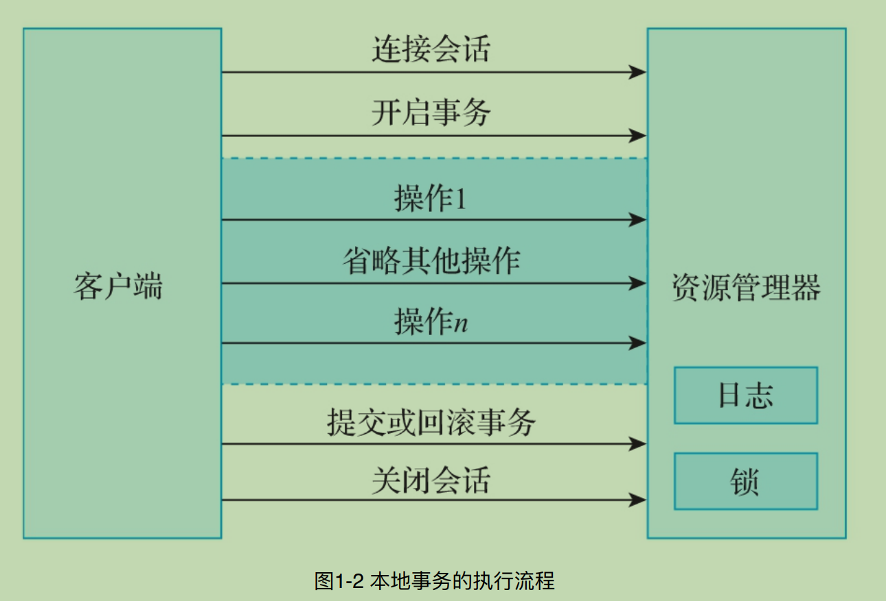

# 第一章 - 事务的基本概念
>   
* 事务的特性。
* 事务的类型。
* 本地事务。
* MySQL事务基础。
>   

```c++
// 事务的特性
// 事务的四大特性: 原子性、 一致性、 隔离性、 持久性.
/*
 事务的原⼦性指的是构成事务的所有操作要么全部执⾏成功，要么全部执⾏失败，不可能出现部分执⾏成功，部分执⾏失败的情况.

 事务的⼀致性指的是在事务执⾏之前和执⾏之后，数据始终处于⼀致的状态.

 事务的隔离性指的是并发执⾏的两个事务之间互不⼲扰.

 事务的持久性指的是事务提交完成后，此事务对数据的更改操作会被持久化到数据库中，并且不会被回滚.

Ps: MySQL通过锁和MVCC机制来保证事务的隔离性.

Ps:数据库的事务在实现时，会将⼀次事务中包含的所有操作全部封装成⼀个不可分割的执⾏单元，这个单元中的所有操作要么全部执⾏成功，要么全部执⾏失败。只要其中任意⼀个操作执⾏失败，整个事务就会执⾏回滚操作.

*/


// 事务的类型
//五大类: 扁平事务、带有保存点的扁平事务、链式事务、嵌套事务和分布式事务.

/*
  扁平事务:
扁平事务是事务操作中最常⻅，也是最简单的事务。在数据库中，扁平事务通常由begin或者start transaction 字段开始，由commit或者rollback字段结束.在这之间的所有操作要么全部执⾏成功，要么全部执⾏失败（回滚）.

 带有保存点的扁平事务:
通俗地讲，内部设置了保存点的扁平事务，就是带有保存点的扁平事务。带有保存点的扁平事务通过在事务内部的某个位置设置保存点（savepoint），达到将当前事务回滚到此位置的⽬的.

示例:
在MySQL数据库中，通过如下命令设置事务的保存点。

savepoint	[savepoint_name]

例如，设置⼀个名称为save_user_point的保存点，代码如下所示。

savepoint	save_user_point;

通过如下命令将当前事务回滚到定义的保存点位置。

rollback	to	[savepoint_name]

例如，将当前事务回滚到定义的名称为save_user_point的保存点位置，代码如下所示。

rollback	to	save_user_point;

通过如下命令删除保存点。

release	savepoint	[savepoint_name]

例如，删除当前事务中名称为save_user_point的保存点，代码如下所示。

release	savepoint	save_user_point;

 链式事务:
链式事务是在带有保存点的扁平事务的基础上, ⾃动将当前事务的上下⽂隐式地传递给下⼀个事务.也就是说, ⼀个事务的提交操作和下⼀个事务的开始操作具备原⼦性，上⼀个事务的处理结果对下⼀个事务是可⻅的，事务与事务之间就像链条⼀样传递下去.

Ps: 链式事务在提交的时候，会释放要提交的事务中的所有锁和保存点.

  嵌套事务:
嵌套事务就是有多个事务处于嵌套状态，共同完成⼀项任务的处理，整个任务具备原⼦性。嵌套事务最外层有⼀个顶层事务，这个顶层事务控制着所有的内部⼦事务，内部⼦事务提交完成后，整体事务并不会提交，只有最外层的顶层事务提交完成后，整体事务才算提交完成.

 分布式事务:
 分布式事务指的是事务的参与者、事务所在的服务器、涉及的资源服务器以及事务管理器等分别位于不同分布式系统的不同服务或数据库节点上。简单来说，分布式事务就是⼀个在不同环境（⽐如不同的数据库、不同的服务器）下运⾏的整体事务。这个整体事务包含⼀个或者多个分⽀事务，并且整体事务中的所有分⽀事务要么全部提交成功，要么全部提交失败。

*/


// 本地事务
// 基于关系型数据库的事务也可以称作本地事务或者传统事务.

// 本地事务具有的典型特征:
/*
1）⼀次事务过程中只能连接⼀个⽀持事务的数据库，这⾥的数据库⼀般指的是关系型数据.
库。

2）事务的执⾏结果必须满⾜ACID特性. 

3）事务的执⾏过程会⽤到数据库本身的锁机制.
*/

```


```C++
/*
从图1-2中可以看出：

1）客户端开始事务操作之前，需要开启⼀个连接会话;

2）开始会话后,客户端发起开启事务的指令;

3）事务开启后, 客户端发送各种SQL语句处理数据;

4）正常情况下，客户端会发起提交事务的指令, 如果发⽣异常情况，客户端会发起回滚事务的指令;

5）上述流程完成后，关闭会话.
*/


// 本地事务的优缺点
/*
    本地事务的优点总结如下:

1）⽀持严格的ACID特性,这也是本地事务得以实现的基础.

2）事务可靠,⼀般不会出现异常情况.

3）本地事务的执⾏效率⽐较⾼.

4）事务的状态可以只在数据库中进⾏维护,上层的应⽤不必理会事务的具体状态.

5）应⽤的编程模型⽐较简单,不会涉及复杂的⽹络通信.


    本地事务的缺点总结如下:

1）不具备分布式事务的处理能⼒.

2）⼀次事务过程中只能连接⼀个⽀持事务的数据库, 即不能⽤于多个事务性数据库.
*/
```