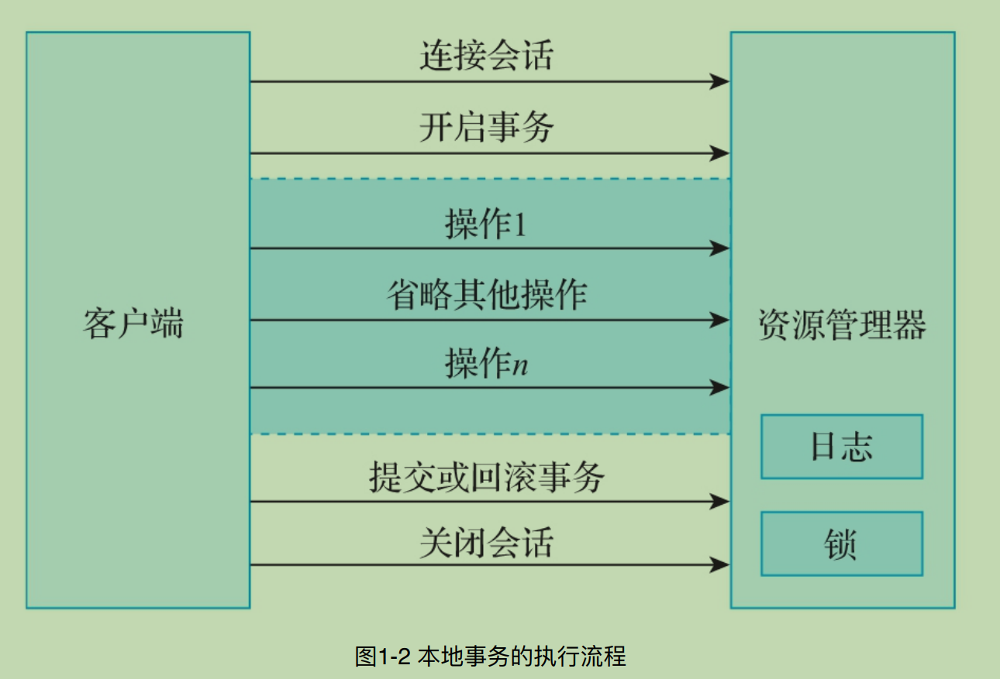

# 第一章 - 事务的基本概念
>   
* 事务的特性。
* 事务的类型。
* 本地事务。
* MySQL事务基础。
>   

```c++
// 事务的特性
// 事务的四大特性: 原子性、 一致性、 隔离性、 持久性.
/*
 事务的原⼦性指的是构成事务的所有操作要么全部执⾏成功，要么全部执⾏失败，不可能出现部分执⾏成功，部分执⾏失败的情况.

 事务的⼀致性指的是在事务执⾏之前和执⾏之后，数据始终处于⼀致的状态.

 事务的隔离性指的是并发执⾏的两个事务之间互不⼲扰.

 事务的持久性指的是事务提交完成后，此事务对数据的更改操作会被持久化到数据库中，并且不会被回滚.

Ps: MySQL通过锁和MVCC机制来保证事务的隔离性.

Ps:数据库的事务在实现时，会将⼀次事务中包含的所有操作全部封装成⼀个不可分割的执⾏单元，这个单元中的所有操作要么全部执⾏成功，要么全部执⾏失败。只要其中任意⼀个操作执⾏失败，整个事务就会执⾏回滚操作.

*/


// 事务的类型
//五大类: 扁平事务、带有保存点的扁平事务、链式事务、嵌套事务和分布式事务.

/*
  扁平事务:
扁平事务是事务操作中最常⻅，也是最简单的事务。在数据库中，扁平事务通常由begin或者start transaction 字段开始，由commit或者rollback字段结束.在这之间的所有操作要么全部执⾏成功，要么全部执⾏失败（回滚）.

 带有保存点的扁平事务:
通俗地讲，内部设置了保存点的扁平事务，就是带有保存点的扁平事务。带有保存点的扁平事务通过在事务内部的某个位置设置保存点（savepoint），达到将当前事务回滚到此位置的⽬的.

示例:
在MySQL数据库中，通过如下命令设置事务的保存点。

savepoint	[savepoint_name]

例如，设置⼀个名称为save_user_point的保存点，代码如下所示。

savepoint	save_user_point;

通过如下命令将当前事务回滚到定义的保存点位置。

rollback	to	[savepoint_name]

例如，将当前事务回滚到定义的名称为save_user_point的保存点位置，代码如下所示。

rollback	to	save_user_point;

通过如下命令删除保存点。

release	savepoint	[savepoint_name]

例如，删除当前事务中名称为save_user_point的保存点，代码如下所示。

release	savepoint	save_user_point;

 链式事务:
链式事务是在带有保存点的扁平事务的基础上, ⾃动将当前事务的上下⽂隐式地传递给下⼀个事务.也就是说, ⼀个事务的提交操作和下⼀个事务的开始操作具备原⼦性，上⼀个事务的处理结果对下⼀个事务是可⻅的，事务与事务之间就像链条⼀样传递下去.

Ps: 链式事务在提交的时候，会释放要提交的事务中的所有锁和保存点.

  嵌套事务:
嵌套事务就是有多个事务处于嵌套状态，共同完成⼀项任务的处理，整个任务具备原⼦性。嵌套事务最外层有⼀个顶层事务，这个顶层事务控制着所有的内部⼦事务，内部⼦事务提交完成后，整体事务并不会提交，只有最外层的顶层事务提交完成后，整体事务才算提交完成.

 分布式事务:
 分布式事务指的是事务的参与者、事务所在的服务器、涉及的资源服务器以及事务管理器等分别位于不同分布式系统的不同服务或数据库节点上。简单来说，分布式事务就是⼀个在不同环境（⽐如不同的数据库、不同的服务器）下运⾏的整体事务。这个整体事务包含⼀个或者多个分⽀事务，并且整体事务中的所有分⽀事务要么全部提交成功，要么全部提交失败。

*/


// 本地事务
// 基于关系型数据库的事务也可以称作本地事务或者传统事务.

// 本地事务具有的典型特征:
/*
1）⼀次事务过程中只能连接⼀个⽀持事务的数据库，这⾥的数据库⼀般指的是关系型数据库.

2）事务的执⾏结果必须满⾜ACID特性. 

3）事务的执⾏过程会⽤到数据库本身的锁机制.
*/

```


```C++
/*
从图1-2中可以看出：

1）客户端开始事务操作之前，需要开启⼀个连接会话;

2）开始会话后,客户端发起开启事务的指令;

3）事务开启后, 客户端发送各种SQL语句处理数据;

4）正常情况下，客户端会发起提交事务的指令, 如果发⽣异常情况，客户端会发起回滚事务的指令;

5）上述流程完成后，关闭会话.
*/


// 本地事务的优缺点
/*
    本地事务的优点总结如下:

1）⽀持严格的ACID特性,这也是本地事务得以实现的基础.

2）事务可靠,⼀般不会出现异常情况.

3）本地事务的执⾏效率⽐较⾼.

4）事务的状态可以只在数据库中进⾏维护,上层的应⽤不必理会事务的具体状态.

5）应⽤的编程模型⽐较简单,不会涉及复杂的⽹络通信.


    本地事务的缺点总结如下:

1）不具备分布式事务的处理能⼒.

2）⼀次事务过程中只能连接⼀个⽀持事务的数据库, 即不能⽤于多个事务性数据库.
*/
```

```c++
// MySQL事务基础
// 在互联⽹领域，MySQL数据库是使⽤最多的关系型数据库之⼀,也是⼀种典型的⽀持事务的关系型数据库.

/* 
  并发事务带来的问题:
  1. 更新丢失 (脏写)
  2. 脏读
  3. 不可重复读
  4. 幻读

  1 更新丢失 (脏写):
  对于同⼀⾏数据，⼀个事务对该⾏数据的更新操作覆盖了其
  他事务对该⾏数据的更新操作.

  本质上是写操作的冲突,解决方法是让每个事务串行执行.

  2 脏读: 
  就是⼀个事务读取了另⼀个事务未提交的数据.

  脏读本质上是读写操作的冲突，解决办法是先写后读，也就是写完之后再读.

  3 不可重复读:
  同⼀个事务，使⽤相同的查询语句，在不同时刻读取到的结果不⼀致.

  不可重复读本质上也是读写操作的冲突，解决办法是先读后写，也就是读完之后再写.

  4 幻读:
  ⼀个事务两次读取⼀个范围的数据记录，两次读取到的结果不同.

  幻读本质上是读写操作的冲突，解决办法是先读后写，也就是读完之后再写.

*/
```

```c++
// MySQL事务隔离级别
  1. 读未提交
  2. 读已提交
  3. 可重复读
  4. 串行化

// 事务隔离级别脏读不可重复读幻读
/*
        读未提交    可能可能可能
        读已提交  不可能可能可能
        可重复读不可能不可能可能
        串⾏化不可能不可能不可能
*/

/*
  MySQL事务隔离级别最佳实践
  在MySQL中创建⼀个test数据库，在test数据库中创建⼀个account数据表作为测试使⽤的账户数据表，如下所示.

mysql>	create	database	test;
Query	OK,	1	row	affected	(0.02	sec)
mysql>	use	test;
Database	changed
mysql>
mysql>	create	table	account(
				->	id	int	not	null	auto_increment,
				->	name	varchar(30)	not	null	default	'',
				->	balance	int	not	null	default	0,
				->	primary	key(id)
				->	)	engine=InnoDB	default	charset=utf8mb4;
Query	OK,	0	rows	affected	(0.02	sec)

创建完数据库和数据表之后，向account数据表中插⼊⼏条测试数据，如下所示.

mysql>	insert	into
				->	test.account(name,	balance)
				->	values
				->	('张三',	300),
				->	('李四',	350),
				->	('王五',	500);
Query	OK,	3	rows	affected	(0.03	sec)
Records:	3		Duplicates:	0		Warnings:	0

  1. 读未提交
  第⼀步：打开服务器终端A，登录MySQL，将当前终端的事务隔离级别设置为read uncommitted，也就是读未提交，如下所示.

  mysql>	set	session	transaction	isolation	level	read	uncommitted;

  在终端A开启事务并查询account数据表中的数据.

  mysql> start transaction;

  mysql> select * from account;
  
  第⼆步：在终端A的事务提交之前，打开服务器的另⼀个终端B，连接MySQL，将当前事务模式设置为read uncommitted并更新account表的数据，将张三的账户余额加100元.

  mysql>	set	session	transaction	isolation	level	read	uncommitted;

  Query	OK,	0	rows	affected	(0.00	sec)

  mysql>	start	transaction;

  Query	OK,	0	rows	affected	(0.00	sec)

  mysql>	update	account	set	balance	=	balance	+	100	where	id	=	1;

  Query	OK,	1	row	affected	(0.00	sec)

  Rows	matched:	1		Changed:	1		Warnings:	0

  在终端B查询account数据表中的数据.

  在终端B中，当前事务未提交时，张三的账户余额变为更新后的值，即400元.

  第三步：在终端A查看account数据表的数据.

  虽然终端B的事务并未提交，但是终端A可以查询到终端B已经更新的数据.

  第四步：如果终端B的事务由于某种原因执⾏了回滚操作，那么终端B中执⾏的所有操作都会被撤销。也就是说，终端A查询到的数据其实就是脏数据.

  在终端B执⾏事务回滚操作，并查询account数据表中的数据.

  mysql> rollback;  

  在终端B执⾏了事务的回滚操作后，张三的账户余额重新变为300元. 

  第五步：在终端A将张三的账户余额减100元，再次查询account数据表的数据，可以发现张三的账户余额变为200元，⽽不是300元.

  mysql> update account set balance = balance - 100 where id = 1;

  mysql> select * from accout;
  +----+--------+---------+
  | id | name   | balance |
  +----+--------+---------+
  |  1 | 张三   |     200 |
  |  2 | 李四   |     350 |
  |  3 | 王五   |     500 |
  +----+--------+---------+

  执⾏第三步时读取到张三的账户余额为400元，然后将张三的账户余额减100元，因为在应⽤程序中并不知道其他会话回滚了事务，所以更新张三的账户余额就变为300元了，这就是脏读的问题。可以采⽤读已提交的事务隔离级别解决这个问题.

*/

/*
    2.  读已提交
    第⼀步：打开⼀个终端A，将当前终端的事务隔离级别设置为read committed，也就是读已提交.

    mysql>	set	session	transaction	isolation	level	read	committed;

    在终端A开启事务并查询account数据表中的数据.
    +----+--------+---------+
    | id | name   | balance |
    +----+--------+---------+
    |  1 | 张三   |     300 |
    |  2 | 李四   |     350 |
    |  3 | 王五   |     500 |
    +----+--------+---------+

    第⼆步：在终端A的事务提交之前，打开终端B，将当前终端的事务隔离级别设置为read committed，开启事务并更新account数据表中的数据，将张三的账户余额增加100元.

    mysql>	set	session	transaction	isolation	level	read	committed;

    mysql>	start	transaction;

    mysql>	update	account	set	balance	=	balance	+	100	where	id	=	1;

    在终端B查询account数据表中的数据:
    +----+--------+---------+
    | id | name   | balance |
    +----+--------+---------+
    |  1 | 张三   |     400 |
    |  2 | 李四   |     350 |
    |  3 | 王五   |     500 |
    +----+--------+---------+

  第三步：在终端B的事务提交之前，在终端A中查询account数据表中的数据.
    +----+--------+---------+
    | id | name   | balance |
    +----+--------+---------+
    |  1 | 张三   |     300 |
    |  2 | 李四   |     350 |
    |  3 | 王五   |     500 |
    +----+--------+---------+
  
  第四步：在终端B提交事务:

    mysql> commit;

  第五步：在终端B提交事务后，在终端A再次查询account数据表中的数据.

    +----+--------+---------+
    | id | name   | balance |
    +----+--------+---------+
    |  1 | 张三   |     400 |
    |  2 | 李四   |     350 |
    |  3 | 王五   |     500 |
    +----+--------+---------+
  
  可以看到，终端A在终端B的事务提交前和提交后读取到的account数据表中的数据不⼀致,产⽣了不可重复读的问题.

  3. 可重复读

    第⼀步：打开终端A，登录MySQL，将当前终端的事务隔离级别设置为repeatable read，也就是可重复读。开启事务并查询account数据表中的数据.

    mysql> set session transaction isolation level repeatable read;

    mysql> start transaction;

    mysql> select * from account;

    +----+--------+---------+
    | id | name   | balance |
    +----+--------+---------+
    |  1 | 张三   |     300 |
    |  2 | 李四   |     350 |
    |  3 | 王五   |     500 |
    +----+--------+---------+

    第⼆步：在终端A的事务提交之前，打开终端B，登录MySQL，将当前终端的事务隔离级别设置为可重复读.开启事务，将张三的账户余额增加100元，随后提交事务.

    mysql>	set	session	transaction	isolation	level	repeatable	read;

    mysql>	start	transaction;

    mysql>	update	account	set	balance	=	balance	+	100	where	id	=	1;

    mysql>	commit;

    接下来，在终端B查询account数据表中的数据.

    +----+--------+---------+
    | id | name   | balance |
    +----+--------+---------+
    |  1 | 张三   |     400 |
    |  2 | 李四   |     350 |
    |  3 | 王五   |     500 |
    +----+--------+---------+

    第三步：在终端A查询account数据表中的数据.

    mysql> select * from account;

    +----+--------+---------+
    | id | name   | balance |
    +----+--------+---------+
    |  1 | 张三   |     300 |
    |  2 | 李四   |     350 |
    |  3 | 王五   |     500 |
    +----+--------+---------+ 

    可以看到，在终端A查询的结果中，张三的账户余额仍为300元，并没有出现不可重复读的问题，说明可重复读的事务隔离级别解决了不可重复读的问题.

    第四步：在终端A为张三的账户增加100元，如下所示.

    mysql>	update	account	set	balance	=	balance	+	100	where	id	=	1;

     mysql> select * from account;
    +----+--------+---------+
    | id | name   | balance |
    +----+--------+---------+
    |  1 | 张三   |     500 |
    |  2 | 李四   |     350 |
    |  3 | 王五   |     500 |
    +----+--------+---------+

    可重复读的隔离级别使⽤了MVCC（Multi-Version Concurrency Control，多版本并发控制）机制，数据库中的查询（select）操作不会更新版本号，是快照读，⽽操作数据表中的数据（insert、update、delete）则会更新版本号，是当前读.

    第五步：在终端B开启事务，插⼊⼀条数据后提交事务.

    mysql>	start	transaction;

    mysql>	insert	into	account(name,	balance)	values('赵六',	100);

    mysql>	commit;

    在终端B查询account数据表中的数据:
    +----+--------+---------+
    | id | name   | balance |
    +----+--------+---------+
    |  1 | 张三   |     400 |
    |  2 | 李四   |     350 |
    |  3 | 王五   |     500 |
    |  4 | 赵六   |     100 |
    +----+--------+---------+
    可以看到，在终端B查询的结果中，已经显示出新插⼊的赵六的账户信息了.

    第六步：在终端A查询account数据表的数据.
    +----+--------+---------+
    | id | name   | balance |
    +----+--------+---------+
    |  1 | 张三   |     500 |
    |  2 | 李四   |     350 |
    |  3 | 王五   |     500 |
    +----+--------+---------+

    可以看到，在终端A查询的数据中，没有赵六的账户信息，说明并明没有出现幻读.

    第七步：在终端A为赵六的账户增加100元.

    mysql>	update	account	set	balance	=	balance	+	100	where	id	=	7;
    +----+--------+---------+
    | id | name   | balance |
    +----+--------+---------+
    |  1 | 张三   |     500 |
    |  2 | 李四   |     350 |
    |  3 | 王五   |     500 |
    |  7 | 赵六   |     200 |
    +----+--------+---------+

    可以看到，在终端A执⾏完数据更新操作后，查询到赵六的账户信息，出现了幻读的问题.

  4. 串⾏化
    ... 未完待续...
*/


```