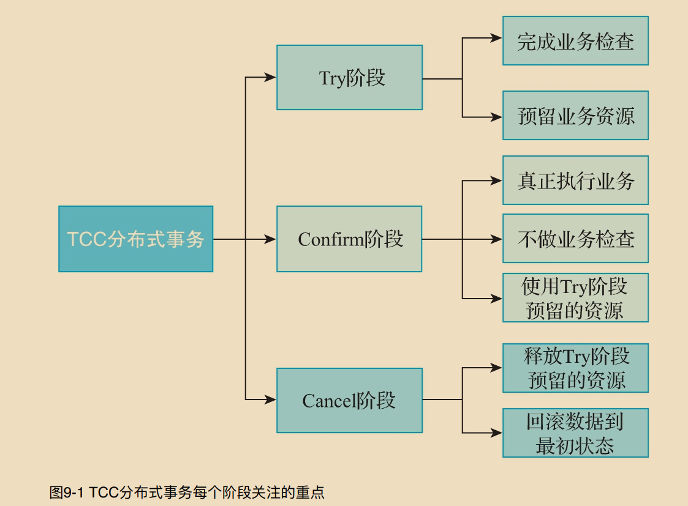
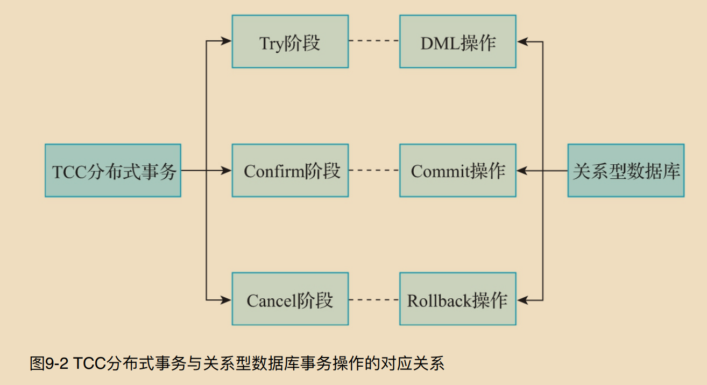
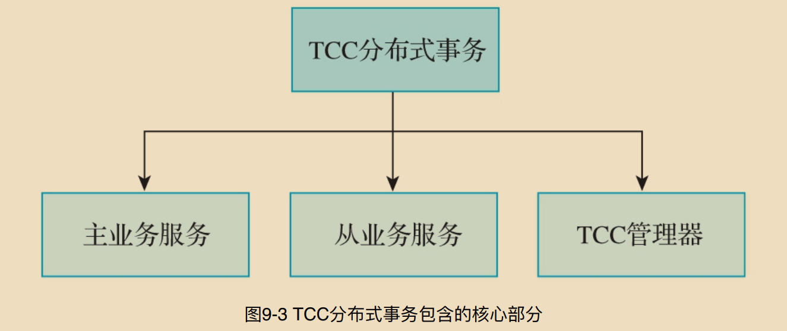
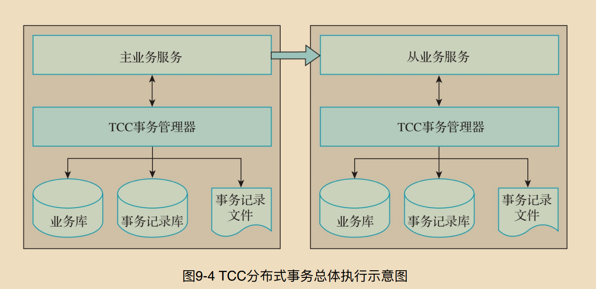

# TCC 分布式事务原理

* 1.TCC核⼼思想
* 2.TCC实现原理
* 3.TCC核⼼流程
* 4.TCC关键技术


## 9.1 TCC核⼼思想

```c++
    TCC分布式事务最核⼼的思想就是在应⽤层将⼀个完整的事务操作分为三个阶段。在某种程度
上讲，TCC是⼀种资源，实现了Try、Confirm、Cancel三个操作接⼝。与传统的两阶段提交协
议不同的是，TCC是⼀种在应⽤层实现的两阶段提交协议，在TCC分布式事务中，对每个业务
操作都会分为Try、Confirm和Cancel三个阶段，每个阶段所关注的重点不同，如图9-1所示。
```
### Try阶段
    Try阶段是准备执⾏业务的阶段，在这个阶段尝试执⾏业务，重点关注如下事项

    1）完成所有的业务检查，确保数据的⼀致性
    2）预留必要的业务资源，确保数据的隔离性

 

 ### Confirm阶段
    Confirm阶段是确认执⾏业务的阶段，在这个阶段确认执⾏的业务。此时，重点关注如下事项

    1）真正地执⾏业务
    2）不做任何业务逻辑检查，直接将数据持久化到数据库
    3）直接利用Try阶段预留的业务资源

### Cancel阶段
    Cancel阶段取消执⾏业务，重点关注如下事项

    1）释放Try阶段预留的业务资源
    2）将数据库中的数据恢复到最初的状态





        在⼀个分布式或微服务系统中，TCC分布式事务的Try阶段是先把多个应⽤中的业务资源锁定，
    预留执⾏分布式事务的资源。同样，关系型数据库的DML操作会锁定数据库的⾏记录，持有数
    据库的资源。TCC分布式事务的Confirm操作是在所有涉及分布式事务的应⽤的Try阶段都执⾏
    成功后确认并提交最终事务状态的操作，⽽关系型数据库的Commit操作是在所有的DML操作
    执⾏成功之后提交事务。TCC分布式事务的Cancel操作是在涉及分布式事务的应⽤没有全部执
    ⾏成功时，将已经执⾏成功的应⽤进⾏回滚，⽽关系型数据库的回滚操作是在执⾏的DML操作
    存在异常时执⾏的。关系型数据库中的Commit操作和Rollback操作也是⼀对反向业务操
    作，TCC分布式事务中的Confirm操作和Cancel操作也是⼀对反向业务操作。


## 9.2 TCC实现原理
    TCC分布式事务在应⽤层将整体事务的执⾏分为Try、Confirm、Cancel三个阶段。每个阶段的
    执⾏不会过多地占⽤数据库资源，⽽是在Try阶段预留事务提交必须的业务资源。TCC分布式事
    务的实现与其核⼼原理密不可分

### TCC核⼼组成


    主业务服务是TCC分布式事务的发起⽅，在下单扣减库存的业务场景中，订单服务是TCC分布式事务的发起⽅，就是主业务服务


    从业务服务主要负责提供TCC业务操作，是整个业务活动的操作⽅。从业务活动必须实现TCC
    分布式事务Try、Confirm和Cancel三个阶段的接⼝，供主业务服务调⽤。由于在TCC分布式事
    务的执⾏过程中，Confirm阶段的操作和Cancel阶段的操作可能会被执⾏多次，因此需要
    Confirm阶段的操作和Cancel阶段的操作保证幂等性.

    TCC管理器在整个TCC分布式事务的执⾏过程中，管理并控制着整个事务活动，包括记录并维
    护TCC全局事务的事务状态和每个从业务服务的分⽀事务状态，并在参与分布式事务的所有分
    ⽀事务的Try阶段都执⾏成功时，⾃动调⽤每个分⽀事务的Confirm阶段的操作，完成分布式事
    务，同时会在参与分布式事务的某些分⽀事务执⾏失败时，⾃动调⽤分⽀事务的Cancel操作回
    滚分布式事务

###  TCC核⼼原理

        在使⽤TCC分布式事务解决分布式场景下的数据⼀致性问题时，需要将原本的⼀个事务接⼝改
    造成三个不同的事务逻辑，也就是前⽂说的Try阶段、Confirm阶段和Cancel阶段。
    原本⼀个接⼝的⽅法完成的事务逻辑也要分拆成如下执⾏流程。

    1）依次执⾏所有参与TCC分布式事务的分⽀事务Try阶段的操作。

    2）如果每个分⽀事务Try阶段的逻辑都执⾏成功，则TCC分布式事务管理器会⾃动调⽤每个分
    ⽀事务Confirm阶段的⽅法并执⾏，完成整个分布式事务的逻辑。

    3）如果某个分⽀事务的Try逻辑或者Confirm逻辑的执⾏出现问题，则TCC分布式事务管理器
    会⾃动感知这些异常信息，然后⾃动调⽤每个分⽀事务Cancel阶段的⽅法执⾏Cancel逻辑，回
    滚之前执⾏的各种操作，使数据恢复到执⾏TCC分布式事务之前的状态。

        讲得直⽩点，就是如果遇到如下情况，TCC分布式事务会在Try阶段检查参与分布式事务的各个
    服务、数据库和资源是否都能够保证分布式事务正常执⾏，能否将执⾏分布式事务的资源预留
    出来，⽽不是先执⾏业务逻辑操作。

    1）数据库或其他数据存储服务宕机，例如下单扣减库存时，库存数据库宕机了。

    2）某个应⽤服务宕机，例如下单扣减库存时，库存服务宕机了。

    3）参与分布式事务的资源不⾜，例如下单扣减库存时，商品库存不⾜。

        如果参与分布式事务的服务都正常执⾏了，也就是说，数据库或其他数据存储能够正常提供服
    务，所有参与分布式事务的应⽤服务正常，执⾏分布式事务时需要的资源充⾜，并且在Try阶段
    顺利预留出执⾏分布式事务需要的资源，再执⾏TCC分布式事务的Confirm阶段，就能够⼤概
    率保证分布式事务成功执⾏。

        如果在Try阶段，某个服务执⾏失败了，可能是数据库或者其他数据存储宕机了，或者是这个服
    务宕机了，也有可能是这个服务对应的数据资源不⾜。此时，会⾃动执⾏各个服务Cancel阶段
    的逻辑，回滚Try阶段执⾏的业务逻辑，将数据恢复到执⾏分布式事务之前的状态。

        其实，通过上⾯的逻辑，TCC分布式事务还是不能保证执⾏结果数据的⼀致性。这⾥存在着⼀
    个问题，那就是如果发⽣了异常情况，例如，在下单扣减库存的业务场景中，订单服务突然宕
    机，然后重启订单服务，TCC分布式事务如何保证之前没有执⾏完的事务继续执⾏呢？
    这种问题在实际的业务场景中是经常出现的，在设计TCC分布式事务框架时必须要考虑这种异
    常场景。
        在执⾏TCC分布式事务时，需要记录⼀些分布式事务的活动⽇志，将这些活动⽇志存
    储到⽂件或者数据库中，将分布式事务的各个阶段和每个阶段执⾏的状态全部记录下来。
    除了参与TCC分布式事务的某些服务宕机这种问题，还需要注意空回滚、幂等和悬挂等问题。
    有关空回滚、幂等和悬挂问题及解决⽅案，读者可以参考第7章的有关内容.





## TCC核⼼流程
   * p269 用例详情.

## TCC关键技术

### 1.AOP切⾯

        实现TCC分布式事务的第⼀个核⼼技术就是AOP切⾯。⽆论是TCC分布式事务的发起者，还是
    参与者，都需要经过AOP切⾯的处理。通过AOP切⾯拦截具体的业务逻辑，在AOP切⾯中执⾏
    事务⽇志的记录、远程调⽤等逻辑。

### 2.反射技术

        实现TCC分布式事务的第⼆个核⼼技术就是反射技术。TCC分布式事务中Confirm阶段的⽅法
    和Cancel阶段的⽅法是通过反射技术调⽤的

### 3.持久化技术

        实现TCC分布式事务的第三个核⼼技术就是持久化技术。在分布式事务的实现中，所有参与事
    务的服务都存在数据的持久化操作。在分布式环境中，由于⽹络的不稳定性，随时都有可能出
    现调⽤服务⽅法失败的情况，在TCC分布式事务中，需要保证数据的最终⼀致性。如果只有⼀
    部分服务的请求被正常处理，则另⼀部分服务的请求最终也需要被处理，对请求数据持久化是
    必不可少的。
        Hmily框架不仅⽀持使⽤Redis、ZooKeeper、⽂件、缓存、ETCD、MongoDB等
    进⾏持久化操作，还提供了SPI扩展接⼝，使具体业务能够根据实际需求实现⾃身的持久化技
    术

### 4.序列化技术

        实现TCC分布式事务的第四个核⼼技术就是序列化技术。在分布式环境中，数据的持久化和在
    ⽹络中的传输，都需要序列化技术的⽀持。Hmily框架⽀持的序列化技术包括JDK⾃带的序列化
    技术、Hessian序列化技术、Kyro序列化技术、MsgPack序列化技术和ProtoBuf序列化技术

### 5.定时任务

        实现TCC分布式事务的第五个核⼼技术就是定时任务。在分布式环境中，由于⽹络的不稳定
    性，难免会出现⽅法调⽤失败的情况，此时，需要利⽤定时任务来重试⽅法的调⽤操作。Hmily
    框架实现了当⽅法调⽤失败时，使⽤定时任务进⾏重试的机制。

### 6.动态代理

        实现TCC分布式事务的第六个核⼼技术就是动态代理。分布式环境中存在很多远程调⽤框架，
    在分布式事务的实现过程中，需要通过动态代理的⽅式⽀持多种远程调⽤框架。例如，在Hmily
    框架中通过动态代理⽀持多种远程调⽤框架，这些远程调⽤框架包括Apache Dubbo、
    Alibaba Dubbo、BRPC、gRPC、Motan、Sofa-RPC、Spring Cloud、Tars等

### 7.多配置源技术

        实现TCC分布式事务的第七个核⼼技术就是多配置源技术。在分布式环境中，为了便于管理各
    业务系统的配置，往往会集中存储各业务系统的配置，并通过相应的技术快速同步到各业务系
    统的本地缓存中。由于在真正的业务场景中，会存在不同的配置存储技术，因此实现分布式事
    务时，需要⽀持多配置源技术。例如，在Hmily框架中，就实现了多种配置源技术，这些配置源
    包括Apollo、Consul、ETCD、Loader、Nacos、ZooKeeper、本地存储等


## 本章⼩结

    本章主要对TCC分布式事务的原理进⾏了简单的介绍。⾸先介绍了TCC分布式事务的核⼼思
    想，接下来介绍了TCC分布式事务的实现原理，包括TCC分布式事务的核⼼组成部分和TCC分
    布式事务的核⼼原理，随后对TCC分布式事务的核⼼流程进⾏了详细的介绍，最后简单介绍了
    实现TCC分布式事务的关键技术