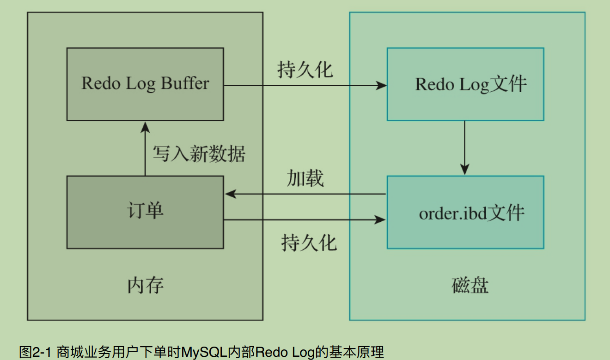
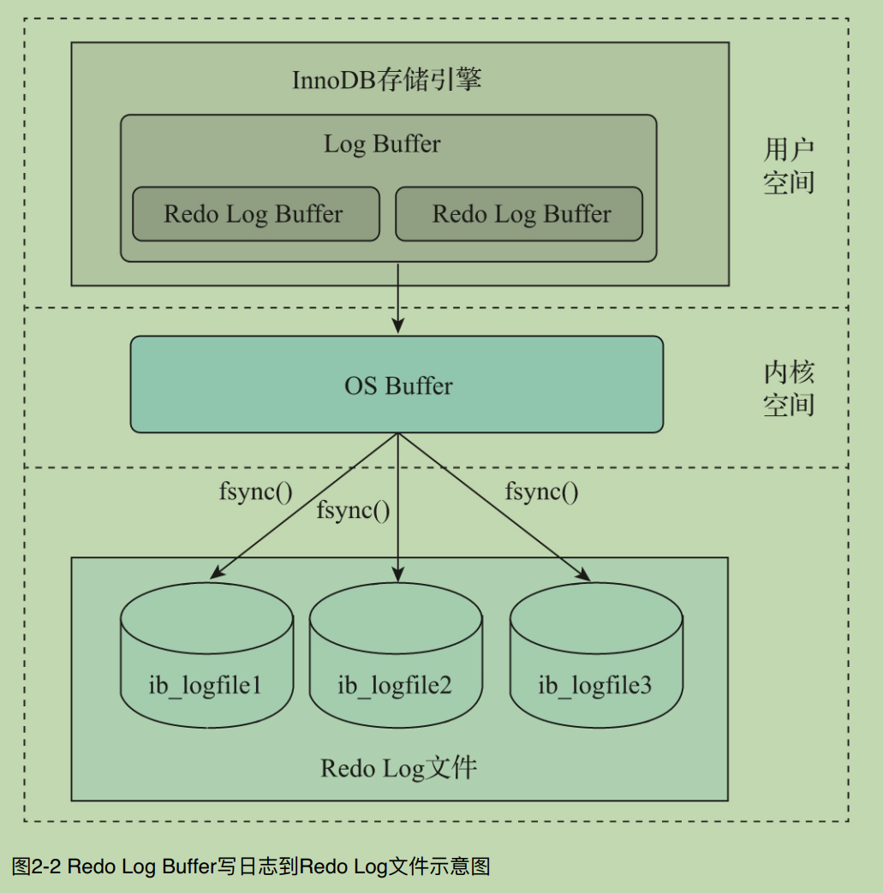
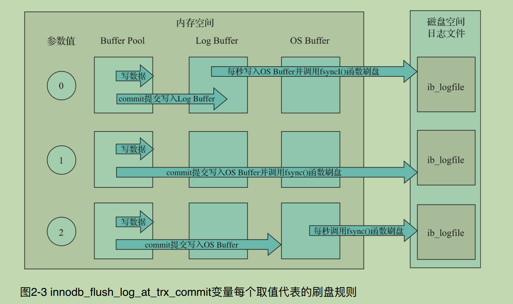
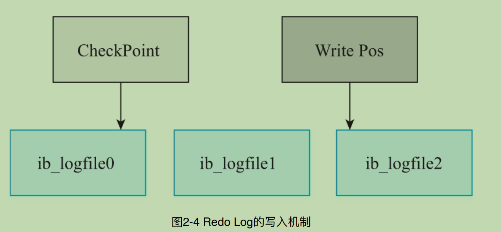

## MySQL事务的实现原理

**涉及内容:**

`1. Redo Log`

`2. Undo Log`

`3. BinLog`

`4. MySQL 事务的流程`

`5. MySQL 中的 XA 事务`

```c++
// 2.1  Redo Log
/*
    MySQL中事务的  原⼦性 和 持久性 是由Redo Log实现的.

     2.1.1 Redo Log基本概念

      Redo Log也被称作重做⽇志, 它是在InnoDB存储引擎中产⽣的，⽤来保证事务的原⼦性和持久性。

      记录物理日志, 对磁盘数据进行修改操作, 往往用来恢复提交后的物理数据页, 不过只能恢复到最后一次提交的位置.

      通常包括两部分: 

       1.日志缓冲(Redo Log Buffer) 易丢失.
       2.存放在磁盘的重做日志文件(Redo Log File),持久化到磁盘上的, 不容易丢失。

     2.1.2 Redo Log基本原理

      Redo Log能够保证事务的原⼦性和持久性，在MySQL发⽣故障时，尽⼒避免内存中的脏⻚数据写⼊数据表的IBD⽂件。在重启MySQL服务时，可以根据Redo Log恢复事务已经提交但是还未写⼊IBD⽂件中的数据，从⽽对事务提交的数据进⾏持久化操作。
*/
```



```c++
    //  Redo Log刷盘最佳实践
    /*
    创建⼀个数据库test，在数据库中创建⼀个名为flush_disk_test的数据表，如下所示.

    create	database if	not	exists	test;
    create	table	flush_disk_test(
    id	int	not	null	auto_increment,
    name	varchar(20),
    primary	key(id)
    )engine=InnoDB;

    为了测试⽅便，这⾥创建⼀个名为insert_data的存储过程，接收⼀个int类型的参数。这个参数表示向flush_disk_test数据表中插⼊的记录⾏数，如下所示.

    

    delimiter	$$
    create	procedure	insert_data(i int)
    begin
            declare	s	int	default	1;
            declare	c	varchar(50)	default	'binghe';
            while	s<=i	do
                            start	transaction;
                            insert	into	flush_disk_test	(name)	values(c);
                            commit;
                            set	s=s+1;
            end	while;
    end$$
    delimiter;

    1）将innodb_flush_log_at_trx_commit变量的值设置为0，调⽤insert_data向flush_disk_test数据表中插⼊10万条数据，如下所示。

    mysql>	call	insert_data	(100000);
    Query	OK,	0	rows	affected	(2.18	sec)


    可以看到，当innodb_flush_log_at_trx_commit变量的值设置为0时，向表中插⼊10万条数据耗时2.18s.


    2）将innodb_flush_log_at_trx_commit变量的值设置为1，调⽤insert_data向flush_disk_test数据表中插⼊10万条数据，如下所示。

    mysql>	call	insert_data	(100000);
    Query	OK,	0	rows	affected	(16.18	sec)


    3）将innodb_flush_log_at_trx_commit变量的值设置为2，调⽤insert_data向flush_disk_test数据表中插⼊10万条数据，如下所示。

    mysql>	call	insert_data	(100000);
    Query	OK,	0	rows	affected	(3.05	sec)

    其实insert_data还有优化的空间，那就是在存储过程中把事务的开启和关闭放到循环体外⾯.
*/

```

---


```c++
// 2.1.5 Redo Log写⼊机制
/*
    Redo Log 主要记录的是物理⽇志，其⽂件内容是以顺序循环的⽅式写⼊的，⼀个⽂件写满时会写⼊另⼀个⽂件，最后⼀个⽂件写满时，会向第⼀个⽂件写数据，并且是覆盖写.

    1）Wirte Pos是数据表中当前记录所在的位置，随着不断地向数据表中写数据，这个位置会向后移动，当移动到最后⼀个⽂件的最后⼀个位置时，⼜会回到第⼀个⽂件的开始位置进⾏写操作；

    2）CheckPoint是当前要擦除的位置，这个位置也是向后移动的，移动到最后⼀个⽂件的最后⼀个位置时，也会回到第⼀个⽂件的开始位置进⾏擦除。只不过在擦除记录之前，需要把记录更新到数据⽂件中；

    3）Write Pos和CheckPoint之间存在间隔时，中间的间隔表示还可以记录新的操作。如果Write Pos移动的速度较快，追上了CheckPoint，则表示数据已经写满，不能再向Redo Log⽂
    件中写数据了。此时，需要停⽌写⼊数据，擦除⼀些记录.
*/
```
```c++
// 2.1.6 Redo Log的LSN机制
/*
    LSN（Log Sequence Number）表示⽇志的逻辑序列号。在InnoDB存储引擎中，LSN占⽤8字节的存储空间，并且LSN的值是单调递增的.

    可以从 LSN 获取的信息:
     1）Redo Log写⼊数据的总量。
     2）检查点位置。
     3）数据⻚版本相关的信息。

     在MySQL的命令⾏通过如下命令可以查看LSN值。

     mysql>	show	engine	innodb	status	\G

     重要的参数说明如下所示。

    1）Log sequence number：表示当前内存缓冲区中的 Redo Log的LSN。

    2）Log flushed up to：表示刷新到磁盘上的Redo Log⽂件中的LSN。

    3）Pages flushed up to：表示已经刷新到磁盘数据⻚上的LSN。

    4）Last checkpoint at：表示上⼀次检查点所在位置的LSN。
*/
```

```c++
// 2.1.7 Redo Log相关参数
 /*
    在MySQL中，输⼊如下命令可以查看与Redo Log相关的参数。
     
    mysql> show	variables	like	'%innodb_log%';
    +-----------------------------+----------+
    | Variable_name               | Value    |
    +-----------------------------+----------+
    | innodb_log_buffer_size      | 1048576  |
    | innodb_log_checksums        | ON       |
    | innodb_log_compressed_pages | ON       |
    | innodb_log_file_size        | 50331648 |
    | innodb_log_files_in_group   | 2        |
    | innodb_log_group_home_dir   | .\       |
    | innodb_log_write_ahead_size | 8192     |
    +-----------------------------+----------+
*/
```

```c++
// 2.2 Undo Log
/*
    Undo Log在MySQL事务的实现中也起着⾄关重要的作⽤，MySQL中事务的⼀致性是由Undo Log实现的.
    

*/

```