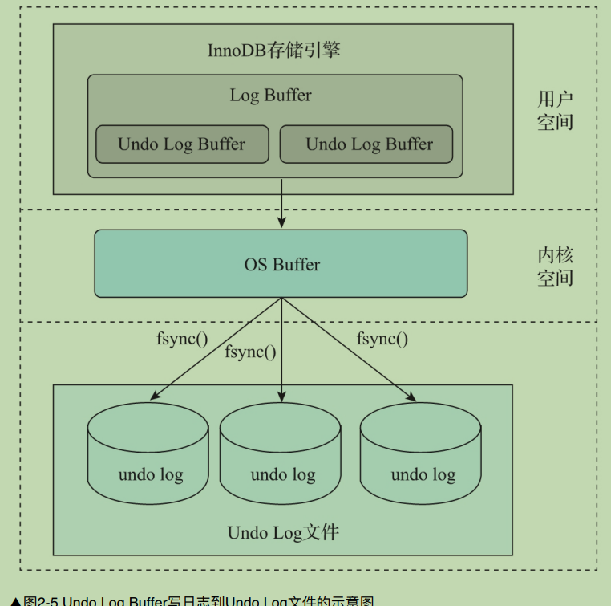
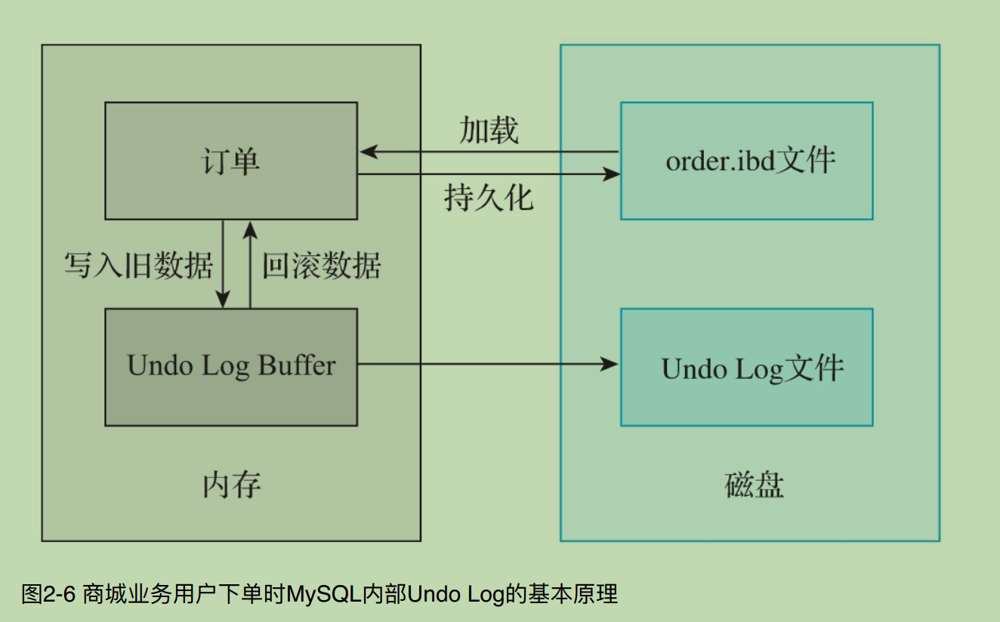
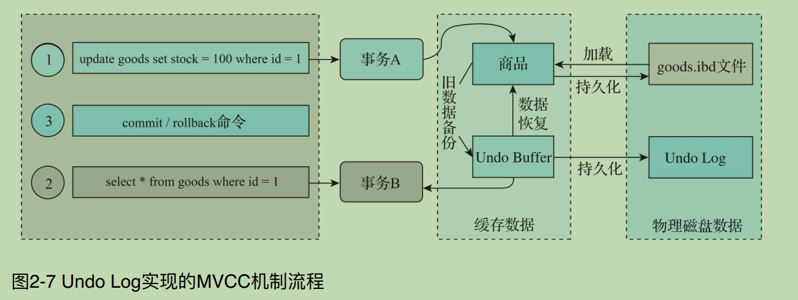

## MySQL事务的实现原理

**涉及内容:**

`1. Redo Log`

`2. Undo Log`

`3. BinLog`

`4. MySQL 事务的流程`

`5. MySQL 中的 XA 事务`

```c++
// 2.1  Redo Log
/*
    MySQL中事务的  原⼦性 和 持久性 是由Redo Log实现的.

     2.1.1 Redo Log基本概念

      Redo Log也被称作重做⽇志, 它是在InnoDB存储引擎中产⽣的,⽤来保证事务的原⼦性和持久性。

      记录物理日志, 对磁盘数据进行修改操作, 往往用来恢复提交后的物理数据页, 不过只能恢复到最后一次提交的位置.

      通常包括两部分: 

       1.日志缓冲(Redo Log Buffer) 易丢失.
       2.存放在磁盘的重做日志文件(Redo Log File),持久化到磁盘上的, 不容易丢失。

     2.1.2 Redo Log基本原理

      Redo Log能够保证事务的原⼦性和持久性,在MySQL发⽣故障时,尽⼒避免内存中的脏⻚数据写⼊数据表的IBD⽂件。在重启MySQL服务时,可以根据Redo Log恢复事务已经提交但是还未写⼊IBD⽂件中的数据,从⽽对事务提交的数据进⾏持久化操作。
*/
```


```c++
    //  Redo Log刷盘最佳实践
    /*
    创建⼀个数据库test,在数据库中创建⼀个名为flush_disk_test的数据表,如下所示.

    create	database if	not	exists	test;
    create	table	flush_disk_test(
    id	int	not	null	auto_increment,
    name	varchar(20),
    primary	key(id)
    )engine=InnoDB;

    为了测试⽅便,这⾥创建⼀个名为insert_data的存储过程,接收⼀个int类型的参数。这个参数表示向flush_disk_test数据表中插⼊的记录⾏数,如下所示.

    

    delimiter	$$
    create	procedure	insert_data(i int)
    begin
            declare	s	int	default	1;
            declare	c	varchar(50)	default	'binghe';
            while	s<=i	do
                            start	transaction;
                            insert	into	flush_disk_test	(name)	values(c);
                            commit;
                            set	s=s+1;
            end	while;
    end$$
    delimiter;

    1）将innodb_flush_log_at_trx_commit变量的值设置为0,调⽤insert_data向flush_disk_test数据表中插⼊10万条数据,如下所示。

    mysql>	call	insert_data	(100000);
    Query	OK,	0	rows	affected	(2.18	sec)


    可以看到,当innodb_flush_log_at_trx_commit变量的值设置为0时,向表中插⼊10万条数据耗时2.18s.


    2）将innodb_flush_log_at_trx_commit变量的值设置为1,调⽤insert_data向flush_disk_test数据表中插⼊10万条数据,如下所示。

    mysql>	call	insert_data	(100000);
    Query	OK,	0	rows	affected	(16.18	sec)


    3）将innodb_flush_log_at_trx_commit变量的值设置为2,调⽤insert_data向flush_disk_test数据表中插⼊10万条数据,如下所示。

    mysql>	call	insert_data	(100000);
    Query	OK,	0	rows	affected	(3.05	sec)

    其实insert_data还有优化的空间,那就是在存储过程中把事务的开启和关闭放到循环体外⾯.
*/

```

---


```c++
// 2.1.5 Redo Log写⼊机制
/*
    Redo Log 主要记录的是物理⽇志,其⽂件内容是以顺序循环的⽅式写⼊的,⼀个⽂件写满时会写⼊另⼀个⽂件,最后⼀个⽂件写满时,会向第⼀个⽂件写数据,并且是覆盖写.

    1）Wirte Pos是数据表中当前记录所在的位置,随着不断地向数据表中写数据,这个位置会向后移动,当移动到最后⼀个⽂件的最后⼀个位置时,⼜会回到第⼀个⽂件的开始位置进⾏写操作；

    2）CheckPoint是当前要擦除的位置,这个位置也是向后移动的,移动到最后⼀个⽂件的最后⼀个位置时,也会回到第⼀个⽂件的开始位置进⾏擦除。只不过在擦除记录之前,需要把记录更新到数据⽂件中；

    3）Write Pos和CheckPoint之间存在间隔时,中间的间隔表示还可以记录新的操作。如果Write Pos移动的速度较快,追上了CheckPoint,则表示数据已经写满,不能再向Redo Log⽂
    件中写数据了。此时,需要停⽌写⼊数据,擦除⼀些记录.
*/
```
```c++
// 2.1.6 Redo Log的LSN机制
/*
    LSN（Log Sequence Number）表示⽇志的逻辑序列号。在InnoDB存储引擎中,LSN占⽤8字节的存储空间,并且LSN的值是单调递增的.

    可以从 LSN 获取的信息:
     1）Redo Log写⼊数据的总量。
     2）检查点位置。
     3）数据⻚版本相关的信息。

     在MySQL的命令⾏通过如下命令可以查看LSN值。

     mysql>	show	engine	innodb	status	\G

     重要的参数说明如下所示。

    1）Log sequence number：表示当前内存缓冲区中的 Redo Log的LSN。

    2）Log flushed up to：表示刷新到磁盘上的Redo Log⽂件中的LSN。

    3）Pages flushed up to：表示已经刷新到磁盘数据⻚上的LSN。

    4）Last checkpoint at：表示上⼀次检查点所在位置的LSN。
*/
```

```c++
// 2.1.7 Redo Log相关参数
 /*
    在MySQL中,输⼊如下命令可以查看与Redo Log相关的参数。
     
    mysql> show	variables	like	'%innodb_log%';
    +-----------------------------+----------+
    | Variable_name               | Value    |
    +-----------------------------+----------+
    | innodb_log_buffer_size      | 1048576  |
    | innodb_log_checksums        | ON       |
    | innodb_log_compressed_pages | ON       |
    | innodb_log_file_size        | 50331648 |
    | innodb_log_files_in_group   | 2        |
    | innodb_log_group_home_dir   | .\       |
    | innodb_log_write_ahead_size | 8192     |
    +-----------------------------+----------+
*/
```

```c++
// 2.2 Undo Log
/*
    Undo Log在MySQL事务的实现中也起着⾄关重要的作⽤,MySQL中事务的⼀致性是由Undo Log实现的.
    Undo Log在MySQL事务的实现中主要起到两⽅⾯的作⽤：回滚事务 和 多版本并发事务, 也就是常说的MVCC机制.

     Undo Log存储⽅式
      在InnoDB存储引擎的数据⽂件中存在⼀种叫作rollback segment 的回滚段,这个回滚段内部有1024个 undo log segment段.

    Undo Log基本原理
      Undo Log写⼊磁盘时和Redo Log⼀样,默认情况下都需要经过内核空间的OS Buffer
    
     Undo Log实现MVCC机制
      在MySQL中,Undo Log除了实现事务的回滚操作外,另⼀个重要的作⽤就是实现多版本并发控制,也就是MVCC机制.
      在事务提交之前,向Undo Log 保存事务当前的数据,这些保存到Undo Log中的旧版本数据可以作为快照供其他并发事务进⾏快照读.
*/
```



```c++
/*
    Undo Log的回滚段中:undo logs分为insert undo log和update undo log

    1）insert undo log：
      事务对插⼊新记录产⽣的 Undo Log,只在事务回滚时需要,在事务提交后可以⽴即丢弃.

    2）update undo log:
      事务对记录进⾏删除和更新操作时产⽣的Undo Log, 不仅在事务回滚时需要,在⼀致性读时也需要.
      因此不能随便删除,只有当数据库所使⽤的快照不涉及该⽇志记录时,对应的回滚⽇志才会被purge线程删除.
*/
```



```c++
// Undo Log相关参数
/*
    在MySQL命令⾏输⼊如下命令可以查看Undo Log相关的参数。
      mysql> show variables	like "%undo%";
      +--------------------------+------------+
        | Variable_name            | Value      |
        +--------------------------+------------+
        | innodb_max_undo_log_size | 1073741824 | Undo Log 空间的最大值.
        | innodb_undo_directory    | .\         | Undo Log 的存储目录.
        | innodb_undo_log_truncate | OFF        | 是否开启在线回收 Undo Log 文件操作.
        | innodb_undo_logs         | 128        | Undo Log 的回滚段数量
        | innodb_undo_tablespaces  | 0          | 
        +--------------------------+------------+
*/
```

```c++
//    BinLog
/*
   Redo Log是InnoDB存储引擎特有的⽇志,MySQL也有其⾃身的⽇志,这个⽇志就是BinLog,即⼆进制⽇志。

    BinLog基本概念
      BinLog 是⼀种记录所有MySQL数据库表结构变更以及表数据变更的⼆进制⽇志.
      BinLog 中不会记录诸如select和show这类查询操作的⽇志.
      BinLog 是以事件形式记录相关变更操作的,并且包含语句执⾏所消耗的时间.
      BinLog有以下两个最重要的使⽤场景:

      1）主从复制：
      在主数据库上开启BinLog,主数据库把BinLog发送⾄从数据库,从数据库获取BinLog后通过I/O线程将⽇志写到中继⽇志,
      也就是 Relay Log 中. 然后,通过SQL线程将Relay Log中的数据同步⾄从数据库,从⽽达到主从数据库数据的⼀致性。 

      2）数据恢复：
      当MySQL数据库发⽣故障或者崩溃时,可以通过BinLog进⾏数据恢复。例如,可以使⽤ mysqlbinlog 等⼯具进⾏数据恢复。


    BinLog记录模式
          Row、Statement 和 Mixed
      1. Row 模式
          Row模式下的BinLog⽂件会记录每⼀⾏数据被修改的情况,然后在MySQL从数据库中对相同的数据进⾏修改。
          优点是能够⾮常清楚地记录每⼀⾏数据的修改情况,完全实现主从数据库的同步和数据的恢复.
          缺点是如果主数据库中发⽣批量操作,尤其是⼤批量的操作,会产⽣⼤量的⼆进制⽇志.
          ⽐如,使⽤alter table操作修改拥有⼤量数据的数据表结构时,会使⼆进制⽇志的内容暴涨,
          产⽣⼤量的⼆进制⽇志,从⽽⼤⼤影响主从数据库的同步性能.

      2. Statement模式
          Statement模式下的BinLog⽂件会记录每⼀条修改数据的SQL语句,MySQL从数据库在复制SQL语句的时候,
          会通过SQL进程将BinLog中的SQL语句解析成和MySQL主数据库上执⾏过的SQL语句相同的SQL语句,然后在从数据库上执⾏SQL进程解析出来的SQL语句。

          Statement模式的优点是由于不记录数据的修改细节,只是记录数据表结构和数据变更的SQL语句,
          因此产⽣的⼆进制⽇志数据量⽐较⼩,这样能够减少磁盘的I/O操作,提升数据存储和恢复的效率。

          缺点是在某些情况下,可能会导致主从数据库中的数据不⼀致。
          例如,在MySQL主数据库中使⽤了last_insert_id()和now()等函数,会导致MySQL主从数据库中的数据不⼀致。

      3. Mixed模式
          Mixed模式下的BinLog是Row模式和Statement模式的混⽤.
          在这种模式下,⼀般会使⽤Statement模式保存BinLog,如果存在Statement模式⽆法复制的操作.
          例如在MySQL主数据库中使⽤了last_insert_id()和now()等函数,MySQL会使⽤Row模式保存BinLog.
          也就是说,如果将BinLog的记录模式设置为Mixed,MySQL会根据执⾏的SQL语句选择写⼊的记录模式.

    BinLog写⼊机制
      MySQL事务在提交的时候,会记录事务⽇志和⼆进制⽇志,也就是Redo Log和BinLog.
      对于事务⽇志和⼆进制⽇志,MySQL会先记录哪种呢？

      Redo Log是InnoDB存储引擎特有的⽇志,BinLog是MySQL本身就有的上层⽇志,并且会先于InnoDB的事务⽇志被写⼊,
      因此在MySQL中,⼆进制⽇志会先于事务⽇志被写⼊.


    BinLog与Redo Log的区别
      BinLog和Redo Log在⼀定程度上都能恢复数据,但是⼆者有着本质的区别,如下:

      1）BinLog是MySQL本身就拥有的,不管使⽤何种存储引擎,BinLog都存在,⽽Redo Log是InnoDB存储引擎特有的,只有InnoDB存储引擎才会输出Redo Log
      2）BinLog是⼀种逻辑⽇志,记录的是对数据库的所有修改操作,⽽Redo Log是⼀种物理⽇志,记录的是每个数据⻚的修改.
      3）Redo Log具有幂等性,多次操作的前后状态是⼀致的,⽽BinLog不具有幂等性,记录的是所有影响数据库的操作.
      例如插⼊⼀条数据后再将其删除,则Redo Log前后的状态未发⽣变化,⽽BinLog就会记录插⼊操作和删除操作.
      4）BinLog开启事务时,会将每次提交的事务⼀次性写⼊内存缓冲区,如果未开启事务,则每次成功执⾏插⼊、更新和删除语句时,
      就会将对应的事务信息写⼊内存缓冲区,⽽Redo Log是在数据准备修改之前将数据写⼊缓冲区的Redo Log中,然后在缓冲区中修改数据.
      ⽽且在提交事务时,先将Redo Log写⼊缓冲区,写⼊完成后再提交事务.
      5）BinLog只会在事务提交时,⼀次性写⼊BinLog,其⽇志的记录⽅式与事务的提交顺序有关,并且⼀个事务的BinLog中间不会插⼊其他事务的BinLog。
      ⽽Redo Log记录的是物理⻚的修改,最后⼀个提交的事务记录会覆盖之前所有未提交的事务记录,并且⼀个事务的Redo Log中间会插⼊其他事务的Redo Log.
      6）BinLog是追加写⼊，写完⼀个⽇志⽂件再写下⼀个⽇志⽂件，不会覆盖使⽤，⽽Redo Log是循环写⼊，⽇志空间的⼤⼩是固定的，会覆盖使⽤.
      7）BinLog⼀般⽤于主从复制和数据恢复，并且不具备崩溃⾃动恢复的能⼒，⽽Redo Log是在服务器发⽣故障后重启MySQL，⽤于恢复事务已提交但未写⼊数据表的数据.

    BinLog相关参数
      mysql> show  variables  like  '%log_bin%'
            +---------------------------------+-------+
            | Variable_name                   | Value |
            +---------------------------------+-------+
            | log_bin                         | OFF   |
            | log_bin_basename                |       |
            | log_bin_index                   |       |
            | log_bin_trust_function_creators | OFF   |
            | log_bin_use_v1_row_events       | OFF   |
            | sql_log_bin                     | ON    |
            +---------------------------------+-------+
      mysql> show  variables  like  '%binlog%';
      +-----------------------------------------+----------------------+
      | Variable_name                           | Value                |
      +-----------------------------------------+----------------------+
      | binlog_cache_size                       | 32768                |
      | binlog_checksum                         | CRC32                |
      | binlog_direct_non_transactional_updates | OFF                  |
      | binlog_error_action                     | ABORT_SERVER         |
      | binlog_format                           | ROW                  |
      | binlog_group_commit_sync_delay          | 0                    |
      | binlog_group_commit_sync_no_delay_count | 0                    |
      | binlog_gtid_simple_recovery             | ON                   |
      | binlog_max_flush_queue_time             | 0                    |
      | binlog_order_commits                    | ON                   |
      | binlog_row_image                        | FULL                 |
      | binlog_rows_query_log_events            | OFF                  |
      | binlog_stmt_cache_size                  | 32768                |
      | innodb_api_enable_binlog                | OFF                  |
      | innodb_locks_unsafe_for_binlog          | OFF                  |
      | log_statements_unsafe_for_binlog        | ON                   |
      | max_binlog_cache_size                   | 18446744073709547520 |
      | max_binlog_size                         | 1073741824           |
      | max_binlog_stmt_cache_size              | 18446744073709547520 |
      | sync_binlog                             | 1                    |
      +-----------------------------------------+----------------------+

*/

```