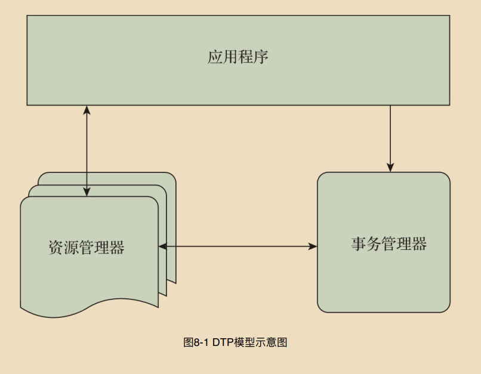

# 第三部分 分布式事务原理

## 第八章 - XA强⼀致性分布式事务原理

* X/Open DTP模型与XA规范分布式系统架构演进

*  MySQL对XA规范的⽀持

* XA规范的优化与思考

* 主流XA分布式事务的解决⽅案


## 8.1 X/Open DTP模型与XA规范

#### 8.1.1 DTP模型

```c++
    DTP模型主要定义了3个核⼼组件，分别是应⽤程序、资源管理器和事务管理器. 
    1）应⽤程序⽤于定义事务边界，即定义事务的开始和结束，并且在事务边界内对资源进⾏操
    作

    2）资源管理器也称为事务参与者，如数据库、⽂件系统等，并提供访问资源的⽅式

    3）事务管理器也称为事务协调者，负责分配事务唯⼀标识，监控事务的执⾏进度，并负责事
    务的提交、回滚等操作
 ```
 

 #### 8.1.2 XA 规范

1）xa_start：负责开启或恢复⼀个事务分⽀，并且管理XID到调⽤线程

2）xa_end：负责取消当前线程与事务分⽀的关联

3）xa_prepare：负责询问资源管理器是否准备好提交事务分⽀

4）xa_commit：负责通知资源管理器提交事务分⽀

5）xa_rollback：负责通知资源管理器回滚事务分⽀

6）xa_recover：负责列出需要恢复的 XA 事务分⽀

#### 8.1.3 JTA规范

#### 8.1.4 XA⼆阶段提交

```c++
    ⼀阶段：执⾏XA PREPARE语句。事务管理器通知各个资源管理器准备提交它们的事务分⽀。
    资源管理器收到通知后执⾏XA PREPARE语句。
    
    ⼆阶段：执⾏XA COMMIT/ROLLBACK语句。事务管理器根据各个资源管理器的
    XA PREPARE语句执⾏结果，决定是提交事务还是回滚事务。如果所有的资源管理器都预提交
    成功，那么事务管理器通知所有的资源管理器执⾏XA提交操作；如果有资源管理器的
    XA PREPARE语句执⾏失败，则由事务管理器通知所有资源管理器执⾏XA回滚操作。
```

### 8.2 MySQL对XA规范的⽀持


### 8.3 XA规范的问题思考
**P253**


