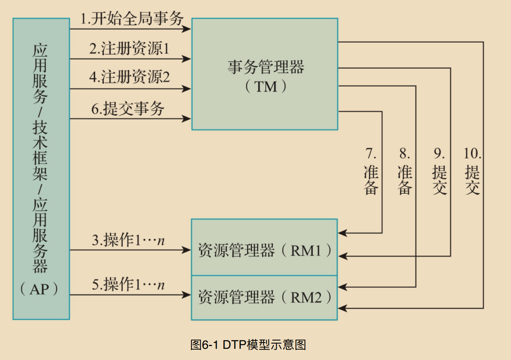
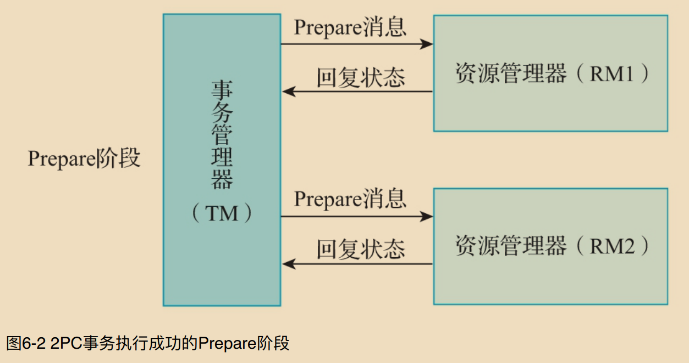
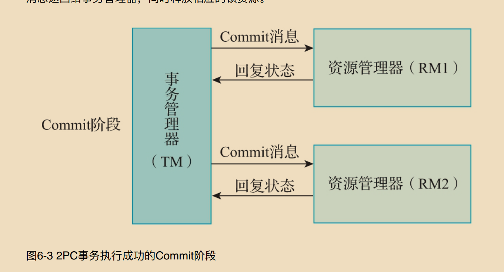
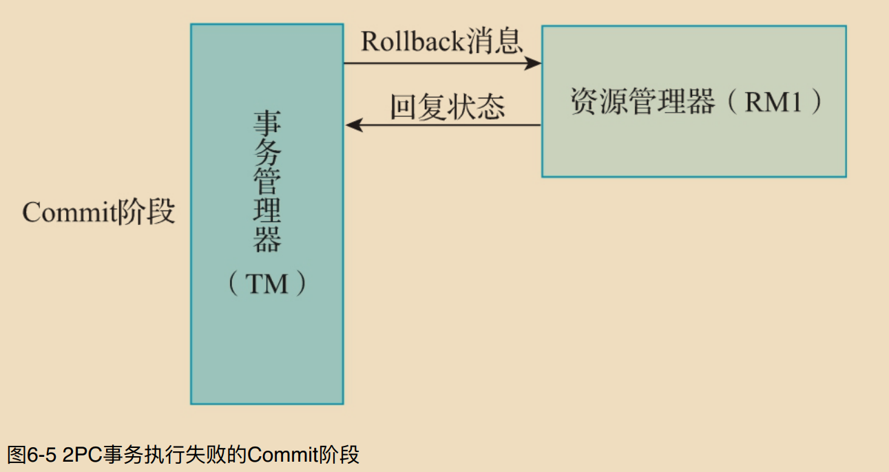
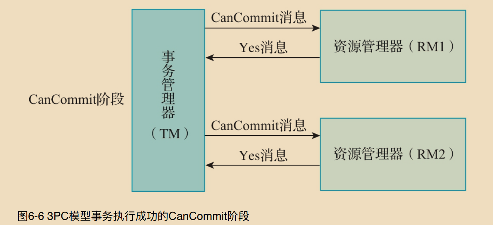
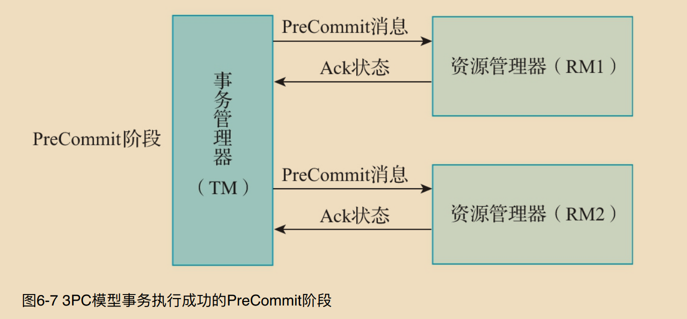
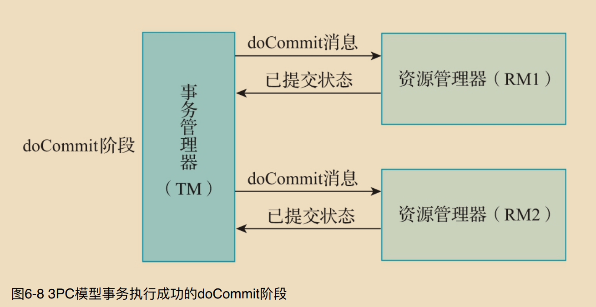
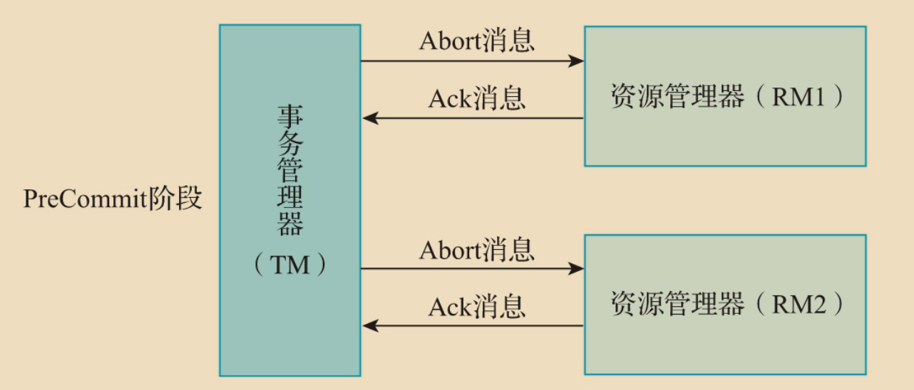
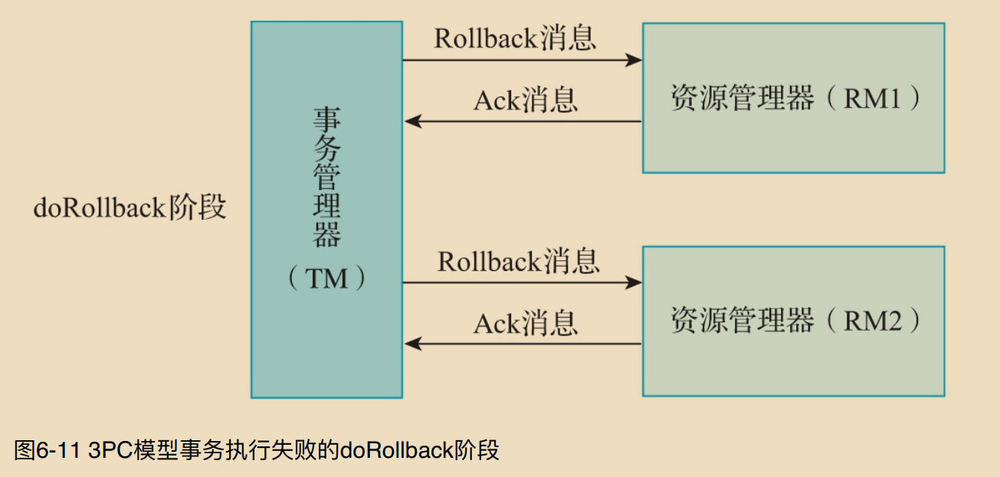

# 分布式事务解决方案

## 强一致性分布式事务解决方案
* `DTP 模型`
* `2PC 模型`
* `3PC 模型`
  
```c++
            强⼀致性事务概述
        强⼀致性分布式事务要求在任意时刻查询参与全局事务的各节点的数据都是⼀致的.

            1. 典型案例
        在强⼀致性事务解决⽅案中，典型的⽅案包括DTP模型（全局事务模型）、2PC模型（⼆阶段提交模型）和3PC模型（三阶段提交模型）3种.


        基于DTP模型，典型的解决⽅案是分布式通信协议 XA 规范，MySQL默认⽀持XA规范.
        另外，Atomikos 框架和 Dromara 开源社区的RainCat框架也在应⽤层⽀持 XA 规范，能够实现分布式事务。  

        基于 2PC 模型，典型的解决⽅案是Dromara开源社区开源的RainCat框架，在应⽤层实现了 2PC 模型，避免出现在数据库层实现2PC模型时阻塞数据库的情况.

        由于3PC模型的设计过于复杂，在解决2PC问题的同时⼜引⼊了新的问题，因此在实际⼯作中的应⽤不是很⼴泛.

            2. 适用场景
        ⼀致性事务要求应⽤程序在任何时间，读取任意节点上的数据，都是最新写⼊的.

        强⼀致性事务解决⽅案存在如下优点:
         1）数据⼀致性⽐较⾼。
         2）在任意时刻都能够查询到最新写⼊的数据。
        
        强⼀致性事务解决⽅案也存在着如下缺点:
         1）存在性能问题，在分布式事务未完全提交和回滚之前，应⽤程序不会查询到最新的数据。
         2）实现复杂。
         3）牺牲了可⽤性。
         4）不适合⾼并发场景。

         
            DTP模型
          1.DTP模型的重要概念

        DTP模型中定义了⼏个重要的概念，分别为 事务、全局事务、分⽀事务 和 控制线程.
         1）事务：⼀个事务就是⼀个完整的⼯作单元，具备ACID特性。

         2）全局事务：由事务管理器管理的事务，能够⼀次性操作多个资源管理器。

         3）分⽀事务：由事务管理器管理的全局事务中，每个资源管理器中独⽴执⾏的事务。

         4）控制线程：执⾏全局事务的线程，这个线程⽤来关联应⽤程序、事务管理器和资源管理器
        三者之间的关系，也就是表示全局事务和分⽀事务的关系，通常称为事务上下⽂环境。

          2. DTP模型的执⾏流程
          
```


```c++
        在DTP模型中，主要定义了3个核⼼组件，分别为AP、TM、RM.
         1）AP：应⽤程序（Application Program）可以理解为参与 DTP 分布式事务模型的应⽤程序.

         2）RM：资源管理器（Resource Manager）可以理解为数据库管理系统或消息服务管理器。
        应⽤程序可以通过资源管理器对相应的资源进⾏有效的控制。相应的资源需要实现 XA 定义的接⼝.

        3）TM：事务管理器（Transaction Manager）负责协调和管理DTP模型中的事务，为应⽤程序提供编程接⼝，同时管理资源管理器.
    
    AP可以和 TM、RM 通信，TM 和 RM 互相之间可以通信，DTP模型定义了 XA 接⼝，TM 和 RM 能够通过 XA 接⼝进⾏双向通信.
    TM 控制着全局事务，管理事务的⽣命周期并协调资源。RM控制和管理实际的资源.

          3. 2PC模型    
        2PC 模型是指两阶段提交协议模型，这种模型将整个事务流程分为 Prepare阶段 和 Commit阶段.
        2PC 中的2指的是两个阶段，P是指 Prepare，即准备，C是指 Commit，即提交.

             2PC模型的执⾏流程
              1.Prepare阶段

              在Prepare阶段，事务管理器给每个参与全局事务的资源管理器发送Prepare消息，资源管理器要么返回失败，要么在本地执⾏相应的事务，
              将事务写⼊本地的 Redo Log ⽂件和 Undo Log ⽂件，此时，事务并没有提交.

              2.Commit阶段
              
              如果事务管理器收到了参与全局事务的资源管理器返回的失败消息，则直接给 Prepare阶段 执⾏成功的资源管理器发送回滚消息.
              否则，向每个资源管理器发送 Commit消息.相应的资源管理器根据事务管理器发送过来的消息指令,执⾏对应的事务回滚或事务提交操作，
              并且释放事务处理过程中使⽤的锁资源.

              事务执⾏成功的流程
               在2PC模型中，正常情况下，分布式事务执⾏成功时，整体上也分为 Prepare阶段 和 Commit阶段.
               在 Prepare阶段 事务管理器会向各资源管理器发送 Prepare消息，在Commit阶段事务管理器会向各资源管理器发送Commit消息.
```


```c++
              事务执⾏失败的流程
        在2PC模型中，当执⾏分布式事务失败时，例如在 Prepare阶段，某些资源管理器向事务管理器响应了Error消息，
        则在Commit阶段，事务管理器会向其他响应正常消息的资源管理器发送回滚消息.    
```



```c++
        4 2PC模型存在的问题

        2PC模型存在着如下的缺点:

    1）同步阻塞问题：事务的执⾏过程中，所有参与事务的节点都会对其占⽤的公共资源加锁，导致其他访问公共资源的进程或者线程阻塞。

    2）单点故障问题：如果事务管理器发⽣故障，则资源管理器会⼀直阻塞。

    3）数据不⼀致问题：如果在Commit阶段，由于⽹络或者部分资源管理器发⽣故障，导致部分资源管理器没有接收到事务管理器发送过来的Commit消息，会引起数据不⼀致的问题。

    4）⽆法解决的问题：如果在Commit阶段，事务管理器发出Commit消息后宕机，并且唯⼀接收到这条Commit消息的资源管理器也宕机了，则⽆法确认事务是否已经提交。

          
          3PC模型
    3PC模型是指三阶段提交模型，是在2PC模型的基础上改进的版本.
    3PC模型把2PC模型中的 Prepare阶段 ⼀分为⼆，最终形成3个阶段：CanCommit阶段、PreCommit阶段 和 doCommit 或者 doRollback阶段.
    3PC模型的流程同样分为事务执⾏成功和事务执⾏失败两种情况.

        1. 事务执⾏成功的流程   
```



```c++
由图6-6可以看出，在事务执⾏成功的CanCommit阶段，事务管理器向参与全局事务的资源管
理器发送CanCommit消息，资源管理器收到CanCommit消息，认为能够执⾏事务，会向事务
管理器响应Yes消息，进⼊预备状态。

由图6-7可以看出，在事务执⾏成功的PreCommit阶段，事务管理器会向参与全局事务的资源管
理器发送PreCommit消息，资源管理器收到PreCommit消息后，执⾏事务操作，将Undo和Redo信
息写⼊事务⽇志，并向事务管理器响应Ack状态，但此时不会提交事务.

由图6-8可以看出，在事务执⾏成功的doCommit阶段，事务管理器会向参与全局事务的资源管
理器发送doCommit消息，资源管理器接收到doCommit消息后，正式提交事务，并释放执⾏事
务期间占⽤的资源，同时向事务管理器响应事务已提交的状态。事务管理器收到资源管理器响
应的事务已提交的状态，完成事务的提交.   

        2. 事务执⾏失败的流程
在3PC模型中，某些资源管理器接收到事务管理器发送过来的CanCommit消息时，如果资源管
理器认为不能执⾏事务，则会向事务管理器响应⽆法执⾏事务的No消息。之后事务管理器会在
PreCommit阶段向资源管理器发送准备回滚的消息，资源管理器向事务管理器响应准备好事务
回滚的消息。在doRollback阶段，事务管理器会向资源管理器发送回滚事务的消息.
```




```c++
由图6-10可以看出，在事务执⾏失败的PreCommit阶段，事务管理器会向参与全局事务的资源
管理器发送Abort消息，资源管理器收到Abort消息或者期间出现超时，都会中断事务的执⾏。

由图6-11可以看出，在事务执⾏失败的doRollback阶段，事务管理器会向参与全局事务的资源
管理器发送Rollback消息，资源管理器会利⽤ Undo Log ⽇志信息回滚事务，并释放执⾏事务期间占⽤的资源，向事务管理器返回事务已回滚的状态。事务管理器收到资源管理器返回的事务已回滚的消息，完成事务回滚.

        3. 3PC模型中存在的问题
与2PC模型相⽐，3PC模型主要解决了单点故障问题，并减少了事务执⾏过程中产⽣的阻塞现
象。在3PC模型中，如果资源管理器⽆法及时收到来⾃事务管理器发出的消息，那么资源管理
器就会执⾏提交事务的操作，⽽不是⼀直持有事务的资源并处于阻塞状态，但是这种机制会导
致数据不⼀致的问题.

如果由于⽹络故障等原因，导致资源管理器没有及时收到事务管理器发出的Abort消息，则源
管理器会在⼀段时间后提交事务，这就导致与其他接收到Abort消息并执⾏了事务回滚操作的资源管理器的数据不⼀致.


                            本章⼩结
"
本章主要介绍了强⼀致性分布式事务的解决⽅案，包括强⼀致性分布式事务概述、DTP模型、
2PC模型和3PC模型，并详细描述了各个模型的执⾏流程，同时对2PC模型和3PC模型存在的
问题进⾏了简单的介绍. 
"
```
