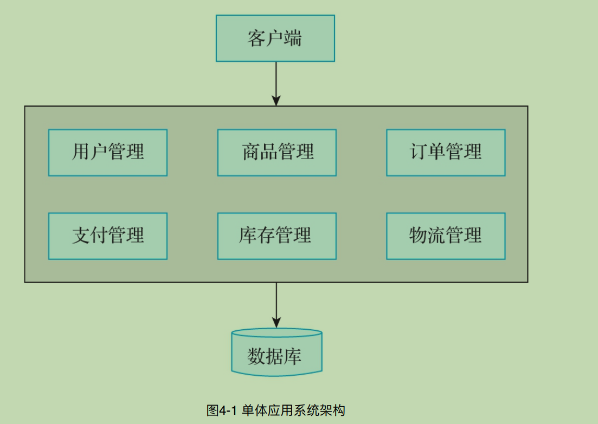
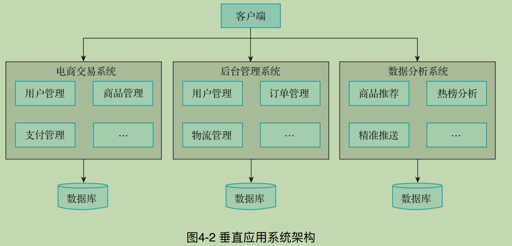
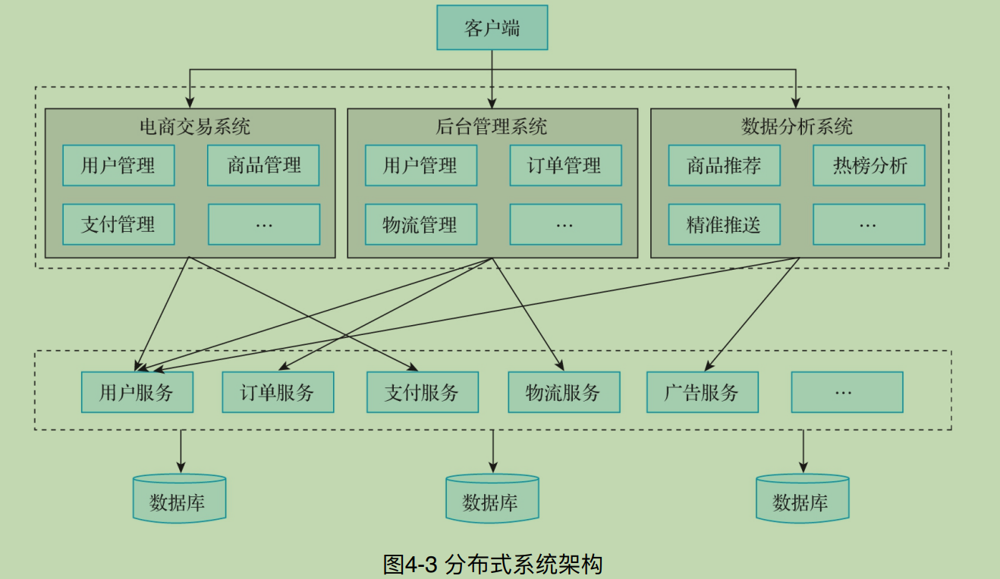
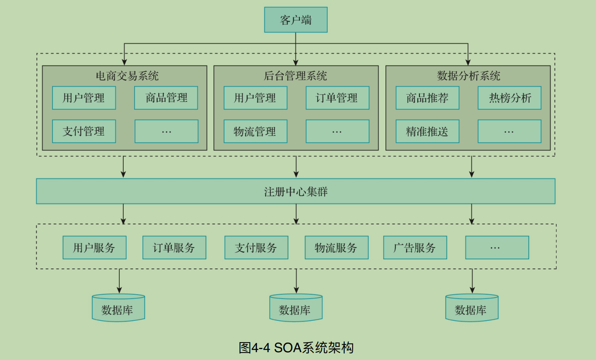
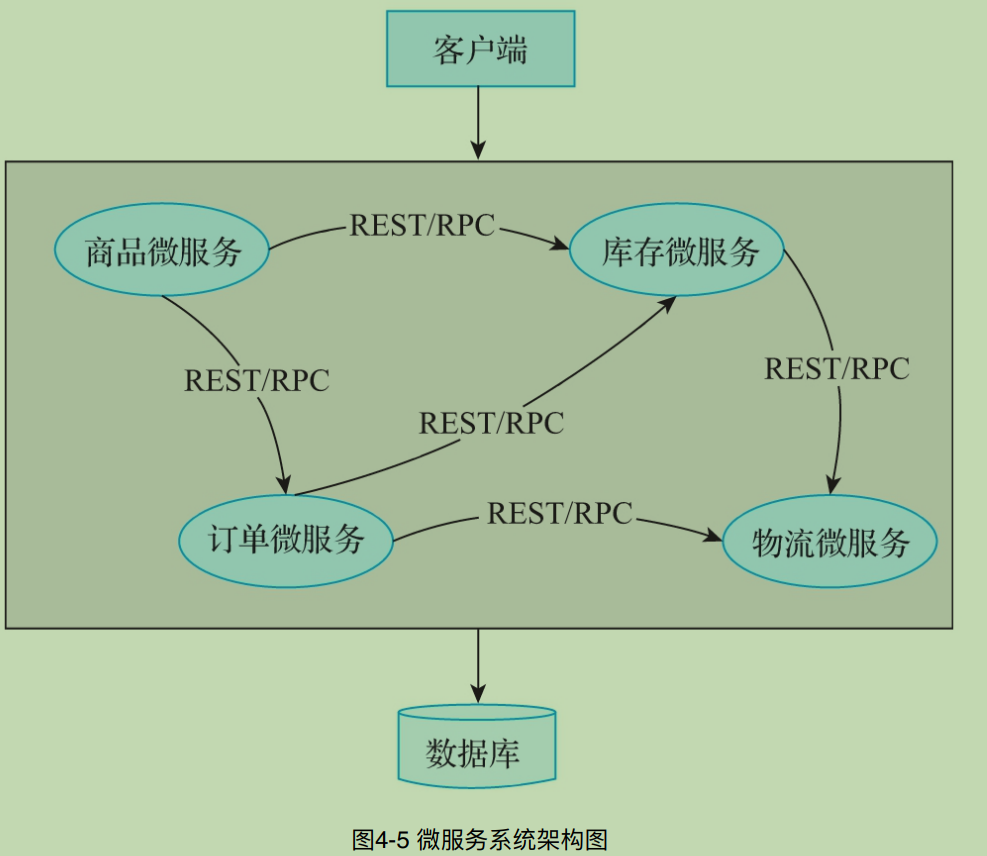
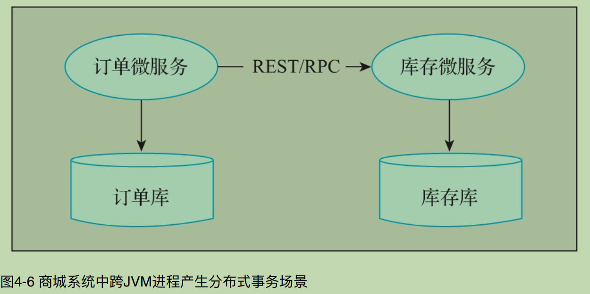
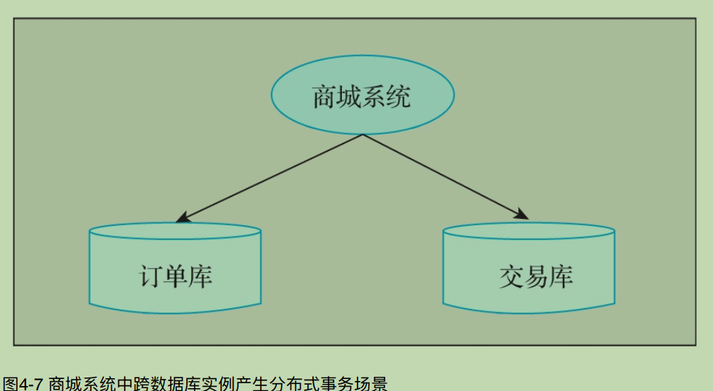
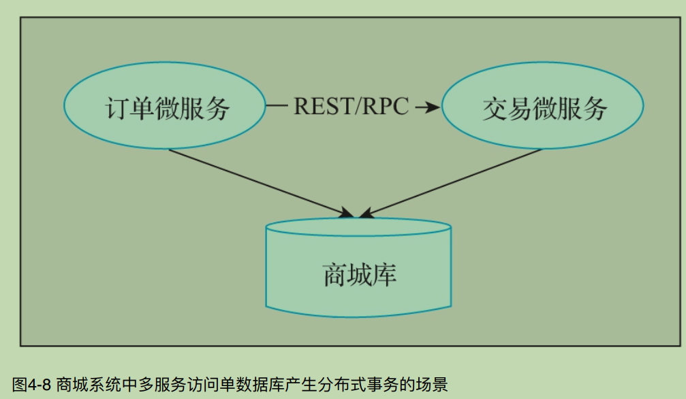

## 分布式事务的基本概念
```c++
    当单台数据库难以存储海量数据时，⼈们便开始探索如何将这些数据分散地存储到多台服务器的多台数据库中，逐渐形成了分布式数据库。

    如果将数据分散存储，对于数据的增删改查操作就会变得更加复杂，尤其是难以保证数据的⼀致性问题，这就涉及了常说的分布式事务。

    ·  分布式系统架构原则。

    · 分布式系统架构演进。

    · 分布式事务场景。

    · 数据⼀致性。

    4.1 分布式系统架构
      15 项架构原则:

        · N+1设计。

        · 回滚设计。

        · 禁⽤设计。

        · 监控设计。

        · 设计多活数据中⼼。

        · 使⽤成熟的技术。

        · 异步设计。

        · ⽆状态系统。

        · ⽔平扩展⽽⾮垂直升级。

        · 设计时⾄少要有两步前瞻性。

        · ⾮核⼼则购买。

        · 使⽤商品化硬件。

        · ⼩构建、⼩发布和快试错。

        · 隔离故障。

        · ⾃动化。

    4.2 分布式系统架构演进

        系统架构⼤致经历了:>

         单体应⽤架构—垂直应⽤架构—分布式架构—SOA架构—微服务架构
```
`1. 单体应⽤架构 `


`2. 垂直应用架构`
  

`3. 分布式架构`


`4. SOA架构`


`5. 微服务架构`


```c++
    4.3 分布式事务场景

      将⼀个⼤的应⽤系统拆分为多个可以独⽴部署的应⽤服务，需要各个服务远程协作才能完成某些事务操作，这就涉及分布式事务的问题。总的来讲，分布式事务会在3种场景下产⽣，分别是 跨JVM进程、跨数据库实例 和多服务访问单数据库。
```

`1. 跨JVM进程`


`2. 跨数据库实例`


`3. 多服务访问单数据库`


```c++
    4.4 数据⼀致性

       数据的⼀致性问题
         总的来说，数据的⼀致性问题包含数据多副本、调⽤超时、缓存与数据库不⼀致、多个缓存节点数据不⼀致等场景.

        1. 数据多副本场景

           如果数据的存储存在多副本的情况，当⽹络、服务器或者系统软件出现故障时，可能会导致⼀部分副本写⼊成功，⼀部分副本写⼊失败，造成各个副本之间数据的不⼀致.

        2. 调用超时

    调⽤超时场景包含 同步调⽤超时 和 异步调⽤超时。

    同步调⽤超时往往是由于⽹络、服务器或者系统软件异常引起的，例如，服务A同步调⽤服务B时出现超时现象，导致服务A与服务B之间的数据不⼀致。

    异步调⽤超时是指服务A异步调⽤服务B，同样是由于⽹络、服务器或者系统软件异常导致调⽤失败，出现服务A与服务B之间的数据不⼀致的情况。⼀个典型的场景就是⽀付成功的异步回调通知。
        
        3.缓存与数据库不⼀致场景

        这种场景主要针对缓存与数据库。在⾼并发场景下，⼀些热数据会缓存到 Redis 或者其他缓存组件中。此时，如果对数据库中的数据进⾏新增、修改和删除操作，缓存中的数据如果得不到及时更新，就会导致缓存与数据库中数据不⼀致.
        
        4. 多个缓存节点数据不⼀致场景

    这种场景主要针对缓存内部各节点之间数据的不⼀致.
    例如在Redis集群中，由于⽹络异常等原因引起的脑裂问题，就会导致多个缓存节点数据不⼀致.


      数据⼀致性解决⽅案
    业界对于数据⼀致性问题提出了相应的解决⽅案，⽬前⽐较成熟的⽅案有 ACID特性、CAP理论、Base理论、DTP模型、2PC（两阶段提交）模型、3PC（三阶段提交）模型、TCC模型、可靠消息最终⼀致性模型、最⼤努⼒通知模型等。
```