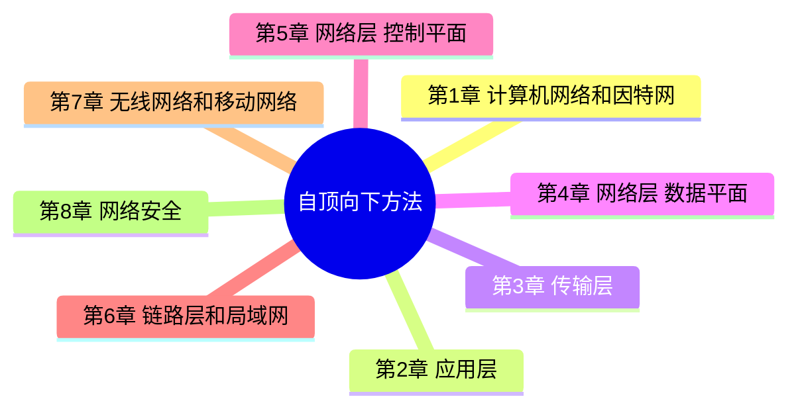

# 计算机网络：自顶向下方法

> 《计算机网络：自顶向下方法》（Computer Networking: A Top-Down Approach）读书笔记

## 全书结构

## 章节目录

| 章节 | 主题 | 笔记 |
| --- | --- | --- |
| 第 1 章 | 计算机网络和因特网 | [第1章-计算机网络和因特网](第1章-计算机网络和因特网.md) |
| 第 2 章 | 应用层 | [第2章-应用层](第2章-应用层.md) |
| 第 3 章 | 传输层 | [第3章-传输层](第3章-传输层.md) |
| 第 4 章 | 网络层：数据平面 | [第4章-网络层-数据平面](第4章-网络层-数据平面.md) |
| 第 5 章 | 网络层：控制平面 | [第5章-网络层-控制平面](第5章-网络层-控制平面.md) |
| 第 6 章 | 链路层和局域网 | [第6章-链路层和局域网](第6章-链路层和局域网.md) |
| 第 7 章 | 无线网络和移动网络 | [第7章-无线网络和移动网络](第7章-无线网络和移动网络.md) |
| 第 8 章 | 计算机网络中的安全 | [第8章-计算机网络中的安全](第8章-计算机网络中的安全.md) |

## 阅读顺序

自顶向下：应用层 → 传输层 → 网络层 → 链路层 → 物理层，最后是无线与安全专题。

## 说明

- 每章按教材完整目录逐节展开，含关键公式、对比表格与 Mermaid 图示。
- 第 1–4 章基于原始笔记整理，第 5–8 章按教材通用内容补写。
- 原始思维导图见 `自顶向下.drawio`。
