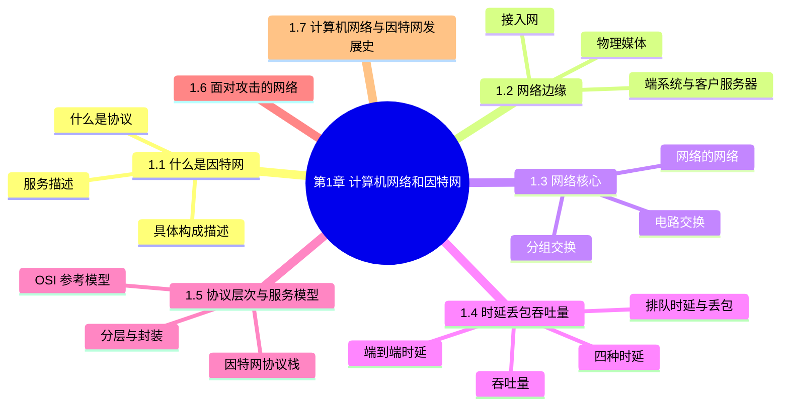
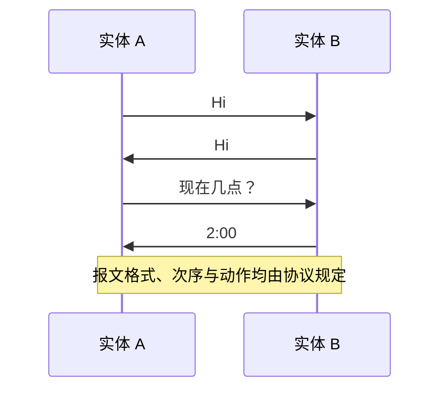
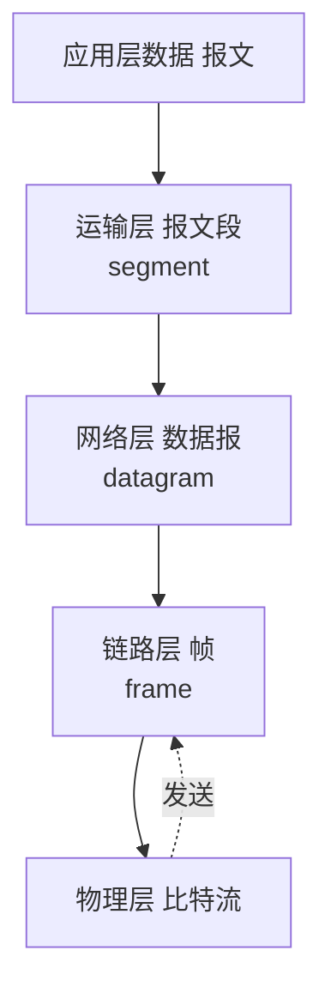

# 第 1 章 计算机网络和因特网

> 《计算机网络：自顶向下方法》读书笔记

## 本章导览

---

## 1.1 什么是因特网

回答"什么是因特网"有两种互补的角度：**具体构成描述**（硬件与软件的组成）和**服务描述**（为分布式应用提供了什么）。

### 1.1.1 具体构成描述

- **端系统**（end system / 主机 host）：接入因特网的设备，如 PC、服务器、手机、TV、汽车、传感器。端系统又分为**客户**（client）与**服务器**（server）。
- **通信链路**（communication link）：连接端系统与交换机的物理介质，如双绞铜线、同轴电缆、光纤、无线电频谱。链路的**传输速率**以比特/秒（bps）度量，即**带宽**。
- **分组**（packet）：当一台端系统向另一台端系统发送数据时，发送端把数据**分段**，并为每段加上**首部字节**，由此形成的包称为分组。
- **分组交换机**（packet switch）：从入链路接收分组，并把它转发到某条出链路。最常见的两类是**路由器**（router，用于网络核心）与**链路层交换机**（link-layer switch，用于接入网）。
- **路径**（route / path）：分组从发送端到接收端所经过的一系列通信链路和分组交换机。
- **ISP**（因特网服务提供商）：为端系统提供接入，ISP 本身也是由多条链路与交换机组成的网络，并呈**层次化**（家庭/企业接入 ISP → 区域 ISP → 第一层 ISP），不同层之间通过 **IXP**（因特网交换点）互联。
- **协议**：控制因特网中信息的接收与发送，端系统和交换机都要运行。
- **因特网标准**：由 **IETF** 制定，标准文档称为 **RFC**（Request for Comments）。

### 1.1.2 服务描述

从服务角度看，因特网是**为分布式应用提供服务的互联基础设施**：

- 分布式应用运行在端系统上，彼此交换数据（Web、即时消息、流媒体、视频会议、P2P 文件共享等）。
- 应用通过**套接字接口**（socket interface）请求因特网传送数据。
- 因特网向应用提供两类服务：**面向连接的可靠服务**（有连接、可靠交付，对应 TCP）和**无连接不可靠服务**（无连接、不保证交付，对应 UDP）。

### 1.1.3 什么是协议

以人类对话类比：两人问候后询问"现在几点"，对方回答——这套交互由**约定**（几点问、几点答、如何应答）规定。

> **协议**（protocol）定义了在两个或多个通信实体之间交换的**报文格式和次序**，以及发送和/或在接收一条报文或其他事件时所采取的**动作**。

---

## 1.2 网络边缘

网络边缘由端系统构成，端系统又分为**客户**与**服务器**。端系统通过**接入网**连接到边缘路由器。

### 1.2.1 接入网

接入网指将端系统物理连接到其**边缘路由器**的网络。

| 场景 | 技术 | 特点 |
| --- | --- | --- |
| 家庭 | DSL（数字用户线） | 复用电话线，上行/下行速率不对称，靠近端局的接入复用器 DSLAM |
| 家庭 | 电缆（HFC 混合光纤同轴） | 复用有线电视电缆，共享广播信道，需电缆调制解调器与 CMTS |
| 家庭 | FTTH（光纤到户） | 光纤直连，AON/PON 两种架构，速率最高 |
| 家庭 | 拨号、卫星、WiMax | 速率低或时延高 |
| 企业/家庭 | 以太网 | 双绞线接入以太网交换机，速率高 |
| 企业/公共 | WiFi（802.11） | 共享无线信道，经 AP 接入 |
| 广域无线 | 3G / 4G LTE / 5G | 蜂窝移动接入，覆盖广 |

### 1.2.2 物理媒体

- **导引型媒体**：双绞铜线（电话线、LAN 网线）、同轴电缆、光纤（高速、抗电磁干扰、低衰减）。
- **非导引型媒体**：陆地无线电信道、卫星无线电信道。
- 光纤速率范围极广（数十 Gbps 到数百 Gbps），是长途骨干的首选。

---

## 1.3 网络核心

网络核心是互联因特网端系统的**分组交换机**与**链路**构成的网状网络。移动数据的两种基本方法是**分组交换**与**电路交换**。

### 1.3.1 分组交换

- 源把长报文划分为较小的**分组**，分组经通信链路与分组交换机传送。
- **存储转发传输**（store-and-forward）：交换机必须接收完整个分组后，才能开始向出链路传输。经一条链路的存储转发时延为 $L/R$（ $L$ 为分组比特数， $R$ 为链路速率）。
- **排队时延与丢包**：每条链路的**输出缓存**（输出队列）暂存待发分组。若链路正忙，到达分组需排队；缓存有限，占满时分组被**丢弃**（丢包）。
- 两种分组交换机：**路由器**（网络核心）与**链路层交换机**（接入网）。路由器通常用于网络核心，链路层交换机通常用于接入网。

> **存储转发时延**：经 $N$ 条速率均为 $R$ 的链路，端到端时延为 $N \cdot L/R$（忽略传播时延与排队时延）。

### 1.3.2 电路交换

- 在发送数据前，先在对端之间**建立连接**（预留）链路资源；连接期间资源**独占**。
- 多路复用方式：
  - **频分复用（FDM）**：将链路频谱划分为多个频段，每条连接独占一个频段。
  - **时分复用（TDM）**：将时间划分为多个时隙（帧周期内的时隙），每条连接独占一个时隙。
- 优点：时延与时延抖动有保证；缺点：空闲时浪费资源。

> **例题对比**：1 Gbps 链路，用户需 100 Mbps，用户 10% 时间活跃。
> - 电路交换最多支持 $1\text{ Gbps} / 100\text{ Mbps} = 10$ 个用户。
> - 分组交换下，若 35 个用户同时活跃（概率 $\binom{35}{11}$ 量级），超过 10 的概率极小，故可支持更多用户——**分组交换更适合突发性流量**。

### 1.3.3 网络的网络

因特网的拓扑是"网络的网络"逐步演化而来：从单层骨干 → 加入区域 ISP → 加入 IXP 与内容提供商 → 出现多宿与对等。当今结构大致是：**第一层 ISP、区域 ISP、接入 ISP、内容提供商网络**通过 IXP 与对等链路互联。

---

## 1.4 分组交换网中的时延、丢包和吞吐量

### 1.4.1 时延概述

分组从一台主机出发，经若干路由器到达目的地，每个节点上的总时延（**节点总时延**）由四部分组成：

$$d_{nodal} = d_{proc} + d_{queue} + d_{trans} + d_{prop}$$

| 时延 | 符号 | 公式 | 说明 |
| --- | --- | --- | --- |
| 处理时延 | $d_{proc}$ | — | 检查分组首部、决定导向，通常微秒级 |
| 排队时延 | $d_{queue}$ | — | 在输出队列中等待传输，随拥塞变化 |
| 传输时延 | $d_{trans}$ | $L / R$ | 把分组所有比特推向链路的时间 |
| 传播时延 | $d_{prop}$ | $d / s$ | 比特在链路上传播， $d$ 为链路长度， $s$ 为传播速率（≈2×10⁸ m/s） |

> **易混点**：传输时延取决于链路速率 $R$（与分组大小有关）；传播时延取决于物理距离与介质（与分组大小无关）。

### 1.4.2 排队时延和丢包

- **流量强度**： $La/R$，其中 $a$ 为分组到达速率（分组/秒）， $L$ 为分组长度， $R$ 为链路速率。
  - $La/R > 1$：到达速率超过服务速率，队列无界增长。
  - $La/R \to 1$：平均排队时延急剧增大。
  - $La/R \approx 0$：排队时延很小。
- 缓存有限 ⇒ 到达分组可能发现队列已满而被**丢弃**。

### 1.4.3 端到端时延

端到端时延是各节点时延之和；若令源到目的的路径上共有 $N-1$ 台路由器（ $N$ 段链路），则

$$d_{end-end} = N \cdot (d_{proc} + d_{trans} + d_{prop}) + \sum d_{queue}$$

工具 **traceroute** 利用 TTL 递增与 ICMP 超时报文测量到各路由器的往返时延。

### 1.4.4 计算机网络中的吞吐量

- **瞬时吞吐量**：某时刻接收方接收数据的速率（bps）。
- **平均吞吐量**： $F / T$（ $F$ 为传输的比特数， $T$ 为耗时）。
- 若源到目的经过速率分别为 $R_s$ 与 $R_c$ 的两段链路，则端到端吞吐量受**瓶颈链路**限制：

$$\text{吞吐量} = \min(R_s, R_c)$$

多段链路串联时，吞吐量为所有链路速率的最小值。

---

## 1.5 协议层次及其服务模型

### 1.5.1 分层的体系结构

- 网络设计采用**分层**：每层利用下层的服务，向上一层提供服务。
- 一层的**服务**是该层向其上层提供的功能；**协议栈**是各层协议的集合。
- **封装**：每层在数据前加上本层首部（有时还加尾部），逐层向下传递；接收方逐层解封装。

### 1.5.2 因特网协议栈

因特网协议栈由 **5 层**组成：

| 层次 | 职责 | 分组名称 | 代表协议 |
| --- | --- | --- | --- |
| 应用层 | 网络应用 | 报文 message | HTTP、SMTP、DNS、FTP |
| 运输层 | 进程到进程的数据传输 | 报文段 segment | TCP、UDP |
| 网络层 | 主机到主机的数据报传送 | 数据报 datagram | IP、路由协议、ICMP |
| 链路层 | 相邻节点的帧传输 | 帧 frame | 以太网、WiFi、PPP |
| 物理层 | 比特在链路上的移动 | 比特 | — |

### 1.5.3 OSI 参考模型

OSI 模型有 **7 层**，比因特网协议栈多出两层（位于应用层与运输层之间）：

- **表示层**：数据的压缩、加密与描述，使应用无需关心内部格式差异。
- **会话层**：数据交换的定界与同步。

因特网协议栈把这部分功能交由应用层自行处理（若需要）。

---

## 1.6 面对攻击的网络

- **恶意软件**：病毒、蠕虫、木马等；受感染主机可被组织成**僵尸网络**（botnet）。
- **拒绝服务攻击（DoS / DDoS）**：带宽泛洪、连接泛洪、漏洞攻击，或用大量被控主机群起而攻之。
- **分组嗅探**（packet sniffing）：在共享介质上窃听，如 WiFi 抓包。
- **IP 欺骗**（IP spoofing）：伪造源 IP 冒充可信主机。

---

## 1.7 计算机网络和因特网发展史（简）

- **1961–1972 分组交换的诞生**：Barane、Kleinrock、Roberts 提出并实现分组交换；ARPANET 首次演示，出现第一个主机到主机协议。
- **1972–1980 专用网络与互联网**：ARPANET 与 ALOHA 网、DARPA 分组无线、分组卫星网互联，提出**网络的网络**思想并引入 **TCP/IP**。
- **1980–1990 网络激增**：TCP/IP 成为主导协议族，DNS、1983 年 1 月 1 日 ARPANET 切换到 TCP/IP。
- **1990s 因特网爆炸**：WWW、Mosaic 浏览器、商业化。
- **2000s– 规模化**：宽带接入、内容分发、云计算、移动互联网、SDN。

---

## 1.8 本章小结

- 因特网由端系统、通信链路、分组交换机构成，协议规定其信息交换方式。
- 网络边缘是端系统与接入网，网络核心是分组交换/电路交换的网络。
- 时延由处理、排队、传输、传播四部分组成，吞吐量受瓶颈链路限制。
- 协议分层（因特网 5 层 / OSI 7 层）与封装是理解全部后续章节的框架。
