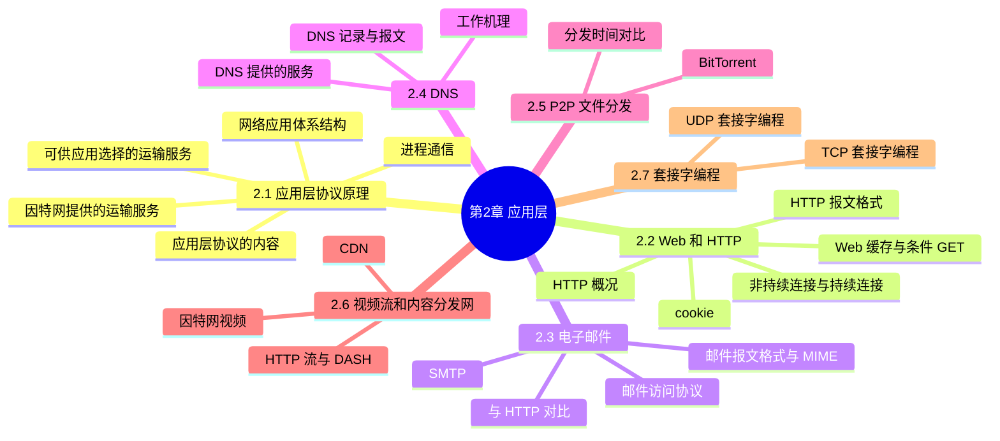
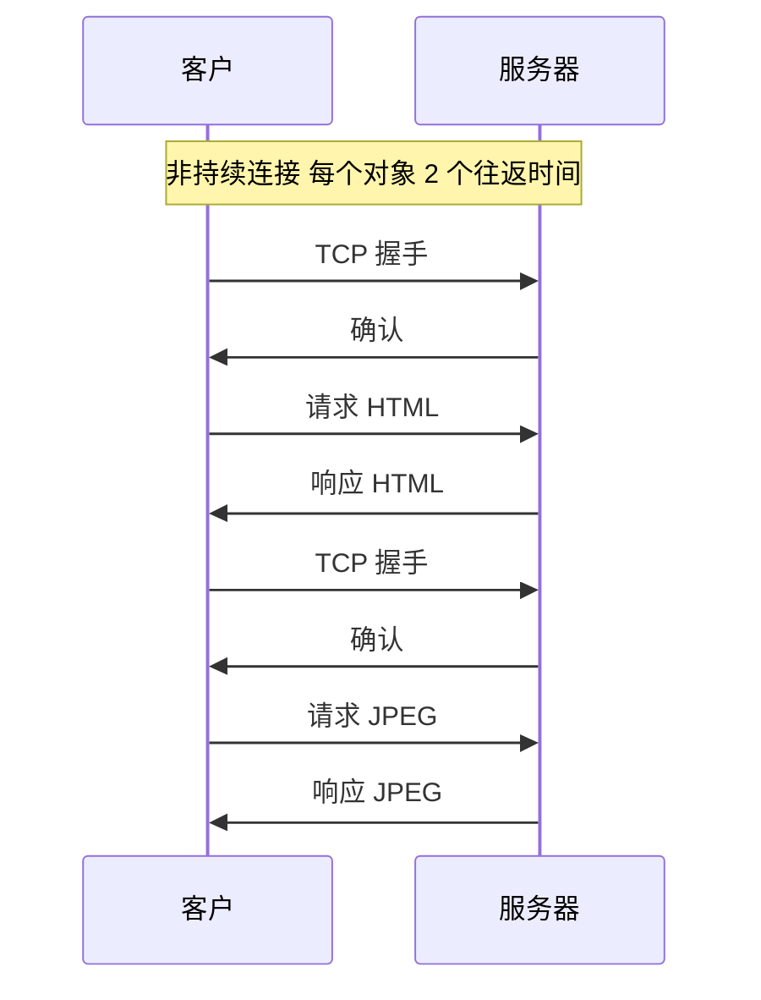
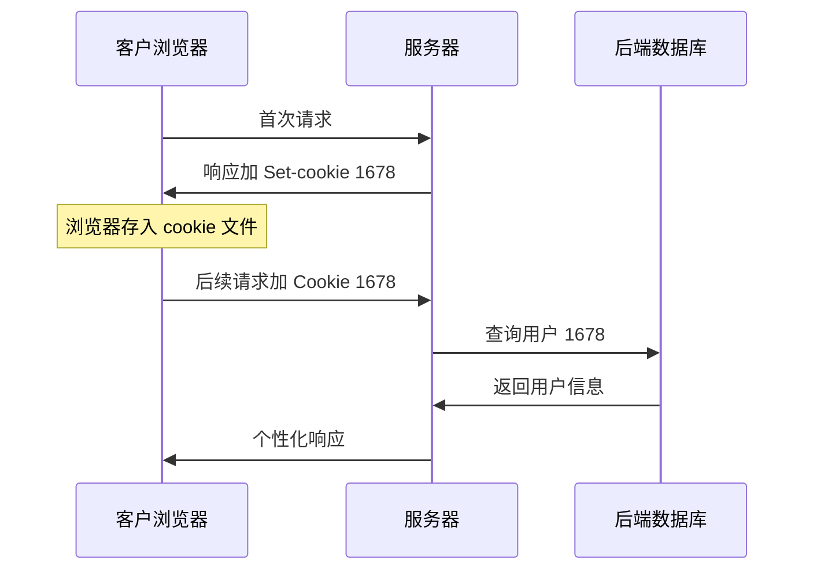
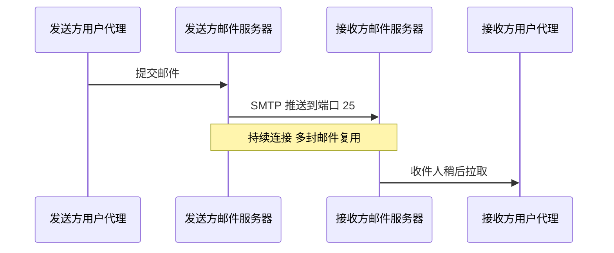
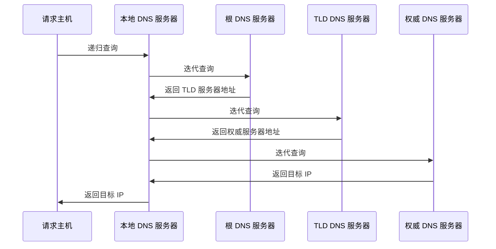
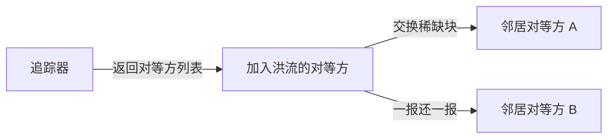
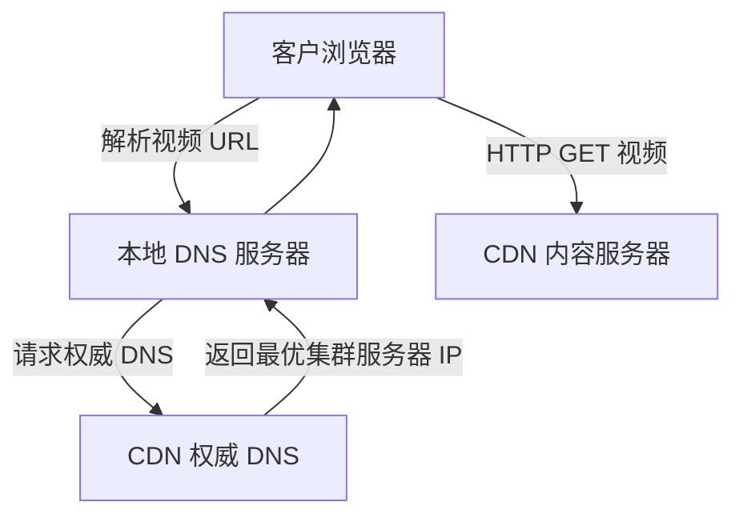
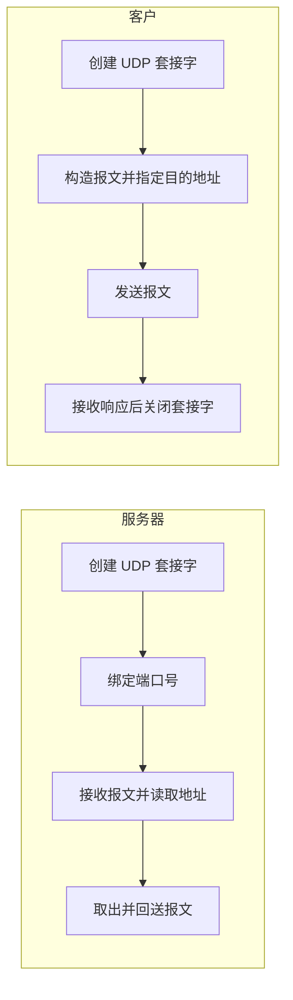
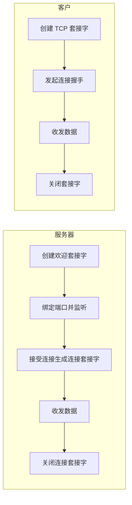

# 第 2 章 应用层

> 《计算机网络：自顶向下方法》读书笔记

## 本章导览



---

## 2.1 应用层协议原理

网络应用是网络存在的理由。应用层是协议栈的最顶层，理解应用层的关键在于：**应用软件运行在端系统上，彼此通过跨越网络的报文交换来协作**。本节先搭建分析任何网络应用都要用的概念框架。

### 2.1.1 网络应用体系结构

应用开发者首先要在**体系结构**上做选择，即应用在端系统之间如何组织。主要有三种：

| 体系结构 | 特点 | 优点 | 缺点 | 典型应用 |
| --- | --- | --- | --- | --- |
| 客户/服务器（C/S） | 有常开的主机（服务器）与请求服务的客户 | 管理集中、易于维护与安全控制 | 服务器单点、需扩展、成本高 | Web、电子邮件、DNS |
| 纯 P2P | 无常开服务器，端系统之间直接通信 | 可扩展、成本低、健壮 | 管理困难、安全与服务保障难 | BitTorrent、早期 Gnutella |
| 混合 | 兼有两者 | 集中管理加 P2P 分发 | 结构复杂 | Napster、即时通信、Kazaa |

- **客户/服务器**：服务器具有**固定、周知的 IP 地址**且始终打开。客户之间不直接通信。当客户数量剧增时会形成**服务器场**（数据中心）来扩展，但成本高。
- **纯 P2P**：任意端系统都可直接通信，每个对等方既请求也提供服务；具有**自扩展性**，新用户带来新服务能力。挑战是管理与安全。
- **混合结构**：如 Napster 用中心服务器做**文件索引**，文件传输却在对等方之间直接进行。

### 2.1.2 进程通信

网络应用由**进程**构成，同一主机上的进程用**进程间通信**机制（由操作系统提供），而运行在不同端系统上的进程则通过**交换报文**通信。

- **客户进程与服务器进程**：在一次通信会话中，发起通信的进程是**客户**，等待被联系的进程是**服务器**。
- **套接字**（socket）：进程通过套接字向网络发送报文、从网络接收报文。套接字是**应用层与运输层之间的接口**，也称为应用编程接口（API）。应用开发者对运输层几乎无控制，只能选择运输协议并（少量地）设定参数。
- **进程寻址**：为了向另一台主机上的进程发送报文，需要两类信息：
  - **主机地址**：目的主机的 **IP 地址**。
  - **端口号**：目的主机上接收进程的**端口号**（如 Web 服务器 80、SMTP 服务器 25、DNS 53）。
- 一个 IP 地址加一个端口号唯一标识了一个套接字、即一个接收进程。

### 2.1.3 可供应用选择的运输服务

应用对运输层服务有四个维度的需求：

| 维度 | 含义 | 对应用的举例 |
| --- | --- | --- |
| 可靠数据传输 | 数据不丢失、按序到达 | 文件传输、电子邮件、Web 文档必须可靠；实时音视频可容忍丢失 |
| 吞吐量 | 单位时间可交付的比特率 | 流媒体需要带宽保证（带宽敏感）；电子邮件、Web 弹性应用可适应 |
| 定时 | 时延上界与抖动 | 实时交互、网络电话、多方游戏对时延敏感 |
| 安全性 | 机密性、完整性、端点鉴别 | 银行、电子商务需要加密与认证 |

- **可靠数据传输**：若协议提供该服务，则数据无差错、无丢失、按序到达；否则为**不可靠**，部分应用（如实时音频）因可容忍丢失而不需要它。
- **吞吐量**：**带宽敏感应用**有吞吐量下限要求；**弹性应用**（如 Web、邮件）能利用可得带宽任意伸缩。
- **定时**：有的应用为有效性要求低时延（如网络电话、虚拟环境）。
- **安全性**：运输层可通过加密、数据完整性、端点鉴别增强安全性，如 TLS。

### 2.1.4 因特网提供的运输服务

因特网（TCP/IP 网络）为应用提供两种运输协议：

- **TCP 服务**：**面向连接**（通信前先握手，建立全双工连接）、**可靠数据传输**（无差错、按序、不丢失、不重复）、**拥塞控制**（网络拥塞时抑制发送方）。TCP 不提供吞吐量与定时保证。
- **UDP 服务**：**无连接**（无握手）、**不可靠数据传输**（不保证到达与顺序）、**不提供拥塞控制**（发送方可以按任意速率发送）。

| 应用 | 应用层协议 | 底层运输协议 |
| --- | --- | --- |
| 电子邮件 | SMTP | TCP |
| 远程终端访问 | Telnet | TCP |
| Web | HTTP | TCP |
| 文件传输 | FTP | TCP |
| 流式多媒体 | HTTP / DASH | TCP |
| 因特网电话 | SIP、RTP | UDP 或 TCP |
| 网络管理 | SNMP | UDP |
| 名字转换 | DNS | UDP |
| 实时视频会议 | 专用协议 | UDP |

> **易混点**：TCP 的拥塞控制对实时应用不利（会因拥塞而降速），故实时音频/视频常用 UDP；而 UDP 无拥塞控制，若大量应用滥用会造成网络拥塞崩溃，这是其代价。

### 2.1.5 应用层协议的内容

**应用层协议**定义了运行在不同端系统上的应用进程如何相互交换报文。具体应包括：

- **交换的报文类型**，如请求报文与响应报文。
- 各种报文类型的**语法**，如报文中各字段及其如何描述。
- 字段的**语义**，即字段中信息的含义。
- 进程何时、如何发送报文以及对报文进行响应的**规则**。

应用层协议可以是**公开的**（由 RFC 定义，如 HTTP、SMTP），也可以是**专用的**（如 Skype）。

---

## 2.2 Web 和 HTTP

Web 是应用层最成功的应用之一，其应用层协议是 **HTTP**（超文本传输协议）。

### 2.2.1 HTTP 概况

- **Web 页面**由若干**对象**组成，一个对象就是一个文件（HTML 文件、JPEG 图像、Java 小程序、视频片段），通过 **URL** 寻址。多数 Web 页面含一个基本 HTML 文件与若干引用对象。
- **URL** 由主机名与对象路径组成，如 `http://www.someSchool.edu/someDepartment/picture.gif`。
- HTTP 使用 **TCP** 作为底层运输协议，默认端口 **80**。
- HTTP 是**无状态协议**：服务器不保存关于客户的任何信息（若需要状态则用 cookie）。

**请求—响应的基本流程**：

1. 客户发起与服务器的 TCP 连接（端口 80）。
2. 一旦连接建立，客户与服务器进程通过套接字访问 TCP。
3. 客户向套接字发送 HTTP 请求报文，服务器从套接字读取并处理，再写回响应报文。
4. 连接关闭（非持续连接时）。

### 2.2.2 非持续连接与持续连接

- **非持续连接**：每个请求/响应对经一个**单独的 TCP 连接**发送，响应后连接即关闭。每个对象需建立一次连接，代价高（反复三次握手、每对象两次往返时间、服务器资源开销）。
- **持续连接**：所有请求/响应经**同一个 TCP 连接**发送，连接保持打开。可分为**流水线**（连续发送请求）与**非流水线**（收到响应后再发下一个请求）。

> **往返时间定义**：一个**往返时间**（RTT）指一个短分组从客户到服务器再返回客户所经历的时间，包括分组传播时延、排队与处理时延。

**非持续连接的时延计算（经典例题）**：假设客户访问一个含 1 个基本 HTML 文件与 10 个 JPEG 小对象的页面，忽略传输时延，每个对象需要建立连接（1 个往返时间握手）再请求/接收（1 个往返时间），则每个对象耗时 **2 个往返时间**，共 $2 + 10 \times 2 = 22$ 个往返时间。若改为持续连接，则只需 1 次握手加各对象请求响应，约 **3 个往返时间**（握手 1 加基本文件 1 加其余对象流水线并行）。



### 2.2.3 HTTP 报文格式

**请求报文**示例（ASCII 文本）：

```
GET /somedir/page.html HTTP/1.1
Host: www.someschool.edu
Connection: close
User-agent: Mozilla/5.0
Accept-language: fr
```

- **请求行**：方法 + URL + 版本。方法有 **GET、POST、HEAD、PUT、DELETE**。
- **首部行**：Host（必需，用于 Web 缓存与虚拟主机）、Connection、User-agent、Accept-language 等。
- **实体体**：GET 通常为空，POST 用于提交表单数据。

**响应报文**示例：

```
HTTP/1.1 200 OK
Connection: close
Date: Tue, 18 Aug 2015 15:44:04 GMT
Server: Apache/2.2.3 (CentOS)
Last-Modified: Tue, 18 Aug 2015 15:11:03 GMT
Content-Length: 6821
Content-Type: text/html

（数据……）
```

- **状态行**：版本 + 状态码 + 短语。
- **首部行**：Connection、Date、Server、Last-Modified、Content-Length、Content-Type 等。
- **实体体**：请求的对象。

**常见状态码分类**：

| 类别 | 含义 | 例子 |
| --- | --- | --- |
| 1xx | 信息提示 | 100 Continue |
| 2xx | 成功 | 200 OK |
| 3xx | 重定向 | 301 Moved Permanently、304 Not Modified |
| 4xx | 客户错误 | 400 Bad Request、404 Not Found |
| 5xx | 服务器错误 | 500 Internal Server Error、505 HTTP Version Not Supported |

### 2.2.4 cookie

HTTP 是无状态的，但许多网站需要识别用户，**cookie** 技术在客户端保存状态、在服务器端关联状态。cookie 有 **4 个组件**：

1. HTTP **响应报文**中的一个 **Set-cookie** 首部行。
2. HTTP **请求报文**中的一个 **Cookie** 首部行。
3. 保存在用户端系统上并由浏览器管理的 **cookie 文件**。
4. Web 服务器后端的 **数据库**。



> **易混点**：cookie 使服务器能跟踪用户（购物车、推荐、登录态），但只保存一个标识号，实际信息存在服务器数据库；因此涉及**隐私**问题。

### 2.2.5 Web 缓存与条件 GET

- **Web 缓存（代理服务器）**：代表初始服务器满足 HTTP 请求的网络实体，保存最近请求过的对象的副本。
- **工作方式**：浏览器将所有请求指向缓存；命中则直接返回，未命中则缓存向初始服务器请求对象、保存副本并返回给客户。
- **好处**：一是缩短客户响应时间；二是大幅减少机构接入链路的流量。
- **条件 GET**：缓存中的对象可能过期，HTTP 提供**条件 GET** 机制保证对象是最新的。客户在请求中带上首部行 `If-Modified-Since`，服务器若对象未修改则返回 `304 Not Modified`（不带实体体），若已修改则返回 `200` 与新对象。

---

## 2.3 电子邮件

电子邮件是应用层另一个经典应用，其整体结构由**用户代理、邮件服务器、SMTP** 三部分组成。

- **用户代理**（user agent）：用户撰写、阅读邮件的客户端程序（如 Outlook、手机邮件应用）。
- **邮件服务器**：邮件系统的核心，每个收件人在服务器上有**邮箱**与**报文队列**。
- **SMTP**（简单邮件传输协议）：因特网电子邮件的主要应用层协议，用于在服务器之间传递报文。

### 2.3.1 SMTP

- SMTP 使用 **TCP**，端口 **25**，采用**持续连接**直接传输。
- 它是**推**（push）协议：发送方邮件服务器将报文**推向**接收方邮件服务器。
- 发送过程：客户（发送方邮件服务器）与服务器（接收方邮件服务器）建立 TCP 连接，进行握手后传送报文，结束后关闭连接。
- 报文全部采用 **7 位 ASCII** 编码，非 ASCII 内容需用 MIME 扩展编码。



### 2.3.2 与 HTTP 的对比

| 维度 | SMTP | HTTP |
| --- | --- | --- |
| 方向 | 推（push），发送方主动推送 | 拉（pull），客户主动请求 |
| 底层与端口 | TCP，端口 25 | TCP，端口 80 |
| 报文编码 | 只能传 7 位 ASCII | 无限制（含二进制） |
| 连接 | 持续连接 | 持续或非持续均可 |
| 用途 | 邮件服务器之间传送邮件 | Web 客户与服务器之间传送对象 |

> **易混点**：虽然二者都是 ASCII 命令/响应式的文本协议，但 SMTP 是推、HTTP 是拉；用户从服务器**读取**邮件用的也不是 SMTP，而是 POP3 或 IMAP（见 2.3.4）。

### 2.3.3 邮件报文格式与 MIME

邮件报文本身包含**首部行**与**正文**，二者以一个**空行**分隔（与 HTTP 报文类似）。

- 常见首部：`From`、`To`、`Subject`（注意：这些首部与 SMTP 命令中的 MAIL FROM、RCPT TO 不同，后者是信封信息）。
- **MIME**（多用途因特网邮件扩展）：通过额外的首部行（如 `Content-Type`、`Content-Transfer-Encoding`）把非 ASCII 数据（图片、音频、附件）编码为 ASCII 以便 SMTP 传输。

### 2.3.4 邮件访问协议

用户代理不能直接用 SMTP 从邮件服务器**取回**邮件（SMTP 是推），因此需要邮件访问协议。主要有两种：

| 协议 | 特点 | 交互 | 适用 |
| --- | --- | --- | --- |
| POP3 | 简单，下载并（可选）删除；无服务器端文件夹状态 | 特许、事务、更新三阶段 | 单设备离线阅读 |
| IMAP | 功能强，报文保存在服务器，支持文件夹与状态同步 | 客户/服务器 | 多设备同步、在线访问 |

- **POP3**（邮局协议第 3 版）：客户连到服务器 110 端口，进行用户鉴别（特许阶段）、取回并删除报文（事务阶段）、退出（更新阶段）。默认下载后删除，对多设备不友好。
- **IMAP**（因特网邮件访问协议）：所有邮件保存在服务器，用户可在服务器上创建、移动文件夹，多设备看到一致状态；也可只取回报文首部或某部分。
- 现代的 **HTTP 邮件**（如 Web 邮件）则用浏览器作为用户代理，通过 HTTP 访问邮件服务器。

---

## 2.4 DNS

**DNS**（域名系统）是应用层核心服务之一：它把主机名转换为 IP 地址，并承担其他重要的名字服务。

### 2.4.1 DNS 提供的服务

1. **主机名到 IP 地址的转换**：如 `www.someschool.edu` 转换为 `93.184.216.34`。
2. **主机别名**（host aliasing）：复杂主机名可有更简单的别名，通过 CNAME 记录实现。
3. **邮件服务器别名**（mail server aliasing）：邮件地址中的主机名可用更易记的别名，通过 MX 记录实现（MX 记录也允许邮件与 Web 服务器不同）。
4. **负载分配**（load distribution）：冗余服务器集合共享一个规范主机名，DNS 轮流返回不同 IP，实现**内容分发**与流量分摊。

### 2.4.2 DNS 的工作机理

DNS 是一个由分层的 **DNS 服务器**实现的分布式数据库，也是一个使主机能查询该数据库的应用层协议。它运行在 **UDP** 之上，端口 **53**。

**三层服务器结构**：

- **根 DNS 服务器**：全球共 13 组（逻辑上），负责转发到顶级域服务器。
- **顶级域（TLD）DNS 服务器**：负责顶级域（com、org、net、edu 及国家域 uk、fr 等）。
- **权威 DNS 服务器**：组织的 DNS 服务器，保存该组织主机的真实映射。
- **本地 DNS 服务器**：严格说不属于层次结构，但起核心作用。每个 ISP 有本地 DNS 服务器，充当**代理**向层次结构转发查询。

**递归查询与迭代查询**：

- **递归查询**：主机向本地 DNS 服务器发出的查询是递归的，即本地 DNS 服务器代为获取结果。
- **迭代查询**：本地 DNS 服务器向根、顶级域、权威服务器发出的通常是迭代查询，被查询服务器直接返回下一级服务器的地址（或最终结果）。



**DNS 缓存**：为减少查询时延与网络流量，DNS 服务器（以及主机）会**缓存**查询结果，在生存时间到期前直接返回缓存记录。

### 2.4.3 DNS 记录与报文

DNS 服务器存储的每条记录称为**资源记录（RR）**，格式为四元组 `(Name, Value, Type, TTL)`：

| 类型 | Name | Value | 作用 |
| --- | --- | --- | --- |
| A | 主机名 | IPv4 地址 | 主机名到 IP 的映射 |
| AAAA | 主机名 | IPv6 地址 | 主机名到 IPv6 地址 |
| NS | 域 | 该域权威 DNS 服务器的主机名 | 指定域的权威服务器 |
| CNAME | 别名主机名 | 规范主机名 | 主机别名 |
| MX | 别名主机名 | 邮件服务器规范主机名 | 邮件服务器别名 |

**DNS 报文**（查询与回答共用同一格式）包含：

- **首部**（12 字节）：标识符、标志（查询/回答、递归、权威等）、4 个计数字段（问题数、回答数、权威数、附加数）。
- **问题部分**：查询的名字与类型。
- **回答部分**：查询名字的资源记录。
- **权威部分**：其他权威服务器的记录。
- **附加部分**：如 MX 查询时附带 A 记录。

> **易混点**：DNS 应用层协议走 UDP 53（查询快、开销小），但**区域传送**等需要可靠性的场合使用 TCP。

---

## 2.5 P2P 文件分发

文件分发是从单个源向大量主机分发文件的问题，P2P 体系结构展现了优于客户/服务器结构的**可扩展性**。

### 2.5.1 分发时间的对比

设：

- $F$：文件大小（比特）。
- $u_s$：服务器上传速率。
- $u_i$：第 $i$ 个对等方的上传速率。
- $d_i$：第 $i$ 个对等方的下载速率。
- $N$：要分发的对等方数量。

**客户/服务器结构的分布时间**：

$$D_{cs} = \max\{ \frac{NF}{u_s},\ \frac{F}{d_{min}} \}$$

服务器必须向 $N$ 个对等方各上传一个副本，共需上传 $NF$ 比特，故上传时间是瓶颈项 $NF/u_s$。

**P2P 结构的分布时间**：

$$D_{P2P} = \max\{ \frac{F}{u_s},\ \frac{F}{d_{min}},\ \frac{NF}{u_s + \sum_{i=1}^{N} u_i} \}$$

- 服务器只需上传**一份**副本（$F/u_s$）。
- 下载最慢的对等方需 $F/d_{min}$。
- 系统总上传能力为 $u_s + \sum u_i$，共需分发 $NF$ 比特。

> **结论**：在 C/S 结构中，分布时间随 $N$ **线性增长**（$NF/u_s$）；而在 P2P 中，随着 $N$ 增大分母 $\sum u_i$ 也增大，分布时间趋于稳定、**具有自扩展性**。

### 2.5.2 BitTorrent

BitTorrent 是最流行的 P2P 文件分发协议，核心概念：

- **洪流**（torrent）：参与分发某一特定文件的所有对等方的集合。
- **块**（chunk）：文件被划分为的等长片段（通常 256 KB），对等方边下载边上传。
- **追踪器**（tracker）：基础设施节点，加入洪流时向追踪器注册，并从中获得对等方列表。
- **最稀缺优先**（rarest first）：对等方优先请求其邻居中**副本最少**的块，以均衡块分布、避免稀缺块消失。
- **一报还一报**（tit-for-tat）：对等方优先向那些**以最高速率向自己发送数据**的邻居发送块（每 10 秒换最优邻居，每 30 秒随机试一个新邻居）。
- **搭便车**（free riding）：只下载不上传的节点；一报还一报机制使其下载速率低甚至被断绝。



---

## 2.6 视频流和内容分发网

### 2.6.1 因特网视频

- 视频是**高比特率**应用，通常以恒定速率（如 24 或 30 帧每秒）逐帧播放，每帧是一副图像，经压缩后编码。
- 视频可压缩为**可变比特率**，包括空间编码（同帧内压缩）与时间编码（帧间压缩），编码质量越高占用比特率越大。
- 从网络角度看，视频最显著的特点是**高比特率与对带宽敏感**。

### 2.6.2 HTTP 流与 DASH

- **HTTP 流**：视频作为 HTTP 服务器上的普通文件，客户端通过 HTTP GET 请求并缓存播放。所有客户收到**相同编码**的视频，即使带宽不同。
- **DASH**（基于 HTTP 的动态自适应流）：视频被编码为**多种版本**（不同比特率），每版本分为若干短片段，并带有**告示文件**。客户根据当前带宽**动态选择**片段版本，实现自适应。

### 2.6.3 内容分发网（CDN）

CDN 管理并部署分布在多地、多网络的服务器，用于加速内容分发、降低时延。其关键设计：

- **服务器放置（深入部署 vs 邀请做客部署）**：
  - **深入部署**（enter deep）：在众多接入 ISP 中部署服务器集群，靠近用户（Akamai 风格），节点多、维护难。
  - **邀请做客部署**（bring home）：在少数关键位置（如 IXP）建立较大的集群（Limelight 风格），节点少、维护易、离用户稍远。
- **集群选择策略**：把客户导向合适集群的方法，包括**地理上最邻近**与**实时测量**（如 DNS 重定向配合时延探测）。
- **DNS 重定向**：多数 CDN 利用 DNS 进行重定向——客户请求视频 URL 时，DNS 解析返回一个**特定 CDN 服务器**的 IP，而非初始服务器。



---

## 2.7 套接字编程

套接字是应用进程与运输层之间的接口。编写网络应用程序时，开发者需要选择 **UDP** 或 **TCP**，并理解两者的差异。

### 2.7.1 UDP 套接字编程

- UDP 是**无连接**的：发送前不需要握手，也不需要建立连接。
- 发送方在报文中**显式指定**目的地址（IP 加端口）。
- 特点：报文独立、可能丢失或乱序，适合对时延敏感、可容忍丢失的应用。



### 2.7.2 TCP 套接字编程

- TCP 是**面向连接**的：客户在通信前必须与服务器**先握手建立连接**。
- 服务器需先创建一个**欢迎套接字**监听连接；客户发起连接时，服务器接受后生成一个**连接套接字**，此后用该套接字与客户交换数据。
- 特点：可靠、按序、全双工，适合需要可靠传输的应用。



**两者差异对比**：

| 维度 | UDP | TCP |
| --- | --- | --- |
| 连接 | 无连接 | 面向连接、先握手 |
| 寻址 | 每次发送都附目的地址 | 连接建立后由连接标识 |
| 可靠性 | 不保证 | 可靠、按序 |
| 服务器套接字 | 一个套接字处理所有报文 | 欢迎套接字加每连接一个连接套接字 |
| 适用 | 时延敏感、可容忍丢失 | 需要可靠传输 |

---

## 2.8 本章小结

- 应用体系结构有 C/S、P2P、混合三类；进程通过套接字通信，用 IP 加端口寻址。
- 运输服务从可靠数据传输、吞吐量、定时、安全性四方面衡量；因特网提供 TCP 与 UDP 两种运输协议，应用按需选择。
- HTTP 是 Web 的应用层协议，无状态、默认端口 80；掌握非持续/持续连接、报文格式、状态码、cookie、Web 缓存与条件 GET。
- 电子邮件用 SMTP（推、端口 25）传输，用 POP3/IMAP（拉）访问；MIME 支持非 ASCII 内容。
- DNS 是把主机名映射为 IP 的分布式层次数据库，运行在 UDP 53，核心记录有 A、NS、CNAME、MX。
- P2P 文件分发（BitTorrent）相对 C/S 具有自扩展性；视频流多用 HTTP 流或 DASH，CDN 通过深入/做客部署与 DNS 重定向加速分发。
- 套接字编程是应用层与运输层的接口，UDP 无连接、TCP 面向连接，两者的服务器套接字模型不同。
