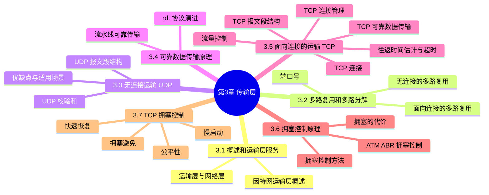
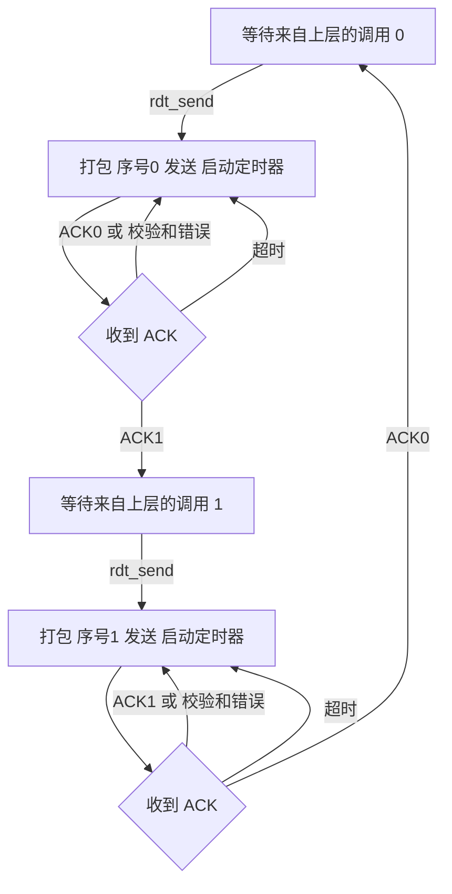
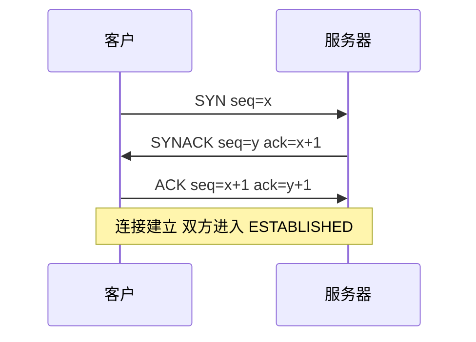
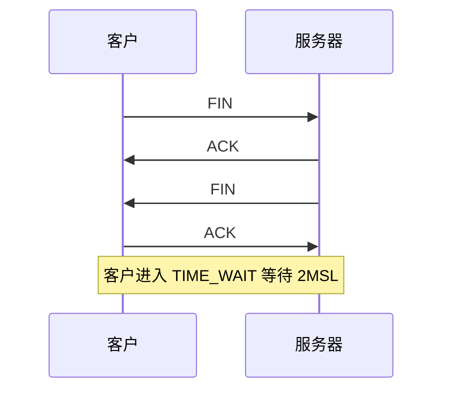
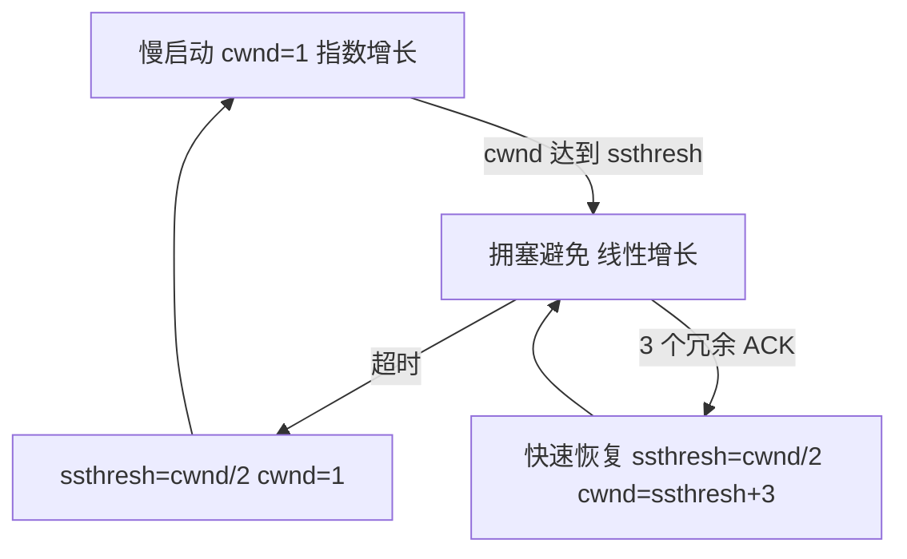

# 第 3 章 传输层

> 《计算机网络：自顶向下方法》读书笔记

## 本章导览

---

## 3.1 概述和运输层服务

### 3.1.1 运输层与网络层的关系

运输层协议为运行在**不同主机**上的**应用进程**之间提供**逻辑通信**（logic communication）。从应用的角度看，运行不同进程的主机仿佛直连；实际上它们可能隔着千山万水与众多路由器。

运输层协议在**端系统**中实现（不在路由器中）；网络层协议则在主机与路由器中都存在。

| 对比 | 网络层 | 运输层 |
| --- | --- | --- |
| 通信粒度 | 主机到主机 | 进程到进程 |
| 实现位置 | 端系统与所有路由器 | 只在端系统 |
| 复用对象 | IP 数据报 | 报文段（带端口号） |

> **家庭类比**：网络层像邮递员，把信送到房子；运输层像家中分发信件的人，把信交给具体某个人。运输层只能利用网络层提供的服务，**无法提供网络层本身给不了的保证**（例如不能凭空提供时延或带宽保证）。

### 3.1.2 因特网运输层概述

因特网为应用提供两种运输层协议：

- **UDP**（用户数据报协议）：无连接、不可靠、尽力而为的交付，无拥塞控制。
- **TCP**（传输控制协议）：面向连接、可靠、有序交付，提供流量控制与拥塞控制。

两者都**不提供**时延保证和带宽保证。TCP/IP 网络中，网络层协议是 IP（尽力而为的交付服务）。

运输层最基础的功能是**多路复用与多路分解**：把网络层的**主机到主机**交付扩展为**进程到进程**交付。

---

## 3.2 多路复用和多路分解

- **多路复用**（multiplexing）：在源主机，从不同套接字收集数据块，为每块装上运输层首部（含源/目的端口号）封装成**报文段**，交给网络层。
- **多路分解**（demultiplexing）：在目的主机，根据报文段首部字段，把数据交付到正确的**套接字**（socket）。

套接字有唯一标识符，每个报文段携带**源端口号**与**目的端口号**字段，各 **16 比特**，取值 **0～65535**。

| 端口号范围 | 用途 |
| --- | --- |
| 0 ～ 1023 | 周知端口号（well-known），如 HTTP 80、HTTPS 443、DNS 53 |
| 1024 ～ 49151 | 登记端口号，供应用注册使用 |
| 49152 ～ 65535 | 动态/私有端口号，客户临时使用 |

### 3.2.1 无连接的多路复用与多路分解

UDP 套接字由**二元组**标识：

$$(\text{目的 IP 地址},\ \text{目的端口号})$$

- 两个具有不同**源** IP/源端口、但相同目的 IP/目的端口的 UDP 报文段，会被分解到**同一个**套接字。
- 源端口号的作用是让接收方知道回信时的目的端口。

### 3.2.2 面向连接的多路复用与多路分解

TCP 套接字由**四元组**标识：

$$(\text{源 IP},\ \text{源端口},\ \text{目的 IP},\ \text{目的端口})$$

- 目的主机用全部四个字段进行分解，因此来自不同源的连接被区分到**不同的**套接字。
- 一个服务器进程可同时支持多个 TCP 连接，每个连接对应一个不同的套接字。

> **易混点**：UDP 只看目的 IP 与目的端口；TCP 要看完整四元组。这就是同一台服务器、同一端口上能同时维持多条 TCP 连接的原因。

---

## 3.3 无连接运输：UDP

### 3.3.1 UDP 报文段结构

UDP 报文段由 8 字节首部与应用数据组成，首部仅 4 个字段：

| 字段 | 长度 | 说明 |
| --- | --- | --- |
| 源端口号 | 16 比特 | 发送方端口，供接收方回信 |
| 目的端口号 | 16 比特 | 接收方端口，用于多路分解 |
| 长度 | 16 比特 | 首部 + 数据的总字节数（最小为 8） |
| 校验和 | 16 比特 | 用于检测报文段中的比特差错 |
| 应用数据 | 变长 | 上层交付的数据 |

### 3.3.2 UDP 校验和

发送方计算步骤：

1. 将报文段内容（首部 + 数据，必要时补 0 使其为 16 比特的整数倍）划分为若干个 **16 比特字**。
2. 对这些 16 比特字做**反码求和**（one's complement sum）：逐字相加，最高位进位**回卷**加到最低位。
3. 对求和结果取**反码**，即得校验和，填入校验和字段。

接收方：把包括校验和在内的所有 16 比特字再做反码求和，若无差错，结果应为**全 1**（即 0xFFFF）。

> UDP 校验和只提供**差错检测**，不提供差错恢复；检测到差错时通常直接丢弃该报文段。它还覆盖了 IP 首部的一部分（伪首部），属于端到端原则的体现。

### 3.3.3 UDP 的优缺点与适用场景

优点：

- 应用层能更精细地控制发送什么数据、何时发送。
- **无连接建立**开销，无需握手。
- **无连接状态**，服务器不必维护连接状态。
- **首部开销小**（仅 8 字节）。
- **无拥塞控制**：UDP 可全速发送（这也可能造成网络拥塞，是缺点也是优点）。

适用场景：容忍丢包、时延敏感或只需简单请求应答的应用，如 **DNS**、**SNMP**、**RIP**、流媒体、实时音视频、多播。

> 若应用需要可靠传输又不想受 TCP 拥塞控制约束，可在应用层自行实现（如 QUIC 在 UDP 之上实现可靠传输与拥塞控制）。

---

## 3.4 可靠数据传输原理

可靠数据传输（rdt）的通用结构：发送方与接收方通过**单向**数据传送（控制信息可双向），网络层信道可能损坏或丢失分组。

### 3.4.1 构造可靠数据传输协议

协议逐层演进，每一步针对新出现的问题加入机制：

| 协议 | 信道假设 | 新增机制 | 序号 |
| --- | --- | --- | --- |
| rdt1.0 | 完全可靠（无差错、不丢包） | 无 | 不需要 |
| rdt2.0 | 可能比特差错 | 校验和、ACK/NAK、停等 | 不需要 |
| rdt2.1 | 差错 + ACK/NAK 本身可能损坏 | 加入序号，发送方两个状态 | 1 比特（0/1） |
| rdt2.2 | 同上，但不使用 NAK | 带序号的 ACK（ACK0/ACK1） | 1 比特 |
| rdt3.0 | 差错 + 可能丢包 | 超时定时器与重传 | 1 比特 |

各协议要点：

- **rdt1.0**：发送方直接发送，接收方直接接收，无需任何反馈。
- **rdt2.0**：发送方发送分组后**停等**应答；接收方校验后回 **ACK**（正确）或 **NAK**（损坏）。缺陷是 ACK/NAK 自身可能损坏。
- **rdt2.1**：发送方为分组编号 0/1。若收到损坏的 ACK/NAK，就重传当前分组；接收方丢弃重复分组。发送方维护两个状态（等待 ACK0、等待 ACK1）。
- **rdt2.2**：取消 NAK，接收方对**正确**收到的分组回带序号的 ACK；对损坏分组回上一次的 ACK。发送方收到重复 ACK 即等同收到 NAK。
- **rdt3.0**（**比特交替协议**，alternating-bit protocol）：信道既差错又丢包。发送方每发一个分组就启动**定时器**，超时未收到 ACK 就**重传**。序号仍只需 1 比特（0/1）。

> **停等（stop-and-wait）**：发一个分组、等一个确认，再发下一个。其致命缺点是**利用率低**：发送方大部分时间在等 RTT，链路带宽被浪费（利用率 $U = \frac{L/R}{RTT + L/R}$）。

### 3.4.2 流水线可靠数据传输

**流水线**（pipelining）：允许发送方连续发送多个分组而无需等待逐个确认。它使序号范围必须增大，发送方/接收方需要**缓存**多个分组。两类经典协议：

- **回退 N 步**（Go-Back-N, GBN）：
  - 发送方维持一个大小为 $N$ 的**发送窗口**，窗口内可连续发送。
  - 采用**累积确认**：ACK n 表示 n 及以前所有分组都已收到。
  - 发送方为**最早**的未确认分组维护**一个定时器**；超时则**重传所有**已发送未确认的分组。
  - 接收方**窗口大小为 1**，只按序接收，**丢弃乱序**分组，回送最后一个正确分组的 ACK。
- **选择重传**（Selective Repeat, SR）：
  - 发送方**逐个**确认分组；只对**超时或可疑**的单个分组重传。
  - 接收方**缓存乱序**到达的分组，逐个确认，待缺失分组到达后一并按序交付。

| 特性 | GBN | SR |
| --- | --- | --- |
| 发送窗口 | N | N |
| 接收窗口 | 1 | N |
| 确认方式 | 累积确认 | 逐个确认 |
| 超时重传 | 重传所有未确认分组 | 只重传该分组 |
| 接收缓存 | 不缓存乱序 | 缓存乱序分组 |
| 窗口与序号位数 k 的关系 | $N \le 2^k - 1$ | $N \le 2^{k-1}$ |

> **窗口大小的约束**：序号空间必须足够大，否则接收方无法区分"新分组"与"重传分组"。GBN 要求 $N \le 2^k - 1$；SR 要求 $N \le 2^{k-1}$（窗口不超过序号空间的一半）。

---

## 3.5 面向连接的运输：TCP

### 3.5.1 TCP 连接

TCP 是**面向连接**的：数据交换前必须先**三次握手**建立连接；连接是**全双工**（双向数据流）且**点对点**（单播，一个发送方一个接收方）。TCP 连接是**逻辑连接**，仅存在于两端系统中，中间的交换机/路由器无连接状态（它们只看到数据报）。

- 连接的双方各有发送缓存与接收缓存。
- **MSS**（最大报文段长度）通常由 **MTU** 决定：$MSS = MTU - 40$（IP 首部 20 + TCP 首部 20）。

### 3.5.2 TCP 报文段结构

| 字段 | 长度 | 说明 |
| --- | --- | --- |
| 源端口号 | 16 比特 | 发送方端口 |
| 目的端口号 | 16 比特 | 接收方端口 |
| 序号 | 32 比特 | 本报文段首字节在字节流中的编号 |
| 确认号 | 32 比特 | 期望收到的下一个字节的序号（累积确认） |
| 首部长度 | 4 比特 | 以 4 字节为单位，指示首部长度 |
| 保留 | 6 比特 | 未使用 |
| 标志位 | 6 比特 | URG、ACK、PSH、RST、SYN、FIN |
| 接收窗口 | 16 比特 | 用于流量控制，接收方可用缓冲容量 |
| 校验和 | 16 比特 | 差错检测 |
| 紧急数据指针 | 16 比特 | 配合 URG 使用 |
| 选项 | 可变 | 如 MSS、窗口扩大、时间戳 |
| 数据 | 变长 | 应用层数据 |

- **序号**：TCP 把数据看作**字节流**，序号是报文段**首字节**的编号（不是报文段编号）。
- **确认号**：接收方期望收到的**下一个字节**的序号，表示该号之前的所有字节都已正确收到。
- 标志位含义：**ACK** 确认号有效；**SYN/FIN** 建立/关闭连接；**RST** 重置连接；**PSH** 尽快交付；**URG** 紧急数据。

### 3.5.3 往返时间估计与超时

超时时间应大于 RTT，但也不能过大。TCP 用**指数加权移动平均**平滑采样：

$$EstimatedRTT = (1-\alpha)\cdot EstimatedRTT + \alpha \cdot SampleRTT \qquad (\alpha \text{ 推荐 } 0.125)$$

测量 RTT 的波动（偏差）：

$$DevRTT = (1-\beta)\cdot DevRTT + \beta \cdot |\,SampleRTT - EstimatedRTT\,| \qquad (\beta \text{ 推荐 } 0.25)$$

超时间隔：

$$TimeoutInterval = EstimatedRTT + 4 \cdot DevRTT$$

> 推荐初值：$TimeoutInterval = 1$ 秒。一旦超时，新值**加倍**，可避免在拥塞时反复超时。$\alpha$ 越接近 1 越看重最新采样，越接近 0 越平滑。

### 3.5.4 TCP 可靠数据传输

TCP 在 IP 不可靠服务之上构建可靠传输：

- 使用**单一重传定时器**（针对最早未确认的报文段）。
- **超时重传**：超时即重传最早未确认的报文段。
- **快速重传**：收到 **3 个冗余 ACK**（同一确认号）时，不等超时立即重传缺失报文段。
- 接收方使用**累积确认**；对乱序到达报文段回送期望序号的 ACK。
- 可选机制：**选择确认（SACK）**、**加倍超时间隔**。

### 3.5.5 流量控制

**流量控制**（flow control）防止发送方发送过快**淹没接收方**的接收缓存。接收方在报文段首部用 **接收窗口 rwnd** 通告可用缓存空间：

$$rwnd = \text{接收缓存大小} - \text{已缓存数据量}$$

发送方保证**未被确认的数据量**不超过 rwnd。当 rwnd 为 0 时，发送方停止发送，仅发送 1 字节探测报文等待窗口更新。

> **易混点**：**流量控制**解决"发送方 vs 接收方"速率匹配，防止接收缓存溢出；**拥塞控制**解决"发送方 vs 网络"速率匹配，防止网络核心过载。前者由 rwnd 约束，后者由 cwnd 约束；发送方实际可发送量为两者较小值。

### 3.5.6 TCP 连接管理

**三次握手**建立连接（SYN、SYNACK、ACK）：

- 该过程还能协商**选项**（如 MSS、窗口扩大因子）。
- 状态迁移：客户 SYN_SENT → ESTABLISHED；服务器 LISTEN → SYN_RCVD → ESTABLISHED。

**四次挥手**关闭连接（FIN、ACK、FIN、ACK）：

- **半关闭**：一方发出 FIN 后仍可接收对方数据（连接进入半关闭），故关闭需要四次。
- 常见状态：FIN_WAIT_1、FIN_WAIT_2、CLOSE_WAIT、LAST_ACK、**TIME_WAIT**、CLOSED。
- **TIME_WAIT**：主动关闭方最后等待 **2MSL**（最长报文段寿命的两倍），确保最后的 ACK 能到达，并让旧连接的迟到报文段在网络中消逝。
- 异常处理：**RST** 用于重置无对应连接的报文段。

---

## 3.6 拥塞控制原理

### 3.6.1 拥塞的代价

当过多发送方以过高速率发送数据、超出网络处理能力时，网络发生**拥塞**。代价包括：

- 路由器缓存溢出导致**丢包**，触发重传，浪费链路带宽。
- 排队时延剧增，端到端时延变大。
- 发送方在拥塞时仍重传，进一步加重负载，吞吐量反而**下降**。
- 多跳路径上，被丢弃的分组已消耗了上游链路的传输能力（浪费）。

### 3.6.2 拥塞控制方法

| 方法 | 思路 | 例子 |
| --- | --- | --- |
| 端到端拥塞控制 | 无网络层显式支持，端系统根据时延/丢包推断 | TCP |
| 网络辅助拥塞控制 | 路由器向端系统提供显式反馈 | ATM ABR、ICMP 源抑制、ECN |

网络辅助方式中，路由器可置位**拥塞指示位**，或向发送方发送**抑制报文**告知拥塞程度。

### 3.6.3 ATM ABR 拥塞控制

面向连接的网络中，ATM ABR（可用比特率）采用资源管理信元：

- **RM 信元**中插有 **CI 位**（拥塞指示）、**NI 位**（无增长）、**ER 字段**（显式速率）。
- 交换机可置位 EFCI 位通知拥塞，或直接写入 ER 值，向源端明示可用速率。

---

## 3.7 TCP 拥塞控制

TCP 通过维护**拥塞窗口 cwnd** 实现拥塞控制，发送方未确认数据量同时受 cwnd 与 rwnd 限制：

$$\text{LastByteSent} - \text{LastByteAcked} \le \min(cwnd,\ rwnd)$$

发送速率近似为 $cwnd / RTT$。核心算法有三个阶段：

### 3.7.1 慢启动

- 初始 $cwnd = 1$ MSS。
- 每收到一个 ACK，$cwnd$ 增加 1 MSS，于是**每个 RTT 翻倍**（指数增长）。
- 当 $cwnd$ 达到 **ssthresh** 时，转入拥塞避免。
- 若发生超时，$ssthresh = cwnd/2$，$cwnd$ 重置为 1 MSS，重新慢启动。
- 优化：若 $ssthresh$ 已知且较小，可在 $cwnd$ 达到 ssthresh 时记下值并转入拥塞避免。

### 3.7.2 拥塞避免

- 每个 RTT 内 $cwnd$ **线性增加约 1 MSS**（每收到一个 ACK 增加 $MSS/cwnd$）。
- 表现为**加性增**。
- 触发事件：
  - **超时**：$ssthresh = cwnd/2$，$cwnd = 1$ MSS，回到慢启动（Tahoe 版本行为）。
  - **3 个冗余 ACK**：进入快速恢复。

### 3.7.3 快速恢复

- 收到 **3 个冗余 ACK** 时：$ssthresh = cwnd/2$，$cwnd = ssthresh + 3$ MSS（补偿已离开网络的 3 个分组），随后每个冗余 ACK 使 $cwnd$ 再增 1 MSS。
- 收到新 ACK 后，$cwnd = ssthresh$，转入拥塞避免。
- 该机制对应 TCP Reno；不使用快速恢复、直接回慢启动的是 TCP Tahoe。

### 3.7.4 AIMD 与拥塞窗口演化

TCP 整体呈现 **AIMD**（加性增、乘性减）：正常情况下每 RTT 线性增加窗口，检测到丢包时把窗口**减半**。

窗口随时间的**锯齿状**变化：线性上升，丢包时减半，再上升。宏观模型下（忽略慢启动），若丢包时窗口为 $W$：

$$\text{平均吞吐量} \approx \frac{0.75\, W}{RTT}$$

若记丢包率为 $p$，可推出吞吐量与丢包率的关系：

$$\text{吞吐量} \approx \frac{1.22 \cdot MSS}{RTT \sqrt{p}}$$

> 该式说明吞吐量与 $\sqrt{p}$ 成反比、与 RTT 成反比：丢包率越小、RTT 越小，吞吐量越大。它也被用作 TCP 友好速率控制的依据。

### 3.7.5 公平性

- **公平性目标**：若有 $K$ 条 TCP 连接共享同一瓶颈链路，每条连接应获得约 $R/K$ 的带宽。
- **AIMD 的收敛性**：加性增让各连接向均等份额靠拢，乘性减使重载连接按比例缩减，故多连接会收敛到公平。
- **不公平因素**：
  - UDP 无拥塞控制，可能挤占 TCP 带宽。
  - RTT 小的连接窗口增长更快，获得更大份额。
  - 应用层使用多条并行 TCP 连接会放大其份额。
- 平衡点：TCP 的公平性是工程近似，并非严格保证。

---

## 3.8 本章小结

- 运输层提供**进程到进程**的逻辑通信，网络层只提供主机到主机的交付，运输层无法超越网络层的保证。
- 多路复用/分解依赖端口号：UDP 用**二元组**（目的 IP、目的端口），TCP 用**四元组**。
- UDP 首部仅 8 字节，提供校验和与无连接服务，适合时延敏感、容忍丢包的应用。
- 可靠数据传输经由 rdt1.0 → 2.0 → 2.1 → 2.2 → 3.0 演进，核心机制是校验和、ACK/NAK、序号、超时重传；流水线用 **GBN**（累积确认、重传全部）与 **SR**（逐个确认、只重传单个）。
- TCP 面向连接、全双工、点对点，用序号/确认号、单一重传定时器、快速重传实现可靠传输，用 rwnd 做流量控制。
- 超时估计：$EstimatedRTT$ 与 $DevRTT$ 平滑采样，$TimeoutInterval = EstimatedRTT + 4\,DevRTT$。
- TCP 拥塞控制由慢启动、拥塞避免、快速恢复组成，整体呈 **AIMD** 行为，吞吐量近似 $\frac{0.75W}{RTT}$，并与 $1/\sqrt{p}$ 成正比。
