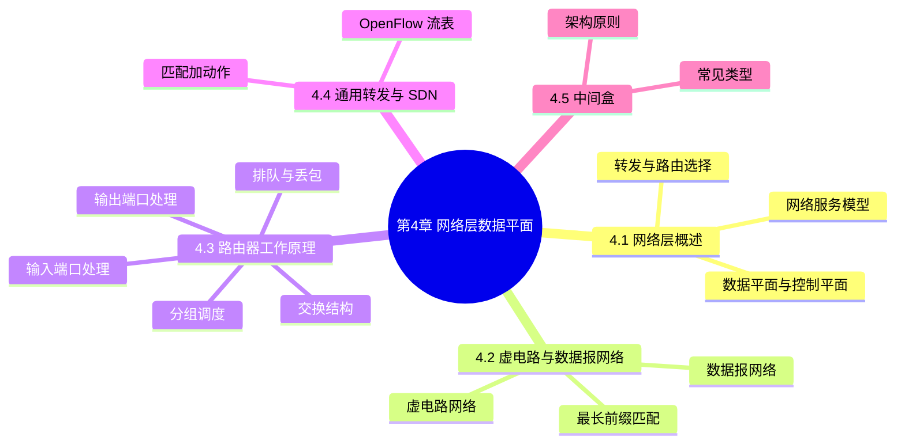
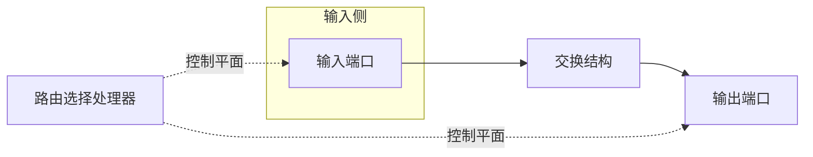

# 第 4 章 网络层：数据平面

> 《计算机网络：自顶向下方法》读书笔记

## 本章导览

---

## 4.1 网络层概述

网络层要完成"把分组从源主机送到目的主机"这件事。它由两个互相配合的部分组成：**数据平面**与**控制平面**。

### 4.1.1 转发和路由选择

- **转发**（forwarding）：分组到达路由器的一个输入链路后，路由器把它移动到合适的输出链路。这是一个**局部**动作，只涉及单台路由器。
- **路由选择**（routing）：确定分组从源到目的地所经过的**端到端路径**，由网络中的路由器协同计算。

两者最直观的区别在于**时间尺度**：

| 功能 | 作用范围 | 时间尺度 | 所属平面 |
| --- | --- | --- | --- |
| 转发 | 单台路由器内部 | 纳秒级（硬件完成） | 数据平面 |
| 路由选择 | 整个网络 | 秒级（软件完成） | 控制平面 |

**控制平面的两种实现方式**：

- **每路由器控制**（传统方式）：每台路由器都运行路由选择协议，彼此交换信息，各自计算出转发表。
- **逻辑集中式控制**（SDN 方式）：一台远程**控制器**计算并分发转发表，路由器只负责"照表转发"。这种方式让控制平面与数据平面彻底解耦。

> **易混点**：转发是"照表办事"（数据平面），路由选择是"造表"（控制平面）。表造好后，转发只在纳秒内完成；表的更新则是秒级事件。

### 4.1.2 网络服务模型

网络服务模型规定网络层向运输层提供的服务。理论上可以提供的服务包括：确保交付、确保在时延上限内交付、确保最小带宽、确保有序交付、提供拥塞指示等。

**因特网的网络层只提供一种服务：尽力而为服务**（best-effort service）。它不保证交付、不保证时延、不保证有序、不保证带宽、不提供拥塞反馈。之所以如此简单，是因为简单的网络层易于大规模部署，而可靠性、有序性等需求被上移到运输层（TCP）解决。

作为对比，**ATM**（异步传递方式）曾提供多种有保证的服务模型：

| ATM 服务 | 中文 | 含义 |
| --- | --- | --- |
| CBR | 恒定比特率 | 持续恒定速率，像专用线路，严格保证速率与时延 |
| VBR | 可变比特率 | 速率可变但有界，保证一定的速率范围与时延 |
| ABR | 可用比特率 | 保证最小速率，链路空闲时可借用额外带宽 |
| UBR | 未指定比特率 | 尽力而为，不提供任何保证 |

> **要点**：ATM 的服务模型对应"连接建立 + 资源预留"的思路；因特网选择了相反的方向——不预留、不保证，把复杂性交给端系统。这是理解后续路由与转发机制的前提。

---

## 4.2 虚电路和数据报网络

网络层也能提供连接服务或无连接服务。只在网络层提供**连接服务**的网络称为**虚电路网络**（VC network），只在网络层提供**无连接服务**的网络称为**数据报网络**（datagram network）。

### 4.2.1 虚电路网络

虚电路是一条从源到目的地的**逻辑连接**，其生命周期分为三个阶段：

- **虚电路建立**：发送方与接收方之间建立一条路径，沿途每台路由器为经过的每条链路维护一个**虚电路号**（VC 号）及转发规则。
- **数据传送**：分组只在首部携带 **VC 号**（而非完整目的地址），沿途路由器按 VC 号查表转发。
- **虚电路拆除**：通信结束后通知网络释放该虚电路，路由器删除相应状态。

一条虚电路由三部分定义：**路径**（源到目的经过的链路序列）、**VC 号序列**（每条链路上各有一个）、**沿途路由器的转发表项**（进入某链路某 VC 号 ⇒ 从某链路某 VC 号出去）。

> **要点**：同一分组在沿途不同链路上可能使用**不同**的 VC 号，路由器需要做"VC 号译换"。VC 号在每条链路上的作用域是本地的，因此同一链路上不同虚电路可以复用相同编号而不冲突。

采用虚电路的代表技术有 **ATM** 与**帧中继**（frame relay）。它们的共同代价是：每次建立连接都需信令开销，路由器需为每条连接保存状态，一旦路由器失效，受影响的所有连接都中断。

### 4.2.2 数据报网络

数据报网络是**无连接**的：路由器不维护端到端连接状态，每个分组独立路由。

- 分组首部携带**目的地址**（因特网中是 IP 地址全量地址）。
- 路由器用目的地址在**转发表**（forwarding table）中查找对应的输出端口。
- 因特网采用**最长前缀匹配**（longest prefix matching）：转发时用的不是完整地址，而是**地址前缀**。

**最长前缀匹配规则**：转发表中每一项是一个前缀，当分组目的地址与多个前缀匹配时，选择**最长**（最具体）的那个前缀对应的输出链路。

**具体例子**：设路由器转发表如下：

| 前缀（匹配的地址范围） | 输出链路接口 |
| --- | --- |
| 11001000 00010111 00010*** ******** | 0 |
| 11001000 00010111 00011000 ******** | 1 |
| 11001000 00010111 00011*** ******** | 2 |
| 其他 | 3 |

若目的地址为 `11001000 00010111 00010110 10100001`，它与接口 0 的前缀（前 21 位相同）匹配，其他前缀不匹配，故转发到**接口 0**。

> **易混点**：转发表与路由选择协议是两回事。转发表由路由选择协议（或 SDN 控制器）**计算生成**，可以随时更新（秒级）；而分组查表转发发生在纳秒级。因特网的转发表项由**地址前缀**而非完整地址构成，正是因为网络地址是**按前缀聚合分配**的。

### 4.2.3 两者对比

| 对比项 | 虚电路网络 | 数据报网络 |
| --- | --- | --- |
| 服务类型 | 连接服务 | 无连接服务 |
| 状态维护 | 沿途路由器为每条连接维护状态 | 路由器不维护连接状态 |
| 分组首部 | 携带 VC 号 | 携带完整目的地址 |
| 转发依据 | VC 号 | 目的地址（最长前缀匹配） |
| 建立阶段 | 必须（信令预留） | 不需要 |
| 可靠性 | 可预留资源、保证质量 | 尽力而为，靠端系统补偿 |
| 代表技术 | ATM、帧中继 | 因特网 |
| 失效影响 | 中断所有受影响连接 | 重新选路即可 |

---

## 4.3 路由器工作原理

路由器由四类组件构成：

- **输入端口**：完成物理层与链路层功能，并执行转发表查找，决定分组该去哪个输出端口。
- **交换结构**：把分组从输入端口连接到输出端口。
- **输出端口**：从交换结构接收并缓存分组，再发送到出链路。
- **路由选择处理器**：执行控制平面功能。传统路由器中它运行路由协议、计算转发表；SDN 中它接收远程控制器下发的表项。

### 4.3.1 输入端口处理和基于目的地转发

输入端口最核心的工作是**查表**：用分组首部（数据报网络里是目的地址）在转发表中查找输出端口。

- **最长前缀匹配**在硬件中实现，常用 **TCAM**（三态内容可寻址存储器）。TCAM 可并行比较所有表项，在**常数时间**内找到最长匹配前缀，代价是功耗与成本高。
- 若用软件哈希或树结构查找，则需要 $O(\log n)$ 量级时间，无法满足线速转发。
- 因特网中，转发表由路由选择处理器计算（传统）或由 SDN 控制器下发（现代）。

此外输入端口还要处理链路层解封装、检查校验和、以及对控制分组（如路由协议报文）的处理。

### 4.3.2 交换结构

交换结构把分组从输入端口搬到输出端口，有三种经典实现：

| 交换方式 | 实现原理 | 速度限制 | 是否可并行 |
| --- | --- | --- | --- |
| 经内存交换 | CPU 直接把分组从输入缓存搬到输出缓存 | 内存带宽，且每分组需两次穿越系统总线 | 一次只能处理一个分组 |
| 经总线交换 | 输入端口给分组加标签后放上共享总线 | 总线带宽 | 一次只能有一个分组在总线上 |
| 经互连网络交换 | 交叉开关（crossbar）等，多条路径并行 | 理论上可达输入端口的 N 倍速率 | 可同时连接多对输入输出 |

- **经内存交换**：早期路由器的方式，受内存带宽和总线带宽双重制约，速度最慢。
- **经总线交换**：分组打上输出端口标签后广播到总线，只有目标端口接收。同一时刻只能传一个分组。
- **经互连网络交换**：以交叉开关为例，$N$ 个输入端口到 $N$ 个输出端口之间有 $N^2$ 个交叉点，可同时建立多对连接，是现代高速路由器的首选。当多个输入端口争用同一输出端口时需调度。

### 4.3.3 输出端口处理

输出端口从交换结构接收分组，放入输出缓存并排队，然后按链路速率发送到出链路。若缓存已满，到达的分组将被**丢弃**。

### 4.3.4 何处出现排队

排队发生在**输入端口**和**输出端口**两处。

**输入排队与队头阻塞**：

- 当交换结构的速度慢于输入端口的到达速率时，分组在输入端口排队。
- **队头（HOL）阻塞**（head-of-line blocking）：输入队列队头的分组因所去输出端口正忙而无法转发，导致它后面本可去其他空闲输出端口的分组也被堵住。极端情况下输入队列吞吐量被限制在约 $0.586$ 倍链路速率。
- 缓解办法：增大交换结构速度（如加速 $N$ 倍）。

**输出排队与排队时延**：

- 若输出链路的速率低于多个输入端口汇聚到它的总速率，分组就会在输出缓存排队。
- 排队时延随流量强度 $La/R$ 增大而急剧上升；缓存溢出即**丢包**。
- **缓存长度的经验规则**：通常取

$$B = \overline{RTT} \cdot C$$

其中 $\overline{RTT}$ 为平均往返时延，$C$ 为链路容量。该式随链路速率升高显得过大，更精细的估计采用 $B = \dfrac{\overline{RTT} \cdot C}{\sqrt{N}}$（$N$ 为并发流数），以平衡时延与丢包。

> **易混点**：输入排队源于**交换结构不够快**（可能发生 HOL 阻塞）；输出排队源于**输出链路相对聚合输入速率不够快**（导致缓存溢出丢包）。两者成因不同。

### 4.3.5 分组调度

当输出队列中有多个分组等待发送时，需要**分组调度**策略决定发送次序：

| 调度策略 | 规则 | 特点 |
| --- | --- | --- |
| FIFO | 先到先服务 | 最简单，无优先级区分 |
| 优先权排队 | 高优先权类先发送 | 需区分优先级；可分非抢占式与抢占式 |
| 轮询 | 各类轮流各发一个分组 | 无优先级，保证各类都能得到服务 |
| WFQ | 按权重比例分配带宽 | 近似"广义处理器共享"，既公平又能体现优先级 |

- **优先权排队**（priority queueing）：到达的分组按类进入不同队列，输出端口总是优先发送高优先权队列。**非抢占式**指当前分组发送完毕后才切换；**抢占式**指高优先分组一到达就中断正在发送的分组。
- **轮询**（round robin）：各类队列轮流发送，一次一个分组。它避免了优先级策略下低优先级类可能被"饿死"的问题。
- **加权公平排队**（WFQ，weighted fair queueing）：在轮询基础上引入权重。类 $i$ 分配权重 $w_i$，则类 $i$ 获得的带宽份额约为

$$\frac{w_i}{\sum_j w_j} \cdot R$$

其中 $R$ 为输出链路速率。WFQ 是同时实现公平与优先级的常用机制。

---

## 4.4 通用转发和 SDN

### 4.4.1 匹配加动作抽象

传统的"基于目的地址转发"只是转发的一种特例。现代网络层把转发抽象为**匹配加动作**（match-plus-action）：

- **匹配**（match）：对分组首部的多个字段（链路层、网络层、传输层字段均可）同时进行匹配。
- **动作**（action）：匹配成功后执行的操作，例如转发到某端口、丢弃、复制、修改首部字段。
- **计数器**（counter）：统计匹配该表项的分组数与字节数。

这种抽象使路由器/交换机可以根据**任意首部字段组合**做出转发决策，是 **SDN**（软件定义网络）数据平面的基础。

### 4.4.2 OpenFlow 流表

**OpenFlow** 是匹配加动作的代表性标准。每台 OpenFlow 交换机维护一张**流表**（flow table），表项由远程控制器下发，含三个部分：**首部字段值（匹配）、动作、计数器**。

OpenFlow 1.0 的匹配字段包括：

| 层次 | 匹配字段 |
| --- | --- |
| 链路层 | 入端口、源 MAC、目的 MAC、以太网类型、VLAN ID、VLAN 优先级 |
| 网络层 | 源 IP、目的 IP、IP 协议号、IP ToS |
| 传输层 | 源端口、目的端口（TCP/UDP） |

常见动作有：**转发**（到指定端口、广播到所有端口、发送给控制器、泛洪）、**丢弃**、**修改**（重写首部字段）。

### 4.4.3 流表项示例

考虑用 OpenFlow 实现基本功能，路由器只维护少量通用规则，具体策略由控制器注入。例如：

| 匹配（Match） | 动作（Action） |
| --- | --- |
| 入端口 = 1，目的 IP = 10.0.0.2 | 转发到端口 2 |
| 目的 IP = 10.0.0.3 | 丢弃 |
| 源 IP = 128.119.1.1，目的端口 = 80 | 转发到控制器（用于深度检测） |
| 目的 MAC = 特定值 | 按二层转发 |
| 通配（match all） | 泛洪 / 丢弃 |

> **要点**：同一条流表可以同时实现**路由器**（按目的 IP 转发）、**防火墙**（按源/目的地址丢弃）、**负载均衡**（按端口转发）等功能，只是匹配字段与动作不同。这正是"通用转发"的含义——一台设备承担多种中间盒角色。

---

## 4.5 中间盒

**中间盒**（middlebox）指位于源主机到目的主机路径上、执行**除标准 IP 路由器转发之外**功能的任何设备。

### 4.5.1 常见类型

| 中间盒 | 作用 |
| --- | --- |
| NAT 网络地址转换 | 在私有地址与公网地址之间转换，缓解 IPv4 地址短缺 |
| 防火墙 | 基于规则过滤/阻断分组，保护内部网络 |
| 负载均衡器 | 把请求分发到多台服务器，提高吞吐与可用性 |
| 流量监视盒 | 深度包检测、入侵检测、流量统计（如 IDS/IPS） |
| 缓存/代理 | 缓存内容或代理请求，减少时延与带宽消耗 |
| 隧道端点 | 封装/解封装分组（如 VPN、IP-in-IP） |

### 4.5.2 中间盒的架构原则

中间盒的存在与因特网的传统体系结构原则相冲突：

- **端到端原则**（end-to-end principle）：网络核心应尽可能简单，复杂功能尽量放在端系统实现。中间盒却在网络中间引入了复杂处理。
- **分层原则**：中间盒常常需要跨越多个层次处理首部（例如 NAT 看 IP 层又改传输层校验和），违背了严格分层。

因此，在设计因特网体系结构时，通常遵循以下原则来容纳中间盒：

1. 网络体系结构**应允许**分组路径上存在中间盒，不能假设端到端直连。
2. 中间盒的处理**不应破坏端到端可用性**——即使中间盒失效，通信也应有回退路径或可被绕过。
3. 中间盒应尽量对端系统**透明**，不阻碍新应用的部署（NAT 阻碍 P2P 即是反面例子）。
4. 明确中间盒所处层次与职责边界，减少跨层耦合带来的脆弱性。

> **要点**：中间盒是"务实的妥协"——它用违背分层与端到端原则的方式，解决了地址短缺、安全、性能等现实问题。理解中间盒是理解现代网络为何偏离"纯粹端到端"的关键。

---

## 4.6 本章小结

- 网络层分为**数据平面**（转发，纳秒级）与**控制平面**（路由选择，秒级）；控制平面可由每路由器实现，也可由 SDN 控制器逻辑集中实现。
- 因特网网络层只提供**尽力而为**服务；ATM 等曾提供 CBR/VBR/ABR/UBR 等有保证的服务模型。
- 网络层可提供连接服务（**虚电路网络**，三阶段、VC 号、维护状态）或无连接服务（**数据报网络**，目的地址、最长前缀匹配）。
- 路由器由输入端口、交换结构、输出端口、路由选择处理器构成；交换结构有经内存、经总线、经互连网络三种方式。
- 排队发生在输入端口（**HOL 阻塞**）与输出端口（缓存溢出丢包）；缓存长度经验规则为 $B = \overline{RTT} \cdot C$。
- 分组调度包括 FIFO、优先权排队、轮询与**加权公平排队 WFQ**。
- **匹配加动作**抽象与 **OpenFlow 流表**使通用转发成为可能，是 SDN 的基础。
- **中间盒**（NAT、防火墙、负载均衡、流量监视等）在网络中间引入复杂性，与端到端原则和分层原则存在张力。
