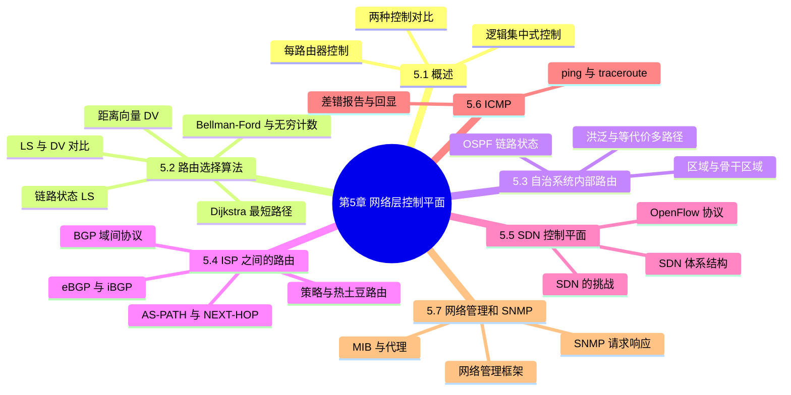
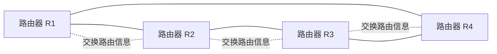
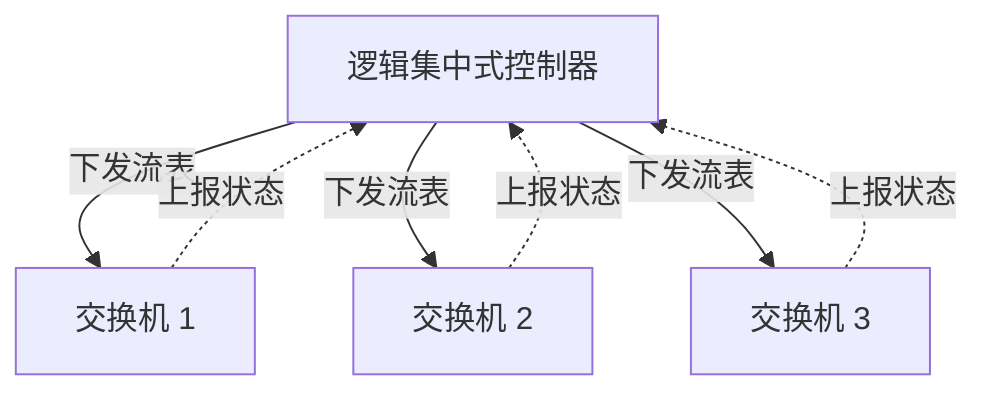
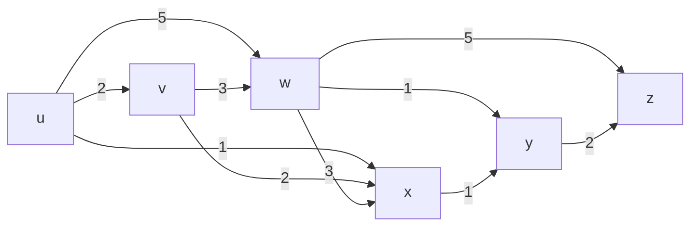
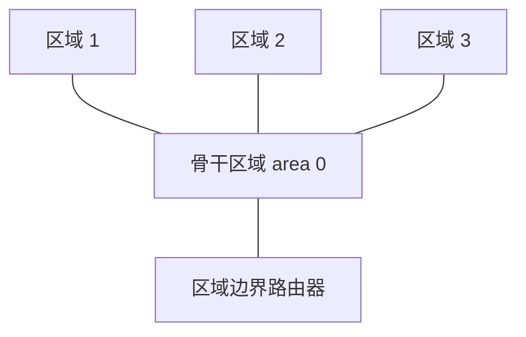
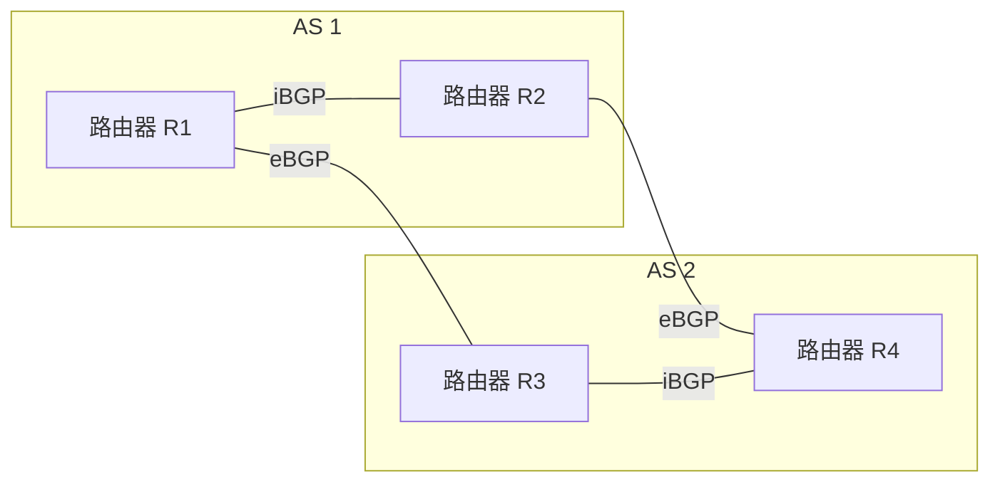
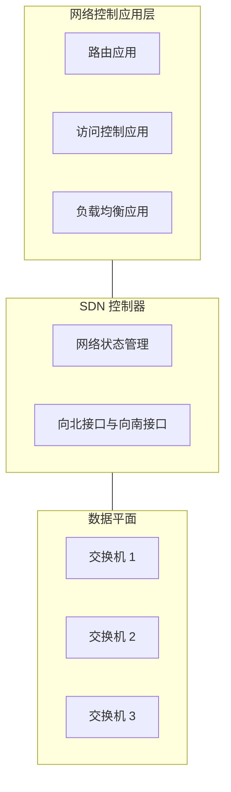
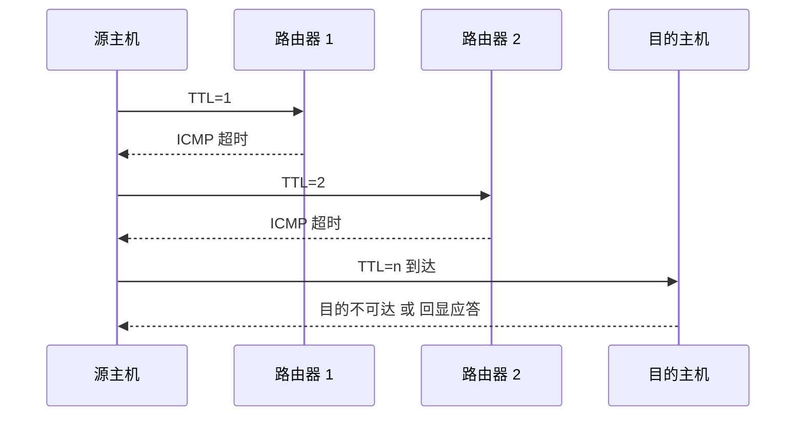
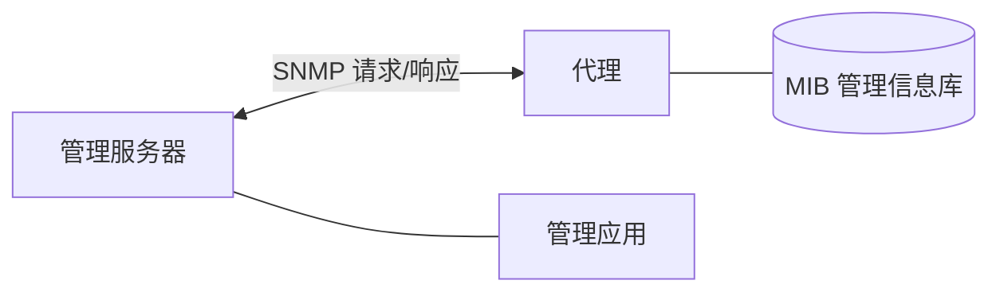

# 第 5 章 网络层：控制平面

> 《计算机网络：自顶向下方法》读书笔记

## 本章导览

---

## 5.1 概述

网络层可分为**数据平面**与**控制平面**两部分：

- **数据平面**（第 4 章）：路由器内部的功能，决定到达某个输入端口的分组如何转发到某个输出端口，是本地的、逐分组的操作。
- **控制平面**（本章）：决定分组从源到目的地整体所走的**端到端路径**，即路由选择。

控制平面关注的是"每条路径如何被计算出来并安装到转发表中"。按实现方式可分为两类。

### 5.1.1 每路由器控制（传统方式）

- 每台路由器都运行一个**路由选择协议**，并与其他路由器交换**路由选择报文**。
- 每台路由器独立运行路由选择算法，各自计算并维护本地**转发表**（forwarding table）。
- 控制功能与转发功能**共存于同一台路由器**中，属于分布式控制。
- 代表协议：**OSPF**、**BGP**。

### 5.1.2 逻辑集中式控制（SDN 方式）

- 存在一台**逻辑集中的控制器**，它掌握全网状态并计算转发表。
- 控制器把计算好的转发表（流表）**分发**给各台路由器（交换机）。
- 路由器只负责**匹配与转发**，与控制功能**解耦**。
- 控制器与路由器通过明确定义的协议（如 **OpenFlow**）交互。
- 物理上控制器可由多台服务器实现，逻辑上表现为单一集中实体。

### 5.1.3 两种控制方式对比

| 维度 | 每路由器控制 | 逻辑集中式控制（SDN） |
| --- | --- | --- |
| 控制位置 | 分布在各路由器中 | 集中在控制器中 |
| 状态视图 | 每台路由器只有局部视图 | 控制器拥有全网视图 |
| 计算方式 | 各路由器独立运行算法 | 控制器统一计算 |
| 转发设备职责 | 计算 + 转发 | 仅转发 |
| 配置灵活度 | 协议固定，改动需升级路由软件 | 可编程，便于快速部署新策略 |
| 代表实现 | OSPF、BGP | OpenFlow、SDN 控制器 |
| 主要挑战 | 收敛慢、难以全局优化 | 可扩展性、可靠性、安全问题 |

> **易混点**：控制平面决定**路径**（整个源到目的的走向），数据平面决定**单跳转发**（分组进入哪个输出端口）。

---

## 5.2 路由选择算法

路由选择算法的目标：给定网络拓扑与链路代价，为源到目的地找出一条**最低代价路径**。可按不同维度分类：

- 按**信息范围**：**全局式**（所有节点掌握完整拓扑，如 LS）与**分散式**（节点只知邻居及链路代价，如 DV）。
- 按**变化时机**：**静态**（路由变化缓慢，人工配置）与**动态**（随拓扑与流量变化而自适应）。
- 按**负载敏感性**：**负载敏感**（代价反映拥塞）与**负载不敏感**（代价不反映拥塞）。

### 5.2.1 链路状态 LS 算法（Dijkstra）

**基本思想**：每个节点通过**链路状态广播**获得全网拓扑与所有链路代价，于是每个节点都拥有**完整的网络视图**，可独立运行 **Dijkstra 算法**计算到所有目的地的最短路径。因依赖全局信息，故为全局式算法。

**记号**：

- $c(x,y)$：节点 $x$ 到直接邻居 $y$ 的链路代价；若不相邻，$c(x,y)=\infty$。
- $D(v)$：从源节点到节点 $v$ 的当前**最低路径代价**估计。
- $p(v)$：沿着从源到 $v$ 的当前最低代价路径，$v$ 的**前驱节点**。
- $N'$：已确定最低代价路径的节点集合。

**Dijkstra 算法步骤**：

1. **初始化**：$N'=\{u\}$（$u$ 为源）；对每个邻居 $v$，令 $D(v)=c(u,v)$，$p(v)=u$；对非邻居，$D(v)=\infty$。
2. **循环**：找出不在 $N'$ 中且 $D$ 值最小的节点 $w$，把 $w$ 加入 $N'$。
3. **更新**：对 $w$ 的每个不在 $N'$ 中的邻居 $v$，计算
   $$D(v) = \min\{\, D(v),\; D(w) + c(w,v) \,\}$$
   若后者更小，则更新 $D(v)$，并令 $p(v)=w$。
4. 重复第 2、3 步，直到所有节点都在 $N'$ 中。

**示例图**（Kurose 教材经典带权图，源节点为 $u$）：

**逐步计算过程**（源 $u$，表中 `--` 表示该节点已进入 $N'$）：

| 步 | $N'$ | $D(v),p(v)$ | $D(w),p(w)$ | $D(x),p(x)$ | $D(y),p(y)$ | $D(z),p(z)$ |
| --- | --- | --- | --- | --- | --- | --- |
| 0 | $u$ | $2,u$ | $5,u$ | $1,u$ | $\infty$ | $\infty$ |
| 1 | $u,x$ | $2,u$ | $4,x$ | -- | $2,x$ | $\infty$ |
| 2 | $u,x,y$ | $2,u$ | $3,y$ | -- | -- | $4,y$ |
| 3 | $u,x,y,v$ | -- | $3,y$ | -- | -- | $4,y$ |
| 4 | $u,x,y,v,w$ | -- | -- | -- | -- | $4,y$ |
| 5 | $u,x,y,v,w,z$ | -- | -- | -- | -- | -- |

**关键步骤说明**：

- 第 1 步：$x$ 的 $D=1$ 最小，加入 $N'$。经 $x$ 更新 $w$：$\min(5,\ 1+3)=4$，前驱改为 $x$；更新 $y$：$\min(\infty,\ 1+1)=2$，前驱为 $x$。
- 第 2 步：未确定节点中 $v=2$ 与 $y=2$ 并列为最小，取 $y$ 加入。经 $y$ 更新 $w$：$\min(4,\ 2+1)=3$，前驱改为 $y$；更新 $z$：$\min(\infty,\ 2+2)=4$，前驱为 $y$。
- 第 3 步：$v$ 的 $D=2$ 最小，加入 $N'$。经 $v$ 检查 $w$：$\min(3,\ 2+3)=3$ 不变。
- 第 4 步：$w$ 的 $D=3$ 最小，加入 $N'$。经 $w$ 检查 $z$：$\min(4,\ 3+5)=4$ 不变。
- 第 5 步：$z$ 加入，算法结束。

**由前驱指针回溯得到的最短路径树**（源为 $u$）：

| 目的地 | 最低代价 | 路径 |
| --- | --- | --- |
| $v$ | 2 | $u \to v$ |
| $w$ | 3 | $u \to x \to y \to w$ |
| $x$ | 1 | $u \to x$ |
| $y$ | 2 | $u \to x \to y$ |
| $z$ | 4 | $u \to x \to y \to z$ |

> **复杂度与实现**：朴素实现（每次线性扫描找最小 $D$）为 $O(n^2)$；用**优先队列**（最小堆）实现可降至 $O(n\log n)$ 量级。

### 5.2.2 距离向量 DV 算法（Bellman-Ford）

**基本思想**：每个节点只与**直接邻居**交换信息，不掌握全网拓扑。算法基于 **Bellman-Ford 方程**：

$$d_x(y) = \min_{v \in N(x)} \{\, c(x,v) + d_v(y) \,\}$$

其中 $N(x)$ 是 $x$ 的邻居集合，$c(x,v)$ 是 $x$ 到邻居 $v$ 的链路代价，$d_v(y)$ 是邻居 $v$ 报告的"它到 $y$ 的最低代价"。直观含义：从 $x$ 到 $y$ 的最短路径，必先经过某个邻居 $v$，路径代价为 $c(x,v)$ 加上 $v$ 到 $y$ 的最短代价。

**算法特征**：

- **分布式**：每个节点只需邻居的距离向量。
- **迭代**：反复计算，直到不再变化（无新信息则停止）。
- **异步**：各节点不必同步地计算与交换。

**节点 $x$ 的算法流程**：

1. **初始化**：对每个邻居 $v$，$D_x(v)=c(x,v)$；对非邻居 $y$，$D_x(y)=\infty$。
2. 每个节点周期性（或链路代价变化时）把自己**距离向量** $D_x=[D_x(y):y\in N]$ 发给所有邻居。
3. 收到邻居 $v$ 的距离向量后，对每个目的地 $y$ 更新：
   $$D_x(y)=\min_{v}\{\, c(x,v) + D_v(y) \,\}$$
4. 若某目的地的距离发生变化，则通知邻居；否则静默等待。

> **Bellman-Ford 的直觉**（路由选择环路无戒指）：$D_x(y)$ 只依赖邻居报告的值，邻居再依赖它们的邻居，最终所有节点收敛到真正的最短距离。

**示例**：三节点链 $x - y - z$，链路代价 $c(x,y)=1$，$c(y,z)=1$，源关注 $x$ 到 $z$。

- 初始：$D_x(z)=\infty$，$D_y(z)=1$。
- $x$ 收到 $y$ 的向量后：$D_x(z)=\min\{c(x,y)+D_y(z)\}=1+1=2$。
- $x$ 再向 $y$ 通告新值，若有更优路径则继续更新，直至收敛。

**无穷计数问题（count-to-infinity）**：

考虑链 $x - y - z$，初始 $c(x,y)=4$，$c(y,z)=1$，$c(x,z)=50$。此时 $x$ 到 $z$ 经 $y$ 的代价为 $4+1=5$。若 $x$ 与 $y$ 之间链路代价突然增大到 $60$：

- $y$ 原本认为到 $z$ 的最短路径是 $y \to x \to z$（代价 $4+1=5$），因为 $x$ 曾向 $y$ 通告 $D_x(z)=5$。
- 链路 $x-y$ 变贵后，$y$ 仍以为可经 $x$ 到 $z$，于是 $D_y(z)=\min\{1, 60+D_x(z)\}$，而 $D_x(z)$ 又是从 $y$ 学来的旧值 $5$。
- 结果 $D_y(z)$ 变成 $60+5=65$，$x$ 再从 $y$ 学到 $65$，$y$ 又学到 $125$……如此**互相引用过时信息**，距离逐步增大，需要很多次迭代才能收敛到真实值（$x \to z$ 直连代价 $50$）。

问题的根源：节点把**经过对方**的路径代价又报告给了对方，形成对"坏消息"的慢传播。

**毒性逆转（poisoned reverse）**：

- 规则：若节点 $z$ 到目的地 $y$ 的最短路径**经过邻居 $x$**，则 $z$ 向 $x$ 通告的 $D_z(y)$ 改为 $\infty$。
- 效果：$x$ 不会把 $z$ 报告的"经 $x$ 到 $y$"的路径当真，从而打断互相引用的环路。
- 局限：毒性逆转只能解决**两个节点之间**的环路；**涉及三个或更多节点**的环路仍可能出现无穷计数。

### 5.2.3 LS 与 DV 对比

| 维度 | 链路状态 LS | 距离向量 DV |
| --- | --- | --- |
| 信息范围 | 全局，掌握全网拓扑 | 分散，只知邻居 |
| 交换内容 | 链路状态（到邻居的代价） | 距离向量（到所有目的地的代价） |
| 传播方式 | 洪泛到全网 | 只发给直接邻居 |
| 计算 | 每个节点独立跑 Dijkstra | 每个节点跑 Bellman-Ford 迭代 |
| 收敛速度 | 较快，需等全网拓扑 | 可能较慢，存在无穷计数 |
| 报文开销 | 较大（全网洪泛） | 较小（只与邻居） |
| 健壮性 | 对错误信息较健壮（本地计算） | 较差，错误会扩散到邻居 |
| 典型协议 | OSPF | RIP |

---

## 5.3 因特网中自治系统内部的路由选择：OSPF

### 5.3.1 自治系统（AS）

- **自治系统**（Autonomous System）：一组处于**同一管理机构**控制下的路由器与网络，用全局唯一的 **AS 号**标识。
- 把因特网划分为许多 AS，使得每个 AS 可以**自主选择内部路由协议**，也便于管理、扩展与策略实施。
- 因此因特网路由分为两层：**AS 内部路由**（域内）与 **AS 之间路由**（域间）。

### 5.3.2 OSPF 概述

**OSPF**（Open Shortest Path First，开放最短路径优先）是广泛使用的**域内**路由协议：

- 基于**链路状态**：路由器用**洪泛**方式向本 AS 内所有其他路由器广播链路状态信息。
- 每台路由器据此构建全网拓扑图，运行 **Dijkstra 算法**计算最短路径。
- **直接承载在 IP 之上**：OSPF 报文封装在 IP 数据报中，使用**协议号 89**，不经过 TCP 或 UDP。
- 支持**等代价多路径**：若到同一目的地存在多条等代价路径，可同时使用以分担流量。
- 周期性地广播链路状态（即便无变化），以增强健壮性。

> **易混点**：OSPF 走 IP 协议号 89，**不**使用 TCP/UDP 端口；而后面的 BGP 使用 TCP 端口 179。

**OSPF 常见报文类型**：

| 报文 | 作用 |
| --- | --- |
| Hello | 发现并维持邻居关系 |
| 链路状态通告 LSA | 携带链路状态信息 |
| 数据库描述 | 汇总链路状态数据库摘要 |
| 链路状态请求/更新 | 请求与发送具体链路状态 |

### 5.3.3 OSPF 的层次结构

为支持大规模网络，OSPF 采用**两级层次**：

- **区域（area）**：把一个 AS 划分为多个区域，每个区域内部运行独立的链路状态路由选择。
- **骨干区域（area 0）**：所有区域必须连接到骨干区域，区域间流量经骨干转发。
- **区域边界路由器（ABR）**：连接本区域与骨干区域的路由器。
- **内部路由器**：所有接口都在同一区域内的路由器。
- **骨干路由器**：至少有一个接口在骨干区域内的路由器。

> **层次结构的好处**：缩小链路状态洪泛范围、降低每台路由器维护的拓扑规模、便于按区域管理。

---

## 5.4 ISP 之间的路由选择：BGP

### 5.4.1 为什么需要域间协议

- 域内协议（如 OSPF）只关心**性能**（最短路径）；而 ISP 之间还要考虑**策略**：哪些流量允许经自己转发、哪些路由可以对外通告。
- **BGP**（Border Gateway Protocol，边界网关协议）是事实上的**域间路由选择协议**，为各 AS 之间交换可达性信息。
- BGP 使用 **TCP 连接**（**端口 179**）交换报文，属于**半永久连接**：连接建立后长期保持，用于持续交换路由更新。

### 5.4.2 eBGP 与 iBGP

- **eBGP**（外部 BGP）：**跨越两个 AS** 的 BGP 连接，用于在相邻 AS 之间交换路由信息。
- **iBGP**（内部 BGP）：**同一 AS 内部**的 BGP 连接，用于把从外部学到的路由在 AS 内部传播。
- 一般地，AS 边界路由器通过 eBGP 从邻居 AS 获知路由，再通过 iBGP 通告给 AS 内其他路由器。

### 5.4.3 BGP 路由属性

BGP 通告的路由携带一组**属性**，路由器据此进行**策略决策**。两个关键属性：

- **AS-PATH**：该路由经过的 AS 序列。例如 AS-PATH 为 "AS2 AS5 AS1" 表示到达目的需依次经过这些 AS。
  - 用途：**检测环路**（若本 AS 号已出现在 AS-PATH 中则拒绝该路由）；也用于**路径长度**比较（AS 数越少越优先）。
- **NEXT-HOP**：该路由下一跳的**路由器 IP 地址**（即进入下一个 AS 的边界路由器地址）。
  - 用途：路由器用 NEXT-HOP 与自身域内路由（如 OSPF）结合，确定到该下一跳的**最短域内路径**。

> **易混点**：AS-PATH 记录的是 **AS 序列**（自治系统号），不是单个路由器；NEXT-HOP 记录的是**具体的路由器 IP**。

### 5.4.4 路由选择策略

BGP 是**策略路由**协议，而非单纯的最短路径协议。原因在于 AS 之间的商业关系：

- **客户与提供商**：客户付费给提供商以获得全球可达性，提供商应转发客户流量。
- **对等（peer）**：两个 ISP 互相免费转发对方及其客户的流量。
- 由此产生**过滤规则**：例如某 ISP 不愿为"既不付费也非对等方"的流量提供中转（避免成为免费骨干）。

因此某条路由即便"更短"，若不满足策略也会被丢弃；这正是域间路由与域内路由的本质差异。

### 5.4.5 热土豆路由选择

- **热土豆路由**（hot potato routing）：当有多条到同一目的地的候选路由时，选择**域内代价最小**的出口（即 NEXT-HOP 离自己最近的那条），尽快把分组"甩"出本 AS。
- 它只优化**本 AS 内部**的代价，**不关心**跨 AS 之后的剩余代价。
- 体现了"把流量尽快交给下一个 AS"的直觉，故得名"热土豆"。

**BGP 路由选择顺序**（从高到低优先级）：

1. **本地偏好**（LOCAL-PREFERENCE）属性最高者优先（本地策略）。
2. 若相同，选 **AS-PATH 最短**者。
3. 若相同，选 **NEXT-HOP 最近**者（**热土豆路由选择**）。
4. 仍相同，用 BGP 标识符等作为打破平局的依据。

---

## 5.5 SDN 控制平面

### 5.5.1 SDN 体系结构

**SDN**（Software-Defined Networking，软件定义网络）把控制平面从数据平面中**解耦**出来，集中到一个软件控制器中。其体系结构分为三个层次：

- **数据平面交换机**（data plane switch）：通用转发设备，维护**流表**，执行"匹配 + 动作"；转发规则由控制器下发。
- **SDN 控制器**（网络操作系统）：维护全网状态（链路、主机、流量），向上提供抽象接口，向下通过协议控制交换机；逻辑上集中，物理上可分布式。
- **网络控制应用**（network-control application）：运行在控制器之上的程序，实现路由、接入控制、负载均衡、防火墙等具体功能。

> **核心思想**："可编程网络"——通过改变控制器上的应用软件，就能改变整个网络的转发行为，无需逐台升级路由器固件。

### 5.5.2 OpenFlow 协议

**OpenFlow** 是运行在**控制器与交换机之间**的通信协议（南向接口），定义了双方交互的报文与交换机流表结构。

- 交换机中的**流表**包含若干**流表项**，每项由：
  - **匹配字段**（match）：如入端口、源/目的 MAC、源/目的 IP、TCP/UDP 端口等。
  - **动作**（action）：如转发到某端口、丢弃、泛洪、修改首部字段等。
- 分组到达时，交换机按优先级匹配流表项，执行相应动作；未匹配则上报控制器（packet-in），由控制器决定如何处理。
- 控制器与交换机之间有三类报文：
  - **控制器到交换机**：配置、修改状态（安装/删除流表项）、读取状态等。
  - **交换机到控制器**：packet-in（上报未匹配分组）、flow-removed（流表项被删除）等。
  - **对称报文**：hello、echo 等用于连接建立与保活。

### 5.5.3 SDN 的挑战

- **可扩展性**：逻辑集中的控制器是潜在瓶颈，需支持大量交换机与高事件速率。
- **可靠性 / 故障容错**：控制器故障可能导致全网失控，需要冗余与一致性机制。
- **性能**：控制器与交换机的交互时延不应影响转发性能。
- **安全**：控制器是攻击的高价值目标，需防止被入侵或篡改流表。
- **与传统网络的互操作**：如何与既有 OSPF/BGP 网络平滑共存与演进。

---

## 5.6 ICMP：因特网控制报文协议

### 5.6.1 功能与报文格式

- **ICMP**（Internet Control Message Protocol，因特网控制报文协议）被**主机与路由器**用来交换网络层信息。
- 主要用途：
  - **差错报告**：如目的不可达、超时、参数问题、重定向等。
  - **回显与应答**：用于探测网络可达性与往返时延。
- ICMP 报文由**类型（type）**与**编码（code）**字段标识，并携带引发该报文的相关信息（如出错数据报的首部）。

**常见 ICMP 类型**：

| 类型 | 名称 | 说明 |
| --- | --- | --- |
| 0 | 回显应答 | 对回显请求的响应 |
| 3 | 目的地不可达 | 网络/主机/端口等不可达 |
| 8 | 回显请求 | 探测对方是否可达 |
| 11 | 超时 | TTL 减为 0 导致分组被丢弃 |
| 5 | 重定向 | 提示更优的下一跳 |

> **易混点**：ICMP 虽被视为网络层协议，但它的报文**承载在 IP 数据报中**（协议号 1），本身并不使用 TCP 或 UDP。

### 5.6.2 ping 与 traceroute

- **ping**：向目的主机发送 **ICMP 回显请求（type 8）**，对方回复 **ICMP 回显应答（type 0）**，据此判断连通性并测量往返时延（RTT）。
- **traceroute**：利用 **TTL 递增**探路：
  1. 源依次发送 TTL = 1, 2, 3, … 的一系列分组。
  2. 第 $i$ 个分组的 TTL 到达第 $i$ 台路由器时减为 0，该路由器丢弃分组并回送 **ICMP 超时报文（type 11）**。
  3. 源由此得知路径上第 $i$ 台路由器的地址与该跳的往返时延。

### 5.6.3 与 IP 的关系

- ICMP 报文作为 IP 数据报的**有效载荷**发送，IP 首部的协议字段值为 **1**。
- ICMP 是 IP 的"辅助"协议：IP 负责尽力而为地转发，ICMP 负责在出错或探测时提供反馈。

---

## 5.7 网络管理和 SNMP

### 5.7.1 网络管理框架

网络管理指对网络设备进行配置、监控与故障处理。其结构包含五个关键组成部分：

- **管理服务器**（managing server）：运行管理应用程序，位于网络运营中心，是人机交互的管理主体。
- **被管设备**（managed device）：被管理的网络设备（主机、路由器、交换机等），内部运行**管理代理**。
- **管理信息库（MIB）**：被管设备中所有可管理对象及其取值的集合，用层次化命名（对象标识符）组织。
- **代理**（agent）：运行在被管设备上的进程，负责读写本设备的 MIB 对象，并与管理服务器通信。
- **网络管理协议**：管理服务器与代理之间的通信协议，即 **SNMP**。

> **被管对象的三种操作**：读取（监视）、写入（配置）、通知/告警（trap，如设备异常主动上报）。

### 5.7.2 SNMP 协议

**SNMP**（Simple Network Management Protocol，简单网络管理协议）用于在管理服务器与代理之间交换管理信息，**承载在 UDP 之上**（代理端口 161，trap 端口 162）。

**主要请求—响应报文**：

| 报文 | 方向 | 含义 |
| --- | --- | --- |
| GetRequest | 管理服务器 → 代理 | 读取一个或多个 MIB 对象的值 |
| GetNextRequest | 管理服务器 → 代理 | 遍历 MIB，读取下一个对象的值 |
| GetBulkRequest | 管理服务器 → 代理 | 批量读取大量数据 |
| SetRequest | 管理服务器 → 代理 | 修改 MIB 对象的值（配置） |
| Response | 代理 → 管理服务器 | 对上述请求的应答 |
| Trap | 代理 → 管理服务器 | 设备异常时主动告警 |

> **易混点**：Get/Set 系列是**管理服务器主动查询或配置**；Trap 是**代理主动上报**，无需先被询问。

---

## 5.8 本章小结

- 控制平面决定分组端到端的路径，可分为**每路由器控制**（分布式，如 OSPF/BGP）与**逻辑集中式控制**（SDN）。
- **LS 算法**基于全局拓扑用 Dijkstra 计算最短路径；**DV 算法**基于 Bellman-Ford，以分散迭代方式收敛，存在无穷计数问题，可用毒性逆转缓解。
- **OSPF** 是域内链路状态协议，走 IP 协议号 89，支持等代价多路径与层次化区域。
- **BGP** 是域间路由协议，走 TCP 端口 179，用 eBGP/iBGP 交换路由，依赖 AS-PATH 与 NEXT-HOP 等属性，并遵循策略选择，常用热土豆路由。
- **SDN** 解耦控制与转发，控制器通过 OpenFlow 下发流表，实现可编程网络。
- **ICMP** 承载在 IP 中，用于差错报告与回显，是 ping、traceroute 的基础。
- 网络管理框架由管理服务器、被管设备、MIB、代理与网络管理协议组成，**SNMP** 是管理服务器与代理之间的请求—响应协议。
