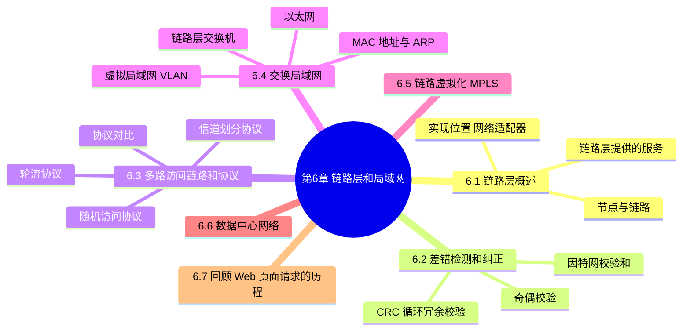
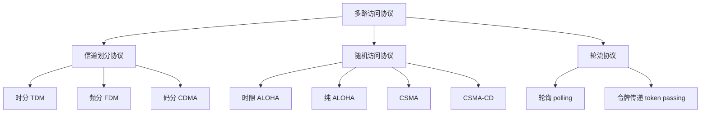
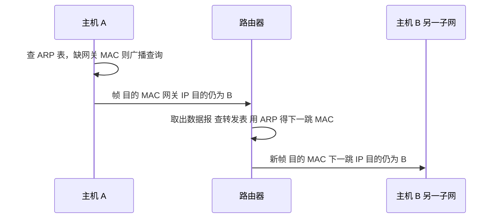
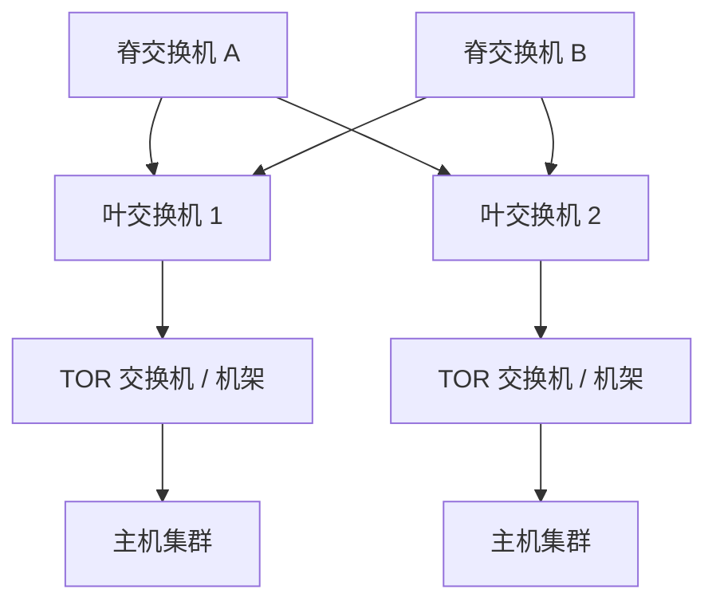
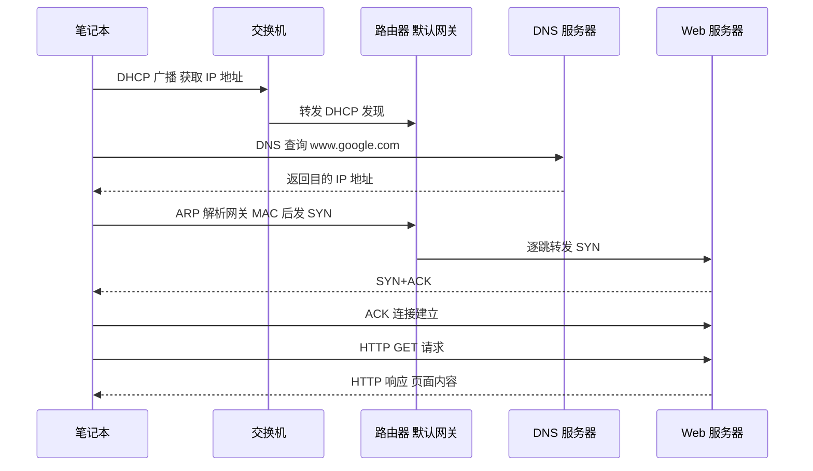

# 第 6 章 链路层和局域网

> 《计算机网络：自顶向下方法》读书笔记

## 本章导览

---

## 6.1 链路层概述

链路层位于协议栈的最底层（紧邻物理层），负责把网络层交下来的**数据报**封装成**帧**，沿**相邻节点**之间的链路传送。它不像网络层那样端到端地负责"主机到主机"，而是**逐跳**地负责"节点到节点"。因此同一台主机在路径上每一段链路上运行的链路层协议可能完全不同（如先以太网、再 PPP、最后 WiFi）。

### 6.1.1 节点与链路

- **节点**（node）：运行链路层协议的设备，包括主机（端系统）、路由器、交换机、WiFi 接入点。
- **链路**（link）：沿着通信路径连接相邻节点的通信信道。链路的类型包括：
  - **有线链路**：双绞铜线、同轴电缆、光纤。
  - **无线链路**：WiFi、蜂窝网、卫星。
- **帧**（frame）：链路层的分组单元，是由数据报加上链路层首部（有时还有尾部）封装而成。
- 链路层协议由一个个**节点间的单条链路**上运行，而不是全局统一。

### 6.1.2 链路层提供的服务

- **成帧**（framing）：把网络层数据报用首部与尾部包装成帧。首部与尾部携带地址、差错检测等控制信息。帧的边界需要显式界定（如插入标志字节）。
- **链路接入**（link access）：规定帧在链路上传输的**规则**。若是**点对点链路**，只有一个发送方；若是**广播链路**（共享介质），则由**多路访问协议**协调多个节点的发送。
- **可靠交付**（reliable delivery）：在相邻节点间提供**无差错**的交付保证。低差错率的链路（如光纤）通常不实现可靠交付，而无线链路差错率高，往往需要本地重传与确认；注意这与 TCP 的端到端可靠交付不同，链路层是**逐跳**的。
- **差错检测与纠正**（error detection and correction）：通过硬件在帧中加**差错检测位**，接收方据此判断是否出错。链路层的差错检测通常由**硬件**实现，比运输层/网络层的软件校验和更快。

### 6.1.3 链路层的实现位置

- 链路层的主要功能由**网络适配器**（network adapter，即**网卡 NIC**）实现，也称为**网络接口控制器**。
- 网卡一般包含一个**控制器**芯片，负责成帧、链路接入、差错检测等任务；其核心功能在**硬件**中实现。
- 链路层的部分功能（如组装链路层地址、激活控制器、响应控制帧、处理差错中断）在**软件**（驱动程序）中实现。
- 因此链路层是**硬件与软件的分界点**：上面的网络层/运输层/应用层基本是软件，下面的物理层是纯硬件。

> **易混点**：链路层的"可靠交付"是**逐跳**的（相邻节点之间），而运输层的"可靠交付"是**端到端**的（源主机到目的主机）。因为链路是逐跳的，所以下一条链路可能用的是另一种协议。

---

## 6.2 差错检测和纠正技术

数据在传输中可能因噪声、衰减而出现**比特差错**（0 变 1 或 1 变 0）。差错检测与纠正（EDC）技术通过附加冗余比特来提高接收方发现（甚至修复）差错的能力。

$$发送: D \to D+EDC \quad \text{经不可靠链路} \quad 接收: D' + EDC'$$

> **易混点**：EDC 只能**降低**差错未被发现的概率，**不能**完全消除误判（仍可能把未出错的比特误判为出错）。冗余位越多，检测能力越强，但开销也越大。

### 6.2.1 奇偶校验

- **单比特奇偶校验**：在数据后附加 1 个**奇偶位**，使整个码字中 1 的个数为偶数（偶校验）或奇数（奇校验）。
  - 能检测**奇数个**比特错误，无法检测偶数个错误。
  - 检错能力弱，但冗余开销极小。
- **二维奇偶校验**：把 $i$ 行 $j$ 列的数据排成矩阵，对**每一行**和**每一列**各算一个奇偶位。
  - 能检测并**纠正单比特差错**：行列交叉定位出错位置。
  - 还能检测（但不能纠正）**任意两个比特**的差错。
  - 因为对每列每行都加了校验，可以定位并翻转出错的单个比特，实现**前向纠错**（无需重传）。

### 6.2.2 因特网校验和

- 面向软件实现的**校验和**方法，主要用在**运输层**（TCP、UDP）。
- 做法：把数据看成若干 **16 比特**的整数序列，**求和**，取结果的**反码**（1 的补码），把该值放入校验和字段。
- 接收方对所有数据（含校验和字段）再求一次和，若结果各位全为 1（即和为 $2^{16}-1$），则认为无差错。
- 相对 CRC，实现简单、开销低，但检错能力较弱，因此用于软件而非链路层硬件。

### 6.2.3 CRC 循环冗余校验

**CRC**（Cyclic Redundancy Check，循环冗余校验）是链路层广泛使用的检错技术，由硬件高效实现。

- 双方约定一个 **$r+1$ 位**的**生成多项式** $G$（即 $r$ 阶，最高位与最低位必须为 1）。
- 发送方：
  1. 把数据 $D$ 左移 $r$ 位，即计算 $D \cdot 2^r$（在 $D$ 后补 $r$ 个 0）。
  2. 用**模 2 除法**（按位异或，不进位不借位）除以 $G$，得到 $r$ 位**余数** $R$。
  3. 发送 $D \cdot 2^r \oplus R$（即把补的 0 换成余数 $R$）。
- 接收方：用 $G$ 去除收到的比特串，**余数为 0** 则认为无差错，否则检出错误。

$$发送: \quad D \cdot 2^r \oplus R \qquad \text{其中 } R = (D \cdot 2^r) \bmod_2 G$$

> **例题**：设数据 $D = 101110$，生成多项式 $G = 1001$（ $r = 3$，即 $x^3 + 1$）。
> 1. 左移 3 位： $D \cdot 2^3 = 101110000$，写成多项式 $x^8 + x^6 + x^5 + x^4$。
> 2. 用模 2 除法（按位异或）逐次消去最高次项：
>    - $(x^8 + x^6 + x^5 + x^4) \oplus (x^3+1)x^5 = x^6 + x^4$
>    - $(x^6 + x^4) \oplus (x^3+1)x^3 = x^4 + x^3$
>    - $(x^4 + x^3) \oplus (x^3+1)x^1 = x^3 + x$
>    - $(x^3 + x) \oplus (x^3+1)x^0 = x + 1$
>    - 余数 $R = x + 1$，即 **011**。
> 3. 发送比特串： $101110000 \oplus 000000011 = \mathbf{101110011}$。
> 接收方收到后用 $1001$ 去除，余数应为 0，否则判定出错。

- CRC 的优势：检错能力强（可检测所有单比特、双比特差错及任意奇数个差错），且用**移位寄存器**硬件线路实现，速度快。

| 技术 | 冗余开销 | 检错能力 | 能否纠错 | 典型层次 |
| --- | --- | --- | --- | --- |
| 单比特奇偶校验 | 1 位 | 仅奇数目差错 | 否 | 教学/简单场景 |
| 二维奇偶校验 | 行+列位 | 强 | 可纠单比特 | 存储、简单信道 |
| 因特网校验和 | 16 位 | 中 | 否 | 运输层（TCP/UDP） |
| CRC | $r$ 位 | 很强 | 否（通常仅检错） | 链路层 |

---

## 6.3 多路访问链路和协议

在**广播链路**上，多个节点共享同一条信道。若两个以上节点同时发送，它们的帧会在接收方**冲突**（collision），导致信号互相干扰而无法解析。**多路访问协议**（multiple access protocol）就是用来协调多个节点共享信道的规则，可分为三大类。

### 6.3.1 信道划分协议

把信道的"资源"划分给各节点**独占**，从根本上避免冲突。

- **时分多路复用（TDM）**：把时间划分为**时帧**，每个时帧再划分为 $N$ 个**时隙**（ $N$ 为节点数），每个节点固定分到每帧中的一个时隙。节点只能在属于自己的时隙里传输。
  - 缺点：即使只有一个节点要发，它也只能用 $1/N$ 的时间；节点必须在时隙中排队等待。
- **频分多路复用（FDM）**：把链路的总频段划分为 $N$ 个**频段**，每个节点独占一个频段，可连续传输。
  - 缺点：同样，单节点可用的带宽被限制为总带宽的 $1/N$。
- **码分多址（CDMA）**：每个节点分配一个**唯一的编码**（码片序列），所有节点可**同时**发送。接收方用对应节点的编码做内积即可从混叠信号中还原出该节点的比特。
  - 优点：抗干扰、抗多径，无需时隙或频段划分；不同编码正交，互不干扰。

### 6.3.2 随机访问协议

节点不独占信道，发送时不受其他节点协调；发生冲突时随机等待一段时间后**重传**。

**时隙 ALOHA**：

- 时间划分为等长的时隙，节点只允许在**时隙开始**时刻发送，且发一帧恰好占满一个时隙。
- 节点若冲突，则在下一时隙以**概率 $p$** 重传。
- 假设 $N$ 个节点，各以概率 $p$ 发送，则某节点发送成功的概率为：

$$S = N  p  (1-p)^{N-1}$$

- 求最优的 $p$，当 $p = 1/N$ 时取最大值：

$$S_{max} = (1 - \frac{1}{N})^{N-1} \xrightarrow{N \to \infty} \frac{1}{e} \approx 0.37$$

**纯 ALOHA**：

- 不划分时隙，节点有帧就立即发送，完全异步。
- 一个帧的成功传输要求其发送时间前后各**一个帧时**内都没有其他节点开始发送，即易冲突窗口翻倍：

$$S = N  p  (1-p)^{2(N-1)}$$

- 取最优 $p = 1/(2N)$，最大效率：

$$S_{max} = \frac{1}{2e} \approx 0.18$$

> **时隙 ALOHA 效率 0.37，纯 ALOHA 效率 0.18**——纯 ALOHA 效率正好是时隙 ALOHA 的一半，原因就是它的易冲突窗口多了一倍。

**CSMA（载波侦听多路访问）**：

- 核心规则：**先听后说**（carrier sensing）。节点发送前先侦听信道：
  - 信道空闲 → 立即发送；
  - 信道忙 → 等待一段时间再发。
- 即便如此仍可能冲突，因为存在**传播时延**：一个节点开始发送后，信号尚未到达远端节点，远端节点侦听到的仍是空闲信道，于是也发送，导致冲突。
- 传播时延越大，冲突概率越高。

**CSMA/CD（带冲突检测的 CSMA）**：

- 在 CSMA 基础上增加**边发边听**（collision detection）：节点在发送过程中持续侦听信道，一旦检测到冲突就**立即中止**发送，不再浪费整个帧时。
- 以太网（广播型）采用 CSMA/CD。冲突后通常采用**二进制指数退避**：第 $m$ 次冲突后，在 $\lbrace 0, 1, \dots, 2^m-1\rbrace $ 中随机取一个值作为等待时隙数（ $m$ 有上限）。
- 效率公式（设 $d_{prop}$ 为任意两节点间最大传播时延， $d_{trans}$ 为发送一个最大帧的时间）：

$$\text{效率}_{CSMA/CD} = \frac{1}{1 + 5  d_{prop} / d_{trans}}$$

- 传播时延 $d_{prop}$ 越小、帧传输时间 $d_{trans}$ 越大，效率越高；当 $d_{prop} \to 0$ 时效率趋近 1。CSMA/CD 的效率远高于 ALOHA。

> **易混点**：CSMA 只是"听"（避免在有信号时发送），CSMA/CD 是"边说边听"（发现冲突立即停）。前者用于不能边发边收的链路（如 WiFi 采用 CSMA/CA），后者用于有线以太网。

### 6.3.3 轮流协议

兼顾信道划分（无冲突）与随机访问（高效）的优点。节点**轮流**使用信道。

- **轮询协议（polling）**：指定一个**主节点**，主节点依次向各从节点发送轮询报文，被轮询到的节点才可发送。
  - 优点：消除了冲突与时隙浪费，效率高。
  - 缺点：引入**轮询时延**；主节点故障则整条信道瘫痪。
- **令牌传递协议（token passing）**：一个特殊的**令牌帧**在节点间按固定顺序传递，持有令牌的节点才可发送，发完把令牌交给下一节点。
  - 优点：无需主节点，去中心化。
  - 缺点：令牌本身的开销；任一节点故障可能丢失令牌，需要复杂的恢复机制。

### 6.3.4 各协议对比

| 协议 | 类别 | 是否冲突 | 关键机制 | 最大效率 | 典型应用 |
| --- | --- | --- | --- | --- | --- |
| TDM | 信道划分 | 无 | 独占时隙 | 满（但每节点 $1/N$） | 电话网 |
| FDM | 信道划分 | 无 | 独占频段 | 满（但每节点 $1/N$） | 广播、电视 |
| CDMA | 信道划分 | 无 | 正交编码 | 高 | 蜂窝网 |
| 时隙 ALOHA | 随机访问 | 有 | 时隙同步+概率重传 | 0.37 | 早期卫星网 |
| 纯 ALOHA | 随机访问 | 有 | 即发+概率重传 | 0.18 | 早期无线 |
| CSMA | 随机访问 | 有 | 先听后说 | 较高 | WiFi（变种） |
| CSMA/CD | 随机访问 | 有 | 先听后说+边发边听 | $\dfrac{1}{1+5 d_{prop}/d_{trans}}$ | 有线以太网 |
| 轮询 | 轮流 | 无 | 主节点轮询 | 高 | 蓝牙 |
| 令牌传递 | 轮流 | 无 | 令牌令牌循环 | 高 | 令牌环、FDDI |

---

## 6.4 交换局域网

局域网通过**链路层交换机**把多台主机连接起来，是接入网的主流形式。

### 6.4.1 链路层寻址与 ARP

- **MAC 地址**（链路层地址 / LAN 地址 / 物理地址）：
  - 长度 **48 比特**，通常用 6 组十六进制表示，如 `1A-23-F9-CD-06-9B`。
  - 固化在网卡中（现代也可软件配置），理论上全球唯一。
  - 用于**局域网内**的寻址；主机拥有**多个**接口就有多个 MAC 地址（如网线口 + WiFi 口）。
  - **广播地址** `FF-FF-FF-FF-FF-FF`，被局域网内所有适配器接收。
- **ARP（地址解析协议）**：在**同一子网**内，把 IP 地址解析为对应的 MAC 地址。
  - 每台主机/路由器维护一张 **ARP 表**，表项为 `<IP 地址, MAC 地址, TTL>`，TTL 通常 20 分钟，过期后自动删除。
  - 同一子网内，发送方广播一个 **ARP 查询分组**（目的 MAC 全 F），携带目标 IP；目标主机收到后**单播**回送一个 **ARP 响应**，告知自己的 MAC。发送方随后把结果填入 ARP 表。
  - 若 ARP 表中已有对应项，则直接使用，无需再次查询。

**跨子网转发流程**（关键！）：

1. 源主机要发送数据报到另一子网的目的主机。
2. 源主机查到目的 IP 不在本子网，于是决定发给**默认网关**（本子网第一跳路由器接口）。
3. 源主机用 ARP 得到**默认网关的 MAC 地址**（目的 IP 保持不变，仍是最终目的主机的 IP）。
4. 帧的**目的 MAC** 填网关接口 MAC，**源 MAC** 填源主机 MAC，发送出去。
5. 路由器收到帧，解封装取出数据报，查转发表决定下一跳，再用 ARP 得到下一跳的 MAC，重新封装成新帧。
6. 如此**逐跳**转发，每跳的 MAC 地址改变，而**源 IP 与目的 IP 始终不变**。

> **易混点**：IP 地址是**端到端**的，整个传输过程中不变；MAC 地址是**逐跳**的，每经过一个路由器就重新封装。交换机只根据 MAC 转发，不修改 IP。

### 6.4.2 以太网

以太网是当今最主流的有线局域网技术，从 10 Mbps 一路演进到 100 Gbps，帧格式却高度稳定。

**以太网帧结构**（各字段）：

| 字段 | 长度 | 说明 |
| --- | --- | --- |
| 前同步码 | 8 字节 | 前 7 字节 `10101010` 用于使接收方时钟同步，第 8 字节 `10101011` 标志着帧的开始 |
| 目的地址 | 6 字节 | 目的 MAC 地址 |
| 源地址 | 6 字节 | 源 MAC 地址 |
| 类型 | 2 字节 | 指示上层协议（如 `0x0800` 表示 IP） |
| 数据 | 46 ~ 1500 字节 | 承载网络层数据报；不足 46 需填充，超过 1500 需分片，1500 即 **MTU** |
| CRC | 4 字节 | 循环冗余校验，接收方检错 |

- 一个以太网帧最短 64 字节（含首尾），最长 1518 字节；若数据不足 46 字节必须填充，否则会被当成碎片丢弃。

**以太网提供的服务**：

- **无连接**（connectionless）：发送适配器发送帧前**不握手**，不需要与接收方建立连接。
- **不可靠**（unreliable）：接收方对通过 CRC 检验的帧**不发送确认**，也不发送否认；出错的帧**直接丢弃**。丢失的帧只有靠上层协议（如 TCP）的重传机制来恢复。
- **使用 CSMA/CD**：以太网是广播链路，采用带冲突检测的载波侦听多路访问。
- **多种速率**：10 Mbps、100 Mbps（快速以太网）、1 Gbps、10 Gbps、40/100 Gbps，同一标准可运行在双绞线、光纤等多种介质上。

> **易混点**：以太网的"无连接不可靠"与 IP 类似（都不握手、不确认），但以太网工作在链路层、以 MAC 寻址、逐跳；若上层是 TCP，端到端可靠性由 TCP 保证。

### 6.4.3 链路层交换机

链路层交换机是**存储转发**设备，工作在链路层，根据 **MAC 地址**转发帧。它是**透明**的：主机意识不到交换机的存在。

**核心机制**：

- **自学习（self-learning）**：交换机维护一张**交换机表**（转发表），记录 `<MAC 地址, 端口, 时间戳>`。
  - 每当一个帧从某端口到达，交换机记录下**源 MAC 地址**与**到达端口**，从而实现自动学习。
  - **无需管理员手动配置**，即插即用。
- **过滤与转发**：
  - **过滤**（filtering）：决定是否丢弃某帧。若目的 MAC 与到达端口相同（同一网段），则丢弃。
  - **转发**（forwarding）：若目的端口与到达端口不同，则把帧转发到该端口。
  - 若表中**没有**目的 MAC，则**向除到达端口外的所有端口泛洪**（flooding）。
- **老化（aging）**：每个表项带时间戳，超过阈值（如几分钟）未更新的表项被删除，以适应主机移动或更换网卡。

**交换机的特点**：

- **即插即用**，无需配置。
- 支持**全双工**运行：每条链路可同时收发，避免了冲突，因而**无冲突**（不用 CSMA/CD）。
- 可连接**不同速率**的链路（如 100 Mbps 与 1 Gbps），每段链路独享带宽。
- 透明性：主机/路由器不知道交换机的存在。

**交换机 vs 路由器**：

| 对比项 | 链路层交换机 | 路由器 |
| --- | --- | --- |
| 工作层次 | 第 2 层（链路层） | 第 3 层（网络层） |
| 转发依据 | MAC 地址 | IP 地址 |
| 转发表 | 自学习的交换机表 | 路由算法计算的路由表 |
| 是否需配置 | 即插即用，通常免配置 | 需配置，运行路由协议 |
| 转发方式 | 按 MAC 硬件查找，快 | 最长前缀匹配，相对慢 |
| 广播域 | 不隔离广播域（默认） | 隔离广播域 |
| 隔离机制 | 避免冲突（全双工） | 防止广播风暴、隔离网络 |
| 规模 | 适合小型网络（几百台主机） | 适合大型网络（因特网骨干） |
| 成本 | 便宜、简单 | 较贵、复杂 |

### 6.4.4 虚拟局域网 VLAN

- **动机**：交换机连接的局域网是一个**单一广播域**，广播流量会到达所有主机。如果部门/用户众多，广播域会变得很大，且不同部门的流量无法隔离。
- **VLAN（虚拟局域网）** 支持在**一个物理交换机**上划分出**多个逻辑局域网**：
  - **基于端口的 VLAN**：把交换机的不同端口划分到不同 VLAN，管理员配置。
  - 每个 VLAN 是一个独立广播域，VLAN 之间的流量必须经过**路由器**（或三层交换机）转发。
- **跨交换机 VLAN**：若一台主机的端口在另一台交换机上，需要把 VLAN 标记在帧里跨越主干链路，这就是 **802.1Q 标签**（在标准以太网帧中插入 4 字节的 VLAN 标签，含 12 位 VLAN ID）。
- 优点：隔离广播域、按逻辑而非物理位置组网、灵活管理、提高安全性。

> **易混点**：路由器天然隔离广播域（每个接口一个子网），而交换机默认**不**隔离广播域；VLAN 正是让交换机也能划分广播域的手段。

---

## 6.5 链路虚拟化：MPLS

**MPLS（多协议标签交换）** 是一种在链路层与网络层之间"插入"一层机制的技术，用于高速转发与**流量工程**。

- **标签（label）**：在帧（或数据报）前加入一个**固定长度的标签**，路由器根据标签（而非 IP 地址）进行转发，称为**标签交换转发**。
- **标签交换路由器（LSR）**：支持 MPLS 的路由器，维护 `入标签 → 出标签` 的转发表，转发时把旧标签**替换**为新标签再送出。
- **转发方式**：与 IP 的"最长前缀匹配"不同，MPLS 按**精确标签**查找，速度快、实现简单。
- **流量工程（traffic engineering）**：可以人为规划不同流的路径，绕过拥塞链路、均衡负载，甚至为某些流提供类似虚电路的服务质量保证。同一目的地的不同流可以走不同路径。
- **多协议**：MPLS 可承载 IP 等多种网络层协议，标签可插入到以太网帧、ATM 信元等之上，故称"多协议"。

> **易混点**：MPLS 的转发是"按标签"，不看 IP；但它仍然工作在链路层与网络层之间，常被归为"2.5 层"。

---

## 6.6 数据中心网络

现代数据中心（云服务、搜索、社交）由**成千上万台主机**组成，它们需要高速、低时延、可容错的网络互连。数据中心网络的设计有以下要点：

- **层次化拓扑（hierarchical topology）**：由**边界路由器 → 汇聚交换机 → 机架顶部交换机（TOR）→ 主机**构成多层结构，主机分布在众多机架中。
- **叶脊结构（leaf-spine）**：为避免上层带宽瓶颈，采用**叶交换机（leaf）** 与 **脊交换机（spine）** 的双层交叉互连：每台叶交换机连接到**所有**脊交换机，任意两台主机间最多两跳可达，且带宽可线性扩展。这比传统三层树形更适合**东西向流量**（服务器之间）占主导的场景。
- **负载均衡**：多条并行路径允许不同流走不同链路，配合 **ECMP（等价多路径）** 与集中式负载均衡器，充分利用带宽、避免拥塞、实现容错。
- **成本与容错**：数据中心内常使用大量**廉价商用交换机**（而非昂贵路由器），通过冗余链路与冗余交换机构建高可用性。

---

## 6.7 回顾：Web 页面请求的历程

访问一个网页（如输入网址 `www.google.com`）时，一台笔记本从**接入网**到**Web 服务器**，会依次用到本书几乎所有协议。下面是一次典型流程（假设笔记本刚开机、无缓存）：

1. **DHCP 获取 IP 地址**：笔记本广播 DHCP 发现报文，DHCP 服务器（常在同一子网或经中继）分配 IP、子网掩码、默认网关、DNS 服务器地址。
2. **DNS 查询**：笔记本需要目的 IP。先查本地/系统 DNS 缓存，没有则向 DNS 服务器发送查询，服务器递归解析出 `www.google.com` 的 IP。
3. **ARP 解析**：要发出的帧需要下一跳 MAC。若目的在另一子网，则用 ARP 解析**默认网关**（路由器接口）的 MAC。
4. **TCP 三次握手**：笔记本向 Web 服务器发起 TCP 连接，经过 `SYN → SYN+ACK → ACK` 建立连接。
5. **HTTP 请求与响应**：在已建立连接上发送 HTTP GET，服务器返回响应。
6. 途中经过**交换机**（按 MAC 转发）、**路由器**（按 IP 转发）、**DNS 服务器**与 **Web 服务器**，逐层封装/解封装，逐跳更换 MAC。

> **易混点**：整个流程中，**DHCP 与 DNS 是应用层**（依赖 UDP），**ARP 是链路层**（同一子网内），**ICMP/TTL 是网络层**，而**MAC 地址逐跳变化、IP 地址端到端不变**。这是把全书各层知识串起来的最佳综合练习。

---

## 本章小结

- 链路层负责**相邻节点**间的帧传输，提供**成帧、链路接入、可靠交付、差错检测与纠正**服务，由**网络适配器（网卡）** 软硬件结合实现。
- **差错检测**从简单的奇偶校验、因特网校验和，到硬件实现的 **CRC**（用生成多项式做模 2 除法，可靠地检测出错帧）。
- **多路访问协议**分三类：信道划分（TDM/FDM/CDMA）、随机访问（ALOHA 效率 0.37 / 纯 ALOHA 0.18 / CSMA / CSMA/CD 效率 $1/(1+5 d_{prop}/d_{trans})$）、轮流协议（轮询、令牌传递）。
- **交换局域网**以 **MAC 地址**（48 位）寻址，用 **ARP** 做 IP→MAC 解析；**以太网**提供无连接、不可靠的帧传输；**链路层交换机**通过自学习转发帧，**VLAN** 划分广播域。
- **MPLS** 用标签转发实现流量工程；**数据中心网络**采用叶脊结构与负载均衡；**一次 Web 请求**把 DHCP、ARP、DNS、TCP、HTTP 串成完整链路，是全书知识的综合演练。
