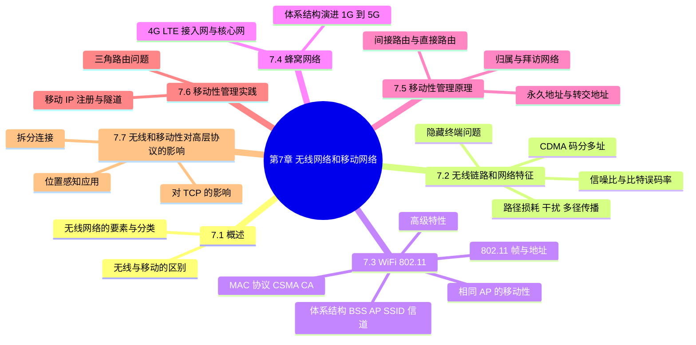
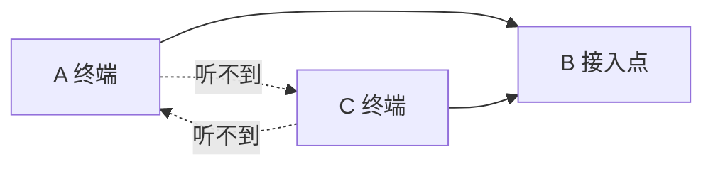
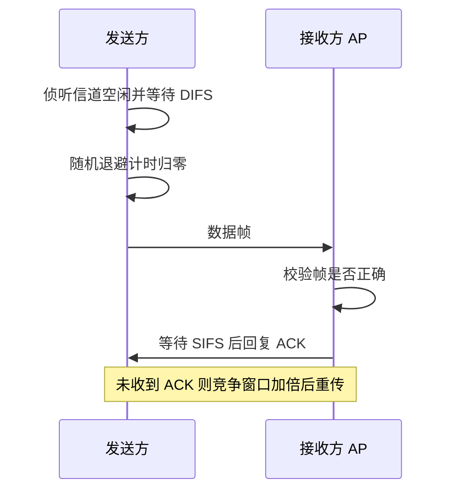
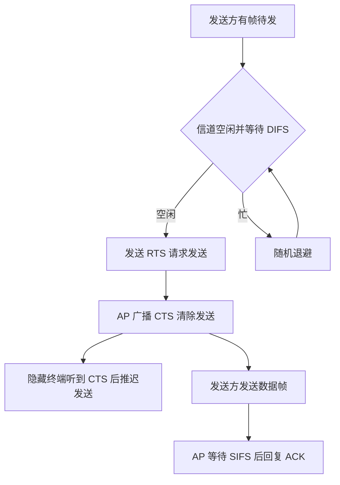
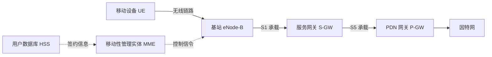
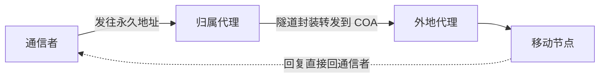
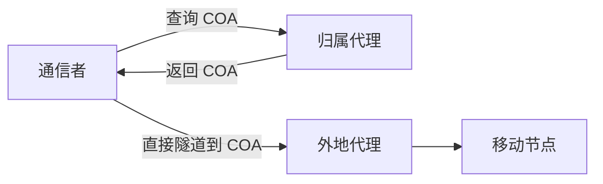
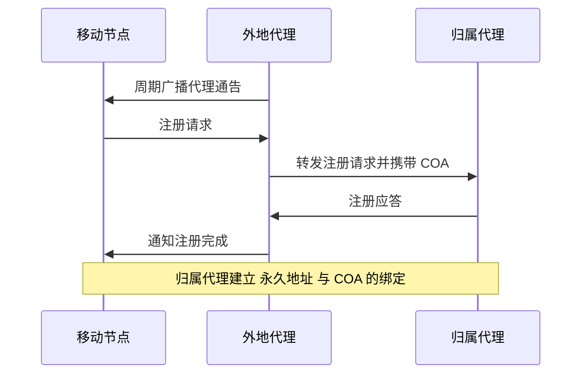

# 第 7 章 无线网络和移动网络

> 《计算机网络：自顶向下方法》读书笔记

## 本章导览

---

## 7.1 概述

### 7.1.1 无线与移动的区别

**无线**（wireless）与**移动**（mobility）是两个独立的维度，不能混为一谈：

- **无线**指通信经由**无线链路**（无线电、红外等非导引型媒体）进行，取代了双绞线、光纤等导引型媒体。
- **移动**指节点在使用网络过程中**改变了接入点**（即改变了它连接网络的物理位置）。

两者的组合有四种，其中三种在现实中常见：

| 情形 | 是否无线 | 是否移动 | 例子 |
| --- | --- | --- | --- |
| 无线但不移动 | 是 | 否 | 家里的 WiFi 台式机、用固定无线链路的楼宇 |
| 移动但无线 | 是 | 是 | 手机在 4G/5G 基站间漫游、笔记本漫游 WiFi |
| 移动但有线 | 否 | 是 | 用户把网线从一间办公室插到另一间（换交换机端口） |
| 既不无线也不移动 | 否 | 否 | 传统固定有线网络 |

> **易混点**：无线链路的影响发生在**链路层及以下**（误码、信道共享、隐藏终端）；移动性的影响主要发生在**网络层**（地址、路由）。二者的原理与解决方案分属不同层次，因此需要分开讨论。

### 7.1.2 无线网络的要素

一个无线网络通常包含以下要素：

- **无线主机**（wireless host）：运行应用的端系统，如手机、笔记本、传感器。
- **无线链路**（wireless link）：连接主机与基站的通信链路，是无线网络的"最后一跳"，如 WiFi、4G/5G 无线信道。
- **基站**（base station）：负责与其覆盖范围内无线主机之间收发数据的设备，如 WiFi 的**接入点 AP**、蜂窝网的**基站**。基站通常通过有线链路连接到更大的网络。
- **网络基础设施**（network infrastructure）：基站之外、连接各基站与因特网的更大网络。

### 7.1.3 无线网络的分类

无线网络可按两个标准分类：**是否有基站（基础设施）**、**是单跳还是多跳**。

| 分类 | 有无基础设施 | 跳数 | 例子 |
| --- | --- | --- | --- |
| 有基础设施、单跳 | 有 | 单跳 | WiFi（经 AP）、4G/5G（经基站） |
| 无基础设施、单跳 | 无 | 单跳 | 蓝牙、ad hoc 模式下的 WiFi |
| 无基础设施、多跳 | 无 | 多跳 | 无线传感器网络、车载自组网 |
| 有基础设施、多跳 | 有 | 多跳 | 无线网状网（mesh）、部分传感器网络 |

> 本章重点是**有基础设施的单跳网络**（WiFi 与蜂窝网），它们承担了绝大多数实际的无线接入。

---

## 7.2 无线链路和网络特征

### 7.2.1 路径损耗、干扰与多径传播

无线链路与有线链路最本质的区别在于：无线信道的质量**随环境剧烈变化**。三个主要原因：

- **路径损耗**（path loss）：信号在传播中随距离衰减。自由空间中功率随距离平方衰减，实际环境衰减更快。
- **干扰**（interference）：同一频段上其他发送方的信号会相互重叠，导致接收端难以分辨。
- **多径传播**（multipath propagation）：信号经不同路径反射后到达接收端，相位不同的副本叠加后相互抵消或增强，造成信号强度随机起伏（即**衰落 fading**）。

> **结论**：无线链路的信噪比会因距离、障碍物、其他发送者而大幅波动，导致接收端的**比特误码率**显著高于有线链路。链路层的差错检测与重传机制因此尤为重要。

### 7.2.2 信噪比 SNR 与比特误码率 BER

- **信噪比**（SNR，Signal-to-Noise Ratio）：接收信号强度与背景噪声强度之比，常以分贝表示：

$$\text{SNR}_{\text{dB}} = 10 \log_{10}(\frac{S}{N})$$

其中 $S$ 为信号功率， $N$ 为噪声功率。

- **比特误码率**（BER，Bit Error Rate）：接收比特出错的概率。
- 二者关系：**SNR 增大时 BER 迅速下降**。在相同 SNR 下，不同的**调制与编码方案**对应不同的 BER：
  - 高速率方案（每符号携带更多比特）在低 SNR 下 BER 更高；
  - 低速率方案（如 BPSK）更抗噪，但吞吐量更低。

> **速率自适应的动机**：既然 SNR 波动，就不能固定用一种调制方案。发送方应根据当前 SNR 动态选择调制与信道编码，SNR 高时用高速率、SNR 低时用低速率，从而在 BER 可接受的前提下尽量提高吞吐量。

### 7.2.3 CDMA 码分多址

**码分多址**（CDMA，Code Division Multiple Access）是一种信道划分多路访问协议：所有用户**共享同一频段、同一时间**，靠**正交的编码**区分彼此。

**核心思想**：

- 每个用户被分配一个唯一的 $M$ 比特**码片序列**（chip sequence），每个比特时间被划分为 $M$ 个**码片**（chip）时隙。
- 用 $+1/-1$ 表示码片，任意两用户的码片序列**互相正交**：

$$c_i \cdot c_j = \frac{1}{M}\sum_{m=1}^{M} c_i[m] c_j[m] =
\begin{cases} 1, & i = j \\\\ 0, & i \ne j \end{cases}$$

**编码（发送）**：若要发送比特 $1$，发送该用户完整的码片序列 $c_i$；若要发送比特 $0$，发送其反码 $-c_i$。

**解码（接收）**：接收方把收到的**叠加信号** $s = \sum_j d_j c_j$ 与目标用户的码片序列做内积：

$$d_i = \frac{1}{M}\sum_{m=1}^{M} s[m] c_i[m]$$

由于正交性，其他用户的信号与 $c_i$ 的内积为 $0$，结果只剩目标用户的分量： $+1$ 判为比特 $1$， $-1$ 判为比特 $0$。

**算例**：设 $M=4$，

| 用户 | 码片序列 $c$ |
| --- | --- |
| A | $(+1, +1, -1, -1)$ |
| B | $(+1, -1, +1, -1)$ |

验证正交性： $c_A \cdot c_B = \frac{1}{4}(1\cdot1 + 1\cdot(-1) + (-1)\cdot1 + (-1)\cdot(-1)) = 0$。

若 A 发比特 $1$（发送 $+c_A = +1,+1,-1,-1$），B 发比特 $0$（发送 $-c_B = -1,+1,-1,+1$），则媒体上叠加信号为

$$s = (+1,+1,-1,-1) + (-1,+1,-1,+1) = (0, 2, -2, 0)$$

接收方 A 解码： $\frac{1}{4}(0\cdot1 + 2\cdot1 + (-2)\cdot(-1) + 0\cdot(-1)) = \frac{1}{4}\cdot4 = +1$，判为比特 $1$。
接收方 B 解码： $\frac{1}{4}(0\cdot1 + 2\cdot(-1) + (-2)\cdot1 + 0\cdot(-1)) = \frac{1}{4}\cdot(-4) = -1$，判为比特 $0$。

> **CDMA 的优点**：抗窄带干扰与抗多径能力强，且天然保密（不知道码片序列就无法解码）；缺点是所有用户平等发射，需要精确的功率控制，否则"远近效应"会淹没弱用户。

### 7.2.4 隐藏终端问题

**隐藏终端问题**（hidden terminal problem）是多跳/无线共享信道特有的冲突来源，用两个场景说明：

- **物理上互相听不到**：A 与 C 都能与 B 通信，但 A 与 C 因距离或障碍彼此听不到。A 与 C 同时向 B 发送，B 处发生冲突，而 A、C 各自都以为信道空闲。
- **信号衰减导致听不到**：A、C 相距较远，信号强度不足以让对方检测到，但足以在 B 处叠加造成冲突。

> **后果**：传统的"边发边听、冲突即止"（CSMA/CD）在无线环境下失效——发送方无法在发送时可靠地检测到冲突，因为远端信号的强度远低于本地发射信号。这直接催生了 802.11 的 **CSMA/CA**（冲突避免）与 **RTS/CTS** 机制。

---

## 7.3 WiFi：802.11 无线 LAN

### 7.3.1 802.11 体系结构

- **基本服务集**（BSS，Basic Service Set）：802.11 网络的基本构建块，由一个**接入点 AP**（Access Point，即基站）与其关联的**无线站点**组成。多个 BSS 可经**分发系统**（通常是有线以太网）互联，构成**扩展服务集 ESS**。
- **SSID**（服务集标识）：网络的名字（如家里的 WiFi 名）由 AP 周期性广播，客户端据此发现并选择网络。
- **信道**（channel）：802.11 工作在 2.4 GHz 与 5 GHz 等频段，频段被划分为多个信道。邻近 AP 应使用**互不重叠**的信道，否则相互干扰。
- **关联**（association）：无线站点接入网络前，须先扫描信道、选定 AP，然后与其**关联**。关联包括：交换能力信息、认证（可选）、分配关联标识 AID。

| 802.11 标准 | 频段 | 主要特点 |
| --- | --- | --- |
| 802.11b | 2.4 GHz | 最高 11 Mbps |
| 802.11a | 5 GHz | 最高 54 Mbps，频段较干净 |
| 802.11g | 2.4 GHz | 最高 54 Mbps |
| 802.11n | 2.4 / 5 GHz | MIMO 多天线，最高 600 Mbps |
| 802.11ac | 5 GHz | 更宽信道与更多空间流，速率达数 Gbps |

> **主动扫描 vs 被动扫描**：被动扫描是静听各 AP 的 beacon 帧；主动扫描是站点主动发送探测请求帧，AP 回探测响应帧。

### 7.3.2 802.11 MAC 协议：CSMA/CA

802.11 采用 **CSMA/CA**（Carrier Sense Multiple Access with Collision Avoidance，载波侦听多路访问/冲突**避免**）而非以太网的 CSMA/CD，原因有二：

1. 无线发送方无法在发送时可靠地同时检测冲突（自我信号淹没远端信号）；
2. 隐藏终端问题使冲突无法被发送方感知。

因此 802.11 转而用**显式确认 ACK**与**主动避免冲突**。

**CSMA/CA 的发送流程**：

1. **载波侦听**：若信道空闲且持续 **DIFS**（DCF 帧间间隔，Distributed Inter-Frame Space）时间，则发送。
2. **随机退避**（backoff）：若信道忙，则选择一个随机退避值（在竞争窗口 $[0, CW]$ 内均匀选取），信道每空闲一个时隙计数减一，减到 $0$ 才发送。这样避免多个站点同时抢信道。
3. **发送数据帧**：整帧发送（包括让接收方）后等待确认。
4. **收到 ACK**：接收方正确收到后，等待 **SIFS**（短帧间间隔，Short Inter-Frame Space，比 DIFS 短）后立即回复 ACK，从而**抢占信道**优先回 ACK。
5. **未收到 ACK**：发送方认为帧丢失（冲突或误码），**竞争窗口加倍**（ $CW$ 从最小值翻倍，直至最大值），重新退避后重传。

> **SIFS 与 DIFS 的作用**：SIFS 短于 DIFS，使接收方能在其他站点开始竞争之前抢先发出 ACK，无需再参与退避竞争。这一"优先级差"是 802.11 用帧间间隔实现优先级控制的基础。

### 7.3.3 RTS/CTS 与隐藏终端

为缓解隐藏终端问题，802.11 可选地使用**请求发送/清除发送**（RTS/CTS）机制：

- 发送方先发一个小的 **RTS** 帧（请求发送）。
- AP 收到后广播 **CTS** 帧（清除发送），其中包含获准发送站的地址与预约时长。
- 所有听到 CTS 的站点（**包括隐藏终端**）都按预约时长**推迟发送**，从而避免在 AP 处冲突。
- 收到 CTS 后，发送方再发数据帧。

> **代价与取舍**：RTS/CTS 本身带来开销，对**短帧**不划算，故通常只对超过阈值的长帧启用；它在隐藏终端普遍存在的多跳环境中收益最大。

### 7.3.4 IEEE 802.11 帧与地址

802.11 数据帧的帧头包含四个地址字段，含义取决于帧是"在无线段"还是"跨越 AP 与有线网"：

| 地址 | 名称 | 含义 |
| --- | --- | --- |
| 地址 1 | 接收地址 RA | 无线链路上**直接接收**该帧的站点的 MAC（可能是目的站或 AP） |
| 地址 2 | 发送地址 TA | 无线链路上**直接发送**该帧的站点的 MAC |
| 地址 3 | — | 供 AP 与路由器使用，指**子网中最终目的**（或源）接口的 MAC，使帧能经有线网转发 |
| 地址 4 | — | 仅用于 **ad hoc 模式**，标识另一端 |

帧的其他重要字段：**持续时间**（用于 RTS/CTS 的时长预约与 NAV 虚载波侦听）、**序号**（用于重传去重）、**帧控制**（类型、子类型、是否为重传等）、**CRC**（帧校验）。

> **与以太网的对比**：以太网帧只有源、目的两个 MAC 地址，因为只在一段链路上传播；802.11 帧要跨越"无线段 + 有线骨干"，故需要额外地址帮助 AP 与路由器正确转发，代价是帧头更复杂。

### 7.3.5 同一 AP 下的移动性

当移动节点在**同一个 AP 覆盖范围内**移动（如在家中客厅与卧室间走动）：

- 它始终关联同一个 AP，IP 地址与子网前缀**不变**；
- 帧的地址字段仍指向同一个 AP 与路由器；
- 对网络层与运输层**完全透明**——TCP 连接不中断。

真正的移动性挑战出现在节点**跨越不同子网/不同 AP** 时，此时 IP 地址与路由需要变化，这由 7.5 与 7.6 的移动性管理机制处理。

### 7.3.6 802.11 高级特性

- **速率自适应**（rate adaptation）：根据链路质量（SNR、误帧率）动态切换调制与编码方案。信道好时用高速率，信道差时降速率以提高可靠性。
- **功率管理**（power management）：为省电，节点可**休眠**。AP 在 beacon 帧中通过 **TIM**（流量指示图）告知哪些有休眠节点有缓存帧；节点周期性醒来查看 beacon，若有缓存帧则主动轮询取回后再休眠。
- **省电多轮询（PSM）**：与上配套，让发送方把发往休眠节点的帧暂存于 AP（或让节点定期唤醒），显著延长电池寿命。

---

## 7.4 蜂窝网络

### 7.4.1 蜂窝体系结构的演进

蜂窝网络把地理区域划分为若干**小区**（cell），每个小区由一个**基站**服务，相邻小区使用不同频率以降低干扰，频率可空间复用以提高容量。

| 代 | 时代 | 代表技术 | 主要特征 |
| --- | --- | --- | --- |
| 1G | 1980s | AMPS | 模拟语音，仅通话 |
| 2G | 1990s | GSM、IS-136 | 数字语音、短信、低速数据 |
| 3G | 2000s | UMTS、CDMA2000 | 语音与分组数据并行，速率提升 |
| 4G | 2010s | LTE | 全 IP 分组交换，高速数据、移动宽带 |
| 5G | 2020s | NR（New Radio） | 更高频段、大规模 MIMO、低时延、网络切片 |

### 7.4.2 4G LTE 体系结构

4G LTE 把网络划分为**无线接入网**（RAN）与**核心网**（EPC，Evolved Packet Core）两部分：

- **无线接入网**：由基站 **eNode-B**（eNB）构成，负责与移动设备（UE）之间的无线通信，包括无线资源管理、调度、切换控制与加密。
- **核心网 EPC**：全 IP 化，主要网元包括
  - **服务网关 S-GW**（Serving Gateway）：用户数据进入/离开核心网的门户，负责会话管理与切换锚点；
  - **PDN 网关 P-GW**（PDN Gateway）:提供移动设备与因特网之间的连接，分配 IP 地址；
  - **移动性管理实体 MME**（Mobility Management Entity）：负责注册、认证、移动性管理与切换协调；
  - **HSS**（Home Subscriber Server）：存放用户签约信息的数据库。

数据通路与隧道：用户 IP 数据报在 **UE → eNode-B → S-GW → P-GW → 因特网** 之间传输。LTE 使用 **GTP 隧道**封装用户数据报：在 eNode-B 与 S-GW 之间用 S1 承载，在 S-GW 与 P-GW 之间用 S5 承载，使移动设备在移动或切换时其 IP 地址保持不变。

> **隧道的意义**：移动设备在基站之间切换时，核心网通过更改隧道端点把流量导向新基站，而**移动设备的 IP 地址保持不变**——移动性对上层透明。

### 7.4.3 5G 简介

5G 在 4G 的基础上进一步：引入更高频段（毫米波与 Sub-6GHz）拓宽带宽，采用**大规模 MIMO** 与波束成形提升容量，支持**超低时延**与超高可靠通信，并通过**网络切片**在同一物理网络上划分出面向不同业务的逻辑网络。

---

## 7.5 移动性管理原理

移动性管理的目标：让移动节点在改变接入点、甚至改变子网时，**仍能被通信者持续寻址**。这需要解决两个问题——**寻址**（节点用哪个地址）与**路由**（分组如何找到它）。

### 7.5.1 移动节点寻址

- **永久地址**（permanent address）：移动节点的"身份"地址，由其**归属网络**分配，长期不变。它用于**标识**该节点。
- **转交地址**（COA，Care-of Address）：移动节点当前所在**拜访网络**中的一个地址。它用于**定位**该节点。
- **归属网络**（home network）与**归属代理**（home agent）：移动节点在归属网络中的路由器/代理，长期代表该节点。
- **拜访网络**（visited network）与**外地代理**（foreign agent）：移动节点当前接入的网络及其代理。
- **通信者**（correspondent）：与移动节点通信的对端。

> **核心思想**：把**标识**（永久地址）与**定位**（转交地址）分离——通信者始终使用永久地址，网络内部用 COA 完成实际交付。

### 7.5.2 路由到移动节点

让分组到达移动节点有两种基本策略：

**间接路由**（indirect routing）：

1. 通信者把分组发往移动节点的**永久地址**。
2. 归属代理**截获**该分组，将其**封装（隧道）**后转发到移动节点的**转交地址**（通常经外地代理）。
3. 外地代理**解封装**后转交移动节点。
4. 移动节点把回复直接（不经归属代理）发回通信者。

**直接路由**（direct routing）：

1. 通信者先向归属代理**查询**，获知移动节点当前的 COA。
2. 通信者**直接**把分组隧道到该 COA（经外地代理），无需再绕道归属网络。

> **代价对比**：间接路由对通信者**透明**（不需修改通信者），但路径可能绕远（三角路由）；直接路由路径更优，但要求通信者具备"移动感知"能力并参与查询。

### 7.5.3 间接路由与直接路由对比

| 维度 | 间接路由 | 直接路由 |
| --- | --- | --- |
| 通信者是否需支持移动性 | 否，透明 | 是，需查询与隧道能力 |
| 路径是否最优 | 否，可能三角绕行 | 是，通常更优 |
| 归属代理的作用 | 全程拦截并转发数据 | 仅提供位置查询 |
| 实现复杂度 | 较低 | 较高 |
| 典型场景 | 移动 IP 基本模式 | 移动 IP 路由优化 |

> **三角路由问题**（triangle routing）：间接路由下，通信者先发到归属网络、再转发到外地网络，即便通信者与移动节点同处一地也要绕一趟归属代理，路径与开销都非最优。解决思路是引入直接路由或路由优化。

---

## 7.6 移动性管理实践：移动 IP

**移动 IP**（Mobile IP）是使移动节点在**跨越不同网络**时仍保持**永久 IP 地址**、并保持连接不中断的标准机制，依赖归属代理、外地代理与隧道技术。其流程分三阶段。

### 7.6.1 代理发现

- **代理通告**（agent advertisement）：归属代理与外地代理周期性广播通告，通告由 **ICMP 路由器发现**报文扩展而来，携带代理的类型、转交地址等信息。
- **代理请求**（agent solicitation）：移动节点也可主动发送请求，请求附近代理通告，加快发现。
- 移动节点由此判断自己身处于**归属网络**还是**拜访网络**。

### 7.6.2 注册

- 移动节点在拜访网络获得**转交地址**（可以是外地代理的地址，或由外部网络 DHCP 分配的地址）。
- 移动节点向归属代理**注册**当前的 COA，归属代理建立**永久地址 ↔ COA 的绑定**，并记录**生存期**（到期需重新注册）。
- 注册可以经外地代理转发，也可直接向归属代理进行。

### 7.6.3 隧道

- 归属代理收到发往移动节点永久地址的数据报后，把**整个原始数据报封装**进一个新的 IP 数据报，外层目的地址填 COA（**IP-in-IP 封装**）。
- 该外层数据报经隧道到达 COA（外地代理），后者解封装取出原始数据报，再交付给移动节点。

### 7.6.4 三角路由问题

移动 IP 的基本模式采用**间接路由**，因此存在**三角路由问题**：通信者到移动节点的分组绕经归属代理，路径非最优，且归属代理成为瓶颈与单点故障。为缓解，移动 IP 定义了**路由优化**扩展：通信者从归属代理获知 COA 后，直接隧道到 COA；但这要求通信者支持移动 IP，并引入额外的绑定更新与安全机制。

---

## 7.7 无线和移动性对高层协议的影响

### 7.7.1 对 TCP 的影响

无线链路与移动性会从多个方面损害 TCP 性能：

- **高误码率**：无线帧丢失被 TCP 误判为**拥塞**，触发不必要的拥塞窗口缩减与慢启动，导致吞吐量骤降——实际上丢包源于链路误码而非拥塞。
- **带宽波动与时延抖动**：无线速率随信道变化，RTT 变化大，TCP 的 RTO 估计容易失准，造成虚假重传。
- **切换时延**：跨 AP/基站的切换可能造成短暂中断与丢包。
- **随机接入时延**：CSMA/CA 的退避带来非确定性时延。

### 7.7.2 拆分连接

**拆分连接**（split-connection）把一条端到端 TCP 连接**在无线链路的边缘拆成两段**：

- 有线段：通信者 ↔ 无线边缘（如 AP/基站），使用标准 TCP；
- 无线段：无线边缘 ↔ 移动节点，使用为无线优化的可靠传输协议（如基于 NAK 的选择重传、Snoop 等）。

优点：无线段的高误码不会"传染"给有线段，端到端 TCP 不受无线抖动影响。
缺点：破坏了端到端的可靠传输语义（中间节点提前确认），状态维护更复杂，且与端到端加密等机制冲突。

> **另一思路：链路层本地恢复**。在无线链路上做**本地重传**（如 802.11 的 ACK/重传、LTE 的 HARQ），把大多数误码丢失在链路层解决，使上层 TCP 尽可能"看到"一条可靠链路——这是当前主流做法。

### 7.7.3 位置感知应用

移动性未必都要"透明化"。**位置感知应用**（location-aware application）恰恰希望**利用位置信息**：

- **导航与路况**：根据位置提供路由与实时交通。
- **本地服务与广告**：基于位置推荐附近的商户、活动。
- **社交与安全**：位置共享、紧急呼叫定位。
- 技术上需要**定位系统**（GPS、蜂窝/ WiFi 定位）与位置信息的传递接口，并注意**隐私**保护。

---

## 7.8 本章小结

- **无线与移动是两个维度**：无线影响链路层及以下，移动影响网络层，需分开处理。
- 无线链路因**路径损耗、干扰、多径传播**而质量波动，**SNR 与 BER** 相互制约，催生**速率自适应**。
- **CDMA** 用正交**码片序列**在同一频段同一时间区分用户，靠内积解码，天然抗干扰。
- **隐藏终端**使 CSMA/CD 失效，802.11 改用 **CSMA/CA**：先听后说 + 随机退避 + **ACK** + 可选 **RTS/CTS**；帧含**地址 1/2/3/4**。
- **蜂窝网络**从 1G 到 5G 演进，**4G LTE** 分**无线接入网**（eNode-B）与**核心网**（EPC），用 **GTP 隧道**保持 IP 地址不变。
- **移动性管理**的核心是分离**永久地址**（标识）与**转交地址**（定位）；**间接路由**透明但绕行，**直接路由**路径优但需通信者配合。
- **移动 IP** 通过**代理发现、注册、隧道**实现全球移动，代价是**三角路由**问题。
- 无线与移动影响 **TCP 性能**，可用**拆分连接**或**链路层本地恢复**缓解；移动性也可为**位置感知应用**所用。
