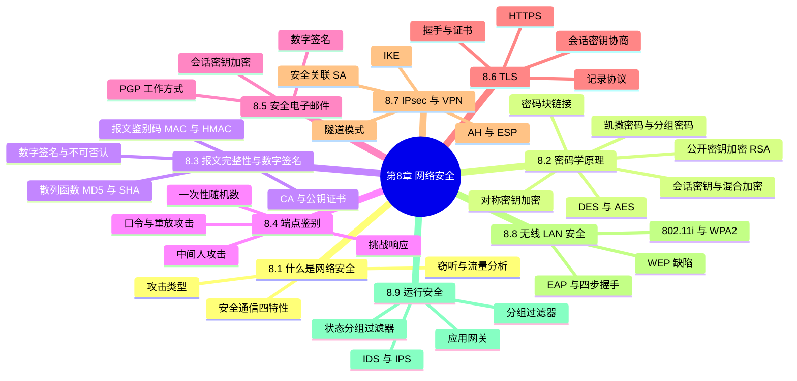
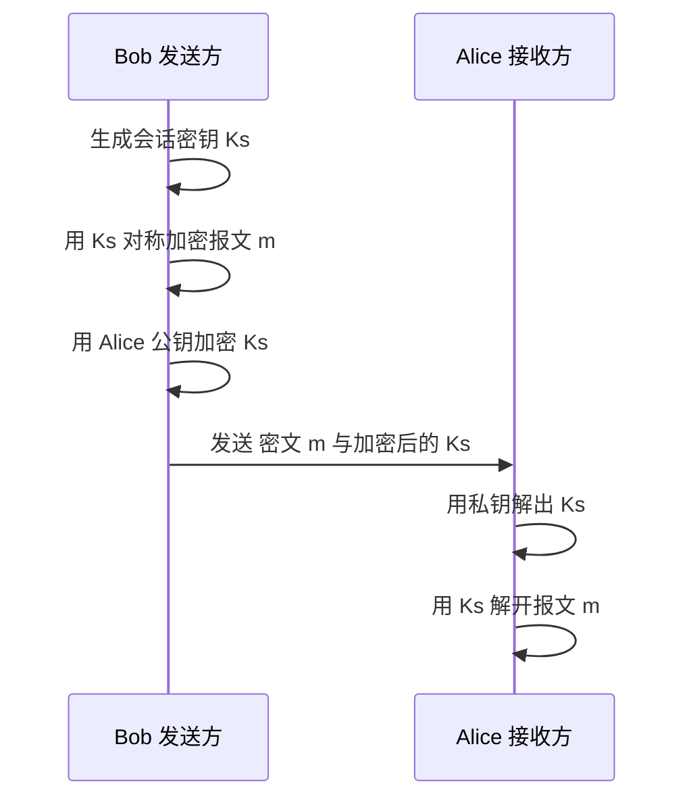
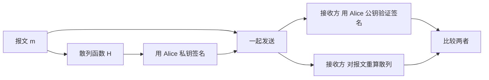
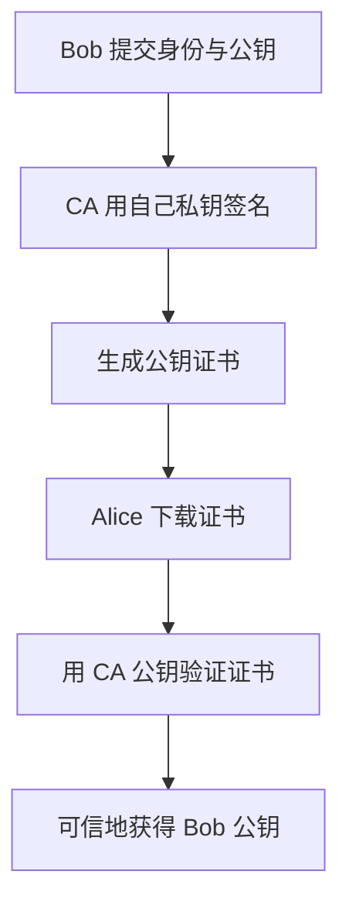
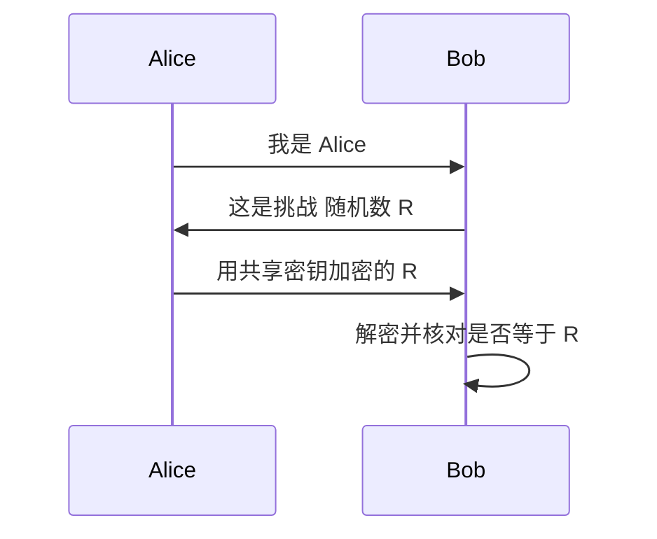
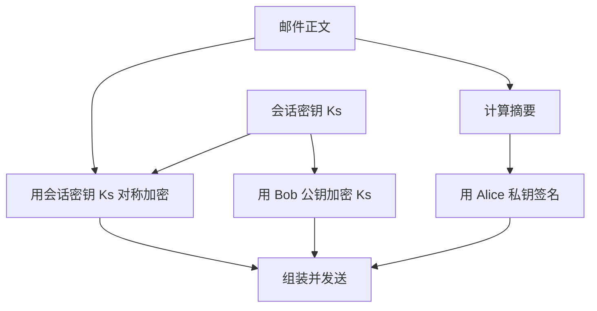
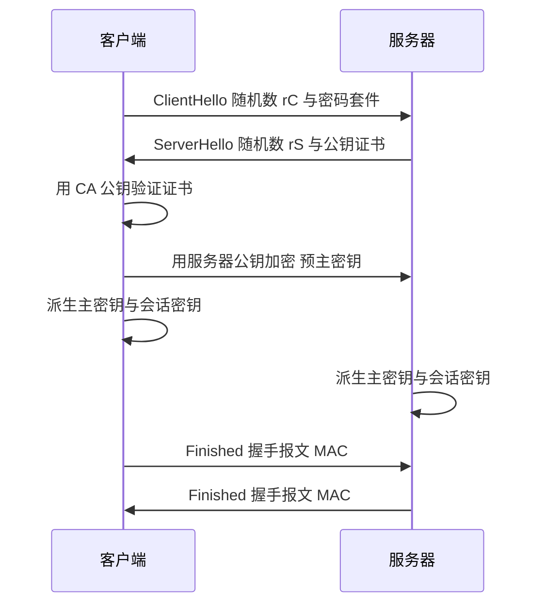
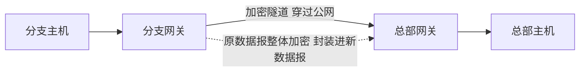
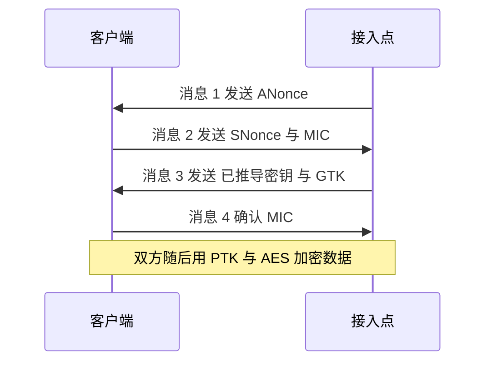
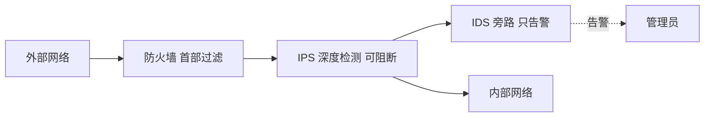

# 第 8 章 计算机网络中的安全

> 《计算机网络：自顶向下方法》读书笔记

## 本章导览

---

## 8.1 什么是网络安全

网络安全讨论的是在**存在对手**的前提下，通信双方如何获得所需的保证。经典的叙述模型涉及三方：

- **Alice 与 Bob**：希望安全通信的两个实体（人、进程、主机，甚至路由器）。
- **Trudy**（入侵者 intruder）：可能**窃听、修改、删除或伪造**信道上传输的报文，也可能直接攻击 Alice 或 Bob 的主机。

### 8.1.1 安全通信的特性

安全的通信（以及对安全通信的讨论）需要满足以下四个特性：

| 特性 | 含义 | 主要技术 |
| --- | --- | --- |
| **机密性** confidentiality | 只有发送方与意向接收方能理解报文内容 | 加密 |
| **报文完整性** message integrity | 通信内容在途中未被偶然或恶意篡改 | 散列、报文鉴别码、数字签名 |
| **端点鉴别** end-point authentication | 能确认报文的真实来源，即"对方确实是自称的那个人" | 口令、挑战响应、证书 |
| **运行安全性** operational security | 保护机构网络不被外部攻入，如防火墙、IDS | 防火墙、入侵检测系统 |

四个特性相互独立：明文报文可以被篡改，加密报文不能保证发送者身份，完整的报文也不能证明来源。

### 8.1.2 攻击类型

Trudy 可以实施多种攻击，教材把它们概括为几类：

- **窃听（eavesdropping / sniffing）**：被动地监听并记录信道上传输的报文（如无线信号、共享以太网）。被动攻击难以被发现。
- **流量分析（traffic analysis）**：即使报文被加密，仍可从**分组长度、时序、通信双方**推断出有用信息。
- **篡改（modification）**：主动修改、插入、删除或重排报文内容。
- **伪装（masquerading / spoofing）**：伪造源地址或身份，冒充另一个人、主机或进程。典型是 **IP 欺骗**（伪造源 IP）。
- **重放（replay）**：把先前截获的合法报文**原样重新发送**，从而重复一次已经授权过的操作（如重复转账）。
- **拒绝服务（DoS / DDoS）**：用大量流量或请求耗尽目标资源，使其无法为正常用户服务。可以集中在一台主机（DoS），也可以发动大量被控主机群起而攻（**分布式 DoS**，借助**僵尸网络**）。

> **被动攻击 vs 主动攻击**：窃听与流量分析是被动的，只观察不改变数据；篡改、伪装、重放、拒绝服务是主动的，会改变数据或系统状态。被动攻击重在**预防**（加密），主动攻击重在**检测与恢复**。

---

## 8.2 密码学原理

密码学是网络安全的基石。它把**明文**（plaintext / cleartext）变换为**密文**（ciphertext），合法接收方能还原明文，而入侵者即使截获密文也无法还原。

### 8.2.1 对称密钥加密

**对称密钥加密**（symmetric key encryption）中，加密与解密使用**同一把密钥** $K_S$：

$$c = K_S(m), \qquad m = K_S(c)$$

双方必须在通信**之前**共享这把密钥。

**凯撒密码**是最古老的对称加密：把每个字母向后移 $k$ 位。

$$c_i = (m_i + k) \bmod 26$$

- **单码代替密码**（monoalphabetic）：一张固定的字母替换表，共有 $26!$ 种可能，暴力搜索不可行。
- **多码代替密码**（polyalphabetic）：按位置使用不同替换表，能抵抗频率分析（如维吉尼亚密码）。
- 二者都能被**已知明文攻击**（攻击者掌握部分"明文—密文"对后反推密钥）破解。

**现代分组密码**把报文切成**定长分组**逐块加密：

- **DES**（数据加密标准）：分组 **64 比特**，密钥 **56 比特**（外加 8 比特校验位共 64 位），采用 16 轮 Feistel 结构。56 位密钥空间太小，现已被**暴力破解**（当年需专用硬件，如今普通算力即可），不再安全。
- **3DES**：用两把或三把密钥做 DES 三次运算，延长寿命但效率低。
- **AES**（高级加密标准）：分组 **128 比特**，密钥长度 **128 / 192 / 256 比特**，是目前主流的对称分组密码。它通过多轮替代、置换与混合操作实现，密钥足够长时目前没有实用的破解方法。

**密码块链接（CBC，Cipher Block Chaining）**解决直接分组加密的两个问题：相同明文分组会得到相同密文分组（可被推断结构），且分组可被重排。

- 加密前把当前明文分组与**前一个密文分组异或**，再送进分组密码：

$$c_i = K_S(m_i \oplus c_{i-1})$$

- 第一个分组需要一个随机的初始向量 **IV**（initialization vector）与之异或，IV 随密文一起发送。
- 相同的明文在不同 IV 下产生不同密文，且破坏一个分组会扩散影响后续分组。

> **密钥分发难题**：对称加密效率高，但 $N$ 个用户两两安全通信需要 $\binom{N}{2}$ 把密钥，且每对密钥都要通过一条安全信道分发——这正是不对称加密要解决的问题。

### 8.2.2 公开密钥加密

**公开密钥加密**（public key encryption）中，每个用户拥有两把密钥：

- **公钥** $K_B^+$：公开，任何人可用。
- **私钥** $K_B^-$：仅 Bob 自己持有。

两者满足互逆关系：

$$m = K_B^-(K_B^+(m)), \qquad m = K_B^+(K_B^-(m))$$

**RSA 算法**是最著名的公开密钥算法，其安全性基于**大整数因子分解的困难性**。

1. 选择两个大素数 $p$ 与 $q$（各数百位），令

$$n = p \cdot q$$

2. 选择指数 $e$，令 $d$ 满足

$$e \cdot d \equiv 1 \pmod{(p-1)(q-1)}$$

3. 公钥为 $(n, e)$，私钥为 $(n, d)$。加密与解密为**模幂运算**：

$$c = m^e \bmod n, \qquad m = c^d \bmod n$$

要点：

- 要求明文数值满足 $m < n$，实际中把长报文切成小于 $n$ 的块，或用混合加密。
- 已知 $n$ 求 $p$、 $q$ 极其困难⇒由公钥无法推出私钥。
- **对称加密**： $K_S(m)$ 与 $K_S(c)$ 中加密与解密**使用同一密钥**；**公开密钥加密**中加密用公钥、解密用私钥，密钥**成对但不同**。
- 公钥算法运算量大（模幂涉及大数乘除），比对称算法**慢几个数量级**，不宜直接加密大量数据。
- 除 RSA 外还有 **Diffie-Hellman** 密钥交换（用于双方在公开信道上协商出共享密钥，本身不加密数据）。

### 8.2.3 会话密钥与混合加密

实际系统把两种体制结合，兼顾**安全**（密钥分发）与**效率**（加密速度）：

1. Bob 生成一个**会话密钥**（session key） $K_S$，用它对报文做对称加密（如 AES）。
2. Bob 用 Alice 的**公钥**加密 $K_S$，得到 $K_A^+(K_S)$。
3. 报文与加密后的会话密钥一起发出。
4. Alice 用**私钥**解出 $K_S$，再用 $K_S$ 解开报文。

这样既避免了每对用户手工分发对称密钥，又只把昂贵的公钥运算用在**短小的会话密钥**上。TLS、PGP 都采用这种混合结构。

---

## 8.3 报文完整性和数字签名

加密解决机密性，但**不能**保证报文未被篡改，也不能证明发送者身份。本节解决这两个问题。

### 8.3.1 散列函数

**散列函数**（hash function）把任意长度的报文映射为**定长的报文摘要**（message digest / 指纹）：

$$H(m) = \text{定长摘要}$$

一个好的用于安全的散列函数需满足：

- **定长输出**：无论输入多长，输出长度固定。
- **多对一**：有无穷多输入映射到同一输出，理论上有碰撞。
- **单向性**：由摘要无法反推原报文。
- **抗碰撞性**：找到两个不同报文 $m_1 \neq m_2$ 使 $H(m_1) = H(m_2)$ 在计算上不可行（决定"捆绑篡改"是否可能）。

常见算法与输出长度：

| 算法 | 输出长度 | 备注 |
| --- | --- | --- |
| MD5 | **128 比特** | 已被证实可构造碰撞，不再安全 |
| SHA-1 | **160 比特** | 已被实用的碰撞攻击攻破，逐步淘汰 |
| SHA-256 | **256 比特** | SHA-2 家族，当前广泛使用 |
| SHA-512 | **512 比特** | SHA-2 家族，安全性更高 |

> **散列不提供鉴别**：Trudy 只要同时替换报文和摘要，Bob 就无法察觉。要防篡改，必须在摘要里混入只有双方知道的"秘密"。

### 8.3.2 报文鉴别码与 HMAC

**报文鉴别码（MAC，Message Authentication Code）**用**共享密钥** $s$ 与散列函数为报文生成一个鉴别标签：

$$H(m + s)$$

- 发送方把报文 $m$ 与标签一起发出；接收方用同一密钥 $s$ 重算散列并比对。
- 攻击者不知道 $s$，无法为篡改后的报文重新计算正确标签⇒保证**完整性**。
- 因为需要共享密钥，MAC 同时提供对"报文来自持有密钥的一方"的**鉴别**（但不提供不可否认，双方都能生成标签）。

**HMAC**（RFC 2104）是业界标准化的 MAC 构造，对密钥做两次嵌套散列以抵抗长度扩展攻击：

$$\text{HMAC} = H((K \oplus \text{opad}) \Vert  H((K \oplus \text{ipad}) \Vert  m))$$

> **MAC vs 数字签名**：二者都保证完整性；MAC 用**共享密钥**，只能向持有密钥的双方鉴别，且**不可否认**不成立（双方都能伪造）；数字签名用**私钥**，任何知道公钥的人都能验证，且具备**不可否认**。

### 8.3.3 数字签名

**数字签名**（digital signature）是"用私钥对报文（或其摘要）做运算"得到的结果，接收方用**公钥**验证。它要满足：

- **可鉴别**：Bob 能确认报文由 Alice 签发。
- **完整性**：报文未被篡改。
- **不可否认**（non-repudiation）：Alice 事后无法否认自己签过该报文，因为只有她持有私钥。

做法：Alice 用自己的**私钥**对报文摘要加密（或直接对报文做 $c = m^d \bmod n$），得到签名：

$$\text{签名} = K_A^-(H(m))$$

Bob 用 Alice 的**公钥**验证：

$$H(m) \overset{?}{=} K_A^+(\text{签名})$$

- 实际先对**摘要**签名而非整篇报文，既大幅减少计算量，又天然绑定完整性。
- 私钥签名、公钥验证，恰与"公钥加密、私钥解密"相反，但二者都基于同一对密钥的互逆性。

### 8.3.4 公钥认证与 CA 证书

公钥加密与数字签名有一个致命前提：**你拿到的公钥真的属于自称的那个人吗？** Trudy 可以伪造一个公钥冒充 Bob（这正是 8.4 节中间人攻击的根源）。

**公钥认证**由**证书认证机构（CA，Certification Authority）**解决：

- CA 是一个所有用户都信任的实体。
- 用户在 CA 处登记自己的**身份与公钥**，并证明身份（如出示证件）。
- CA 用**自己的私钥**对"Bob 的身份 + Bob 的公钥"这一捆绑做**数字签名**，生成**公钥证书**（public key certificate，通常为 **X.509** 格式）。
- 任何人持 **CA 的公钥**即可验证该证书，从而可信地得到 Bob 的真实公钥。

信任链：Alice 信任 CA ⇒ 验证 CA 签名的证书 ⇒ 信任证书中的公钥。浏览器内置了根 CA 的公钥列表，构成整个 HTTPS 信任的起点。

---

## 8.4 端点鉴别

**端点鉴别**（end-point authentication）要回答："正在和我通信的确实是 Bob 本人吗？"教材用一系列逐步改进（又逐步被击败）的协议 **ap1.0 → ap4.0** 展示鉴别中的陷阱。

### 8.4.1 ap1.0：直接发口令

Alice 直接把口令发过去："我是 Alice，口令是 xxx。"

- 缺点：**明文口令**在信道上被 Trudy 窃听即失守。

### 8.4.2 ap2.0：加密口令

Alice 用与 Bob 共享的对称密钥加密口令后发送。

- 攻击：**重放攻击（replay attack）**。Trudy 截获加密后的口令，原样重放给 Bob，就能冒充 Alice（因为密文每次相同）。

### 8.4.3 ap3.0：口令 + 加密 + 序列号

为了让每次的口令密文不同，Alice 每次发送**加密（口令 + 序列号）**，Bob 记录已用过的序号。

- 攻击：Trudy 可以先冒充 Bob 向 Alice 骗取当前序号下的加密口令（**回放/反射攻击**），再拿去冒充 Alice；或者通过其他交互套取。问题在于**口令本身是静态秘密**。

### 8.4.4 ap3.1：每次使用不同口令

改为发送**加密的口令 + 每次递增的序号**，且双方约定口令每次变化。若 Trudy 不能同时攻破 Alice 和 Bob 两端，就难以重放。

- 但若 Trudy 能**同时窃听并向双方转发**（在信道中间），仍可劫持。

### 8.4.5 ap4.0：一次性随机数与挑战-响应

Bob 主动发一个**一次性随机数 nonce** $R$ 作为**挑战**（challenge），Alice 用共享密钥加密 $R$ 后返回作为**响应**（response）：

- $R$ 每次都是新的随机数，**重放**旧的响应会因为 $R$ 已变而失败。
- Trudy 无法伪造加密后的 $R$（不知道共享密钥）。
- 关键：**挑战必须是新鲜的、不可预测的**，从而杜绝重放。

### 8.4.6 中间人攻击

即便有了 nonce，如果在 ap4.0 中用**公钥**做鉴别（Bob 发 nonce，Alice 用私钥签名返回），仍可能遭遇**中间人攻击**（man-in-the-middle attack）：

- Trudy 分别与 Alice、Bob 建立连接，夹在中间**转发**双方报文。
- 若 Trudy 向 Bob 出示**自己的公钥**冒充 Alice，而 Bob 无法核实公钥归属，就会把 Trudy 当成 Alice。
- 根源仍是**公钥归属未认证**⇒必须借助 **CA 证书**绑定身份与公钥（8.3.4）。

> **鉴别三要素**：一个稳健的鉴别协议通常同时使用**共享秘密或私钥**（证明身份）、**不可预测的挑战**（防重放）、**可信的公钥证书**（防冒充）。缺一即可被相应攻击击破。

---

## 8.5 安全电子邮件

电子邮件的安全需求包括**机密性**（邮件内容不被偷看）、**鉴别与完整性**（确认发件人、内容未被改）。**PGP**（Pretty Good Privacy，相当好的隐私）是广泛使用的端到端邮件安全方案，它综合了对称加密、公钥加密、散列与数字签名。

**Alice 发送一封机密且签名的邮件**：

1. 生成一次性**会话密钥** $K_S$，用**对称算法**（如 AES、3DES）加密邮件正文，得到对称密文。
2. 用**Bob 的公钥**加密会话密钥 $K_S$，得到 $K_B^+(K_S)$。
3. 对邮件正文（或"正文 + 时间戳"）计算**报文摘要**，用 **Alice 的私钥**签名。
4. 把三段（对称密文、加密的会话密钥、签名）组合后一起发送。

**Bob 接收**：

1. 用**自己的私钥**解出会话密钥 $K_S$。
2. 用 $K_S$ 对称解密得到邮件正文，即获得**机密性**。
3. 用 **Alice 的公钥**验证签名，即获得**鉴别、完整性与不可否认**。

- **机密性**来自"对称加密 + 公钥加密会话密钥"的混合结构。
- **签名**来自"私钥加密摘要"。
- PGP 的信任模型是**信任网**（web of trust），用户互相签名公钥，而非完全依赖中心 CA。
- 邮件在传输链路上仍可能被邮件服务器以明文存储，PGP 保护的是**端到端**内容。

---

## 8.6 使 TCP 连接安全：TLS

**TLS**（Transport Layer Security，传输层安全性）是 SSL 的后继，为运行在 **TCP** 之上的应用提供**机密性、数据完整性与端点鉴别**。它位于应用层与运输层之间，应用（如 HTTP）调用 TLS 发送数据，TLS 把明文交给 TCP 传输。

### 8.6.1 TLS 握手

通信开始前，客户端与服务器先完成**握手**，目标有两个：**鉴别服务器身份**、**协商出会话密钥**。

1. **ClientHello**：客户端发送随机数 $r_C$（客户端 nonce）与支持的密码套件列表。
2. **ServerHello + 证书**：服务器发送随机数 $r_S$ 与自己的**公钥证书**（含身份与公钥，由 CA 签名）。
3. **验证证书**：客户端用内置的 **CA 公钥**验证证书，从而确认服务器身份并拿到其真实公钥。
4. **密钥协商**：客户端生成**预主密钥**（pre-master secret，PMS），用**服务器公钥**加密后发送（或采用 Diffie-Hellman 交换）。
5. **派生密钥**：双方用 $r_C$、 $r_S$ 与 PMS 通过伪随机函数派生**主密钥**（master secret），再导出多个**会话密钥**——分别用于客户端→服务器加密、服务器→客户端加密、以及两个方向的 MAC。
6. **Finished**：双方各自发送对前面所有握手报文的 MAC，验证握手未被篡改。

### 8.6.2 TLS 记录协议

握手建立会话密钥后，应用数据通过 **TLS 记录协议**（record protocol）传输：

- 把应用数据**分片**成记录。
- 为记录附加 **MAC**（通常 HMAC），提供**完整性**。
- 用**会话密钥**对"数据 + MAC"做**对称加密**，提供**机密性**。
- 加上记录首部（类型、版本、长度）后交给 TCP。

### 8.6.3 HTTPS

**HTTPS** 就是 **HTTP over TLS**：HTTP 报文先交给 TLS 加密，再经 TCP 发送；默认端口 **443**（HTTP 为 80）。借助 TLS，HTTPS 同时获得了机密性、完整性与服务器鉴别（由证书保证）。

> **TLS vs IPsec**：TLS 保护的是**单个应用**（需应用主动调用），且建立在 TCP 之上；IPsec 保护**所有 IP 流量**，对应用透明，工作在网络层（见 8.7）。

---

## 8.7 网络层安全性：IPsec 和 VPN

前面几节的安全机制工作在应用层（PGP）或运输层（TLS）。**IPsec** 把安全性下沉到**网络层**，使**所有**由 IP 承载的流量（TCP、UDP、ICMP 等）都获得保护，对应用**透明**。

### 8.7.1 安全关联 SA

IPsec 是**面向连接**的：收发双方在通信前先建立一条**安全关联**（SA，Security Association），它是一组**单向**的逻辑连接约定：

- **方向**：SA 是单向的（Alice→Bob 一个 SA，Bob→Alice 又一个 SA）。
- **标识**：由**目的 IP 地址、安全协议标识符（AH 或 ESP）、安全参数索引 SPI** 三者唯一标识。
- **参数**：约定使用的**加密算法与密钥**、**完整性算法与密钥**等。

### 8.7.2 AH 与 ESP

IPsec 定义了两个协议：

| 协议 | 全称 | 提供的服务 |
| --- | --- | --- |
| **AH** | Authentication Header 鉴别首部 | 报文**完整性**与**源鉴别**，**不提供机密性** |
| **ESP** | Encapsulating Security Payload 封装安全载荷 | **机密性** + 完整性 + 鉴别，最常用 |

- AH 在 IP 首部与载荷之间插入鉴别信息，不加密数据。
- ESP 把原始 IP 数据报加密后封装，再附加鉴别信息，因而同时提供保密与完整性。

### 8.7.3 隧道模式

IPsec 有两种工作模式：**运输模式**（transport mode，保护 IP 载荷，端到端）与**隧道模式**（tunnel mode）。**VPN** 主要用隧道模式：

- 原始 IP 数据报整体被加密，作为**载荷**封装进一个**新的 IP 数据报**。
- 新数据报的源与目的地址是两台**安全网关**（如分支机构与总部的 VPN 网关）。
- 公共网络中只能看到加密后的外层，原始源/目的与内容均被隐藏。

### 8.7.4 IKE

**IKE**（Internet Key Exchange，因特网密钥交换）负责自动地建立 SA：用 **Diffie-Hellman** 交换安全地协商出共享密钥，并完成双方鉴别，从而为 IPsec 生成加密与完整性所需的密钥材料。

> **VPN 的本质**：VPN 利用 IPsec 隧道模式，把分布在不同地点的私有网络流量，安全地穿越公共因特网，像在一个专网内通信一样。

---

## 8.8 使无线 LAN 安全

无线信道是**开放介质**，附近任何人都能收发，因此 802.11 的安全机制尤为重要。其演进路线是 **WEP → WPA → WPA2/802.11i**。

### 8.8.1 WEP 及其缺陷

**WEP**（Wired Equivalent Privacy，有线等效保密）是 802.11 早期的链路层加密：

- 用 **RC4** 流密码加密数据。
- 每个帧使用一个 **IV**（初始向量），与共享密钥一起生成**密钥流**，逐比特异或。
- 用 **CRC-32** 校验和提供完整性。

缺陷：

- **IV 太短且常被重用**（24 比特，重启后从 0 开始），相同 IV 产生相同密钥流，异或两次密文即可恢复明文，甚至反推密钥流。
- **CRC 不是密码学安全的校验**，攻击者可在不知道密钥的情况下调整 CRC 与密文，使篡改不被发现。
- **密钥管理与鉴别薄弱**：全网共享一个静态密钥，无有效身份鉴别。

WEP 的这些缺陷使其很容易被破解，早已被淘汰。

### 8.8.2 802.11i 与 WPA2

**802.11i**（对应 **WPA2**）是新一代无线 LAN 安全标准，提供**强加密**与**双向鉴别**：

- **加密**：采用 **AES-CCMP**（基于 AES 的计数器模式与 CBC-MAC），同时提供机密性与强完整性。
- **鉴别**：区分**鉴别服务器（AS）**（如 RADIUS 服务器）、**接入点 AP** 与**无线客户端**三方，客户端先用 **EAP** 与 AS 相互鉴别。
- **密钥层次**：从鉴别阶段得到**主会话密钥**，再派生**成对主密钥 PMK**、**成对临时密钥 PTK**（每个客户端唯一）与**组临时密钥 GTK**（组播用）。
- 过渡方案 **WPA** 用 TKIP 弥补 WEP，AES 与 WPA2 现已成主力，**WPA3** 进一步引入 SAE 抗离线口令破解。

### 8.8.3 EAP 与四步握手

**EAP**（Extensible Authentication Protocol，可扩展鉴别协议）是一种**鉴别框架**，本身不规定具体方法，而是承载多种鉴别机制（如 **EAP-TLS** 用证书、EAP-PEAP/EAP-TTLS 用口令）。它以 **EAPoL** 在客户端与 AP 间传输，再经 **RADIUS** 送到鉴别服务器。

鉴别通过后，用 **4 步握手**（four-way handshake）确认双方持有相同 PMK，并派生、安装加密密钥：

- 双方各自用 PMK 与两个 nonce 推导出相同的 **PTK**。
- **MIC**（消息完整性码）证明对方确实持有正确的 PMK，从而**防止中间人**。
- 握手完成后，数据帧用 PTK 加密，组播用 GTK 加密。

---

## 8.9 运行安全：防火墙和 IDS

即使应用、传输、网络、链路各层都有安全机制，机构仍需保护内部网络整体不被攻入，这就是**运行安全性**，主要靠**防火墙**与**入侵检测系统**。

### 8.9.1 防火墙

**防火墙**（firewall）位于内部网络与外部网络之间，依据策略**允许或拒绝**进出流量。三类：

| 类型 | 工作原理 | 特点 |
| --- | --- | --- |
| **分组过滤器** packet filter | 逐分组检查首部字段，按 ACL 规则决定放行或丢弃 | 简单、快、无状态，逐分组独立判断 |
| **状态分组过滤器** stateful filter | 用**连接表**跟踪 TCP 连接状态 | 能识别已建立连接的合法流量，比无状态更严格有效 |
| **应用网关** application gateway | 作为**代理**，在应用层转发并检查/鉴别用户 | 可做用户级鉴别与应用级过滤，开销大、每应用一套 |

**分组过滤器**可依据的字段：源/目的 IP、源/目的端口、协议类型、TCP 标志位（SYN/ACK）、ICMP 类型等。

> **例题**：规则"允许内部 222.22.0.0/16 网段建立对外 Web 连接"，可写成两条：允许源在内部网段、目的端口 80 的 TCP SYN 出去；允许目的在内部网段、源端口 80 的 TCP 返回。默认策略通常是"默认拒绝"。

**状态分组过滤器**把同一连接的分组关联起来：当内部主机发起连接，连接表登记该连接；后续返回分组即使是任意高位端口，只要属于已登记连接就放行，而不必为每个返回端口静态写规则。

**应用网关**（代理服务器）让内部用户先连到网关，再由网关代表用户访问外网；所有进出流量都经过应用层检查，并可要求用户鉴别。代价是处理延迟大，且每种应用需要专门的网关。

### 8.9.2 IDS 与 IPS

防火墙主要看**首部**并按规则过滤，难以发现"看起来合法的恶意负载"。**入侵检测系统（IDS，Intrusion Detection System）**通过**深度分组检测**（deep packet inspection，检查分组**载荷**内容）识别攻击：

- **特征匹配**（signature-based）：把载荷与已知攻击的**特征**（特征串、规则）比对，命中即告警。准确率高但只能识别已知攻击，且需频繁更新特征库。
- **异常检测**（anomaly-based）：建立正常流量基线，偏离基线即告警。可发现未知攻击，但误报率较高。
- 典型系统：**Snort**。

**IDS 与 IPS 的区别**：IDS 只**检测并告警**（旁路部署，不阻断）；**IPS**（入侵防御系统）则**串联在路径上**，检测到攻击可**直接丢弃/阻断**流量。

> **易混点**：防火墙基于**首部与连接状态**做策略过滤，快速但盲目；IDS/IPS 深入**载荷内容**做特征或异常检测，能发现应用层攻击，但开销大、可能误报。三者常组合部署。

---

## 8.10 本章小结

- 安全通信的四个特性：**机密性、报文完整性、端点鉴别、运行安全性**；攻击分为被动（窃听、流量分析）与主动（篡改、伪装、重放、拒绝服务）两类。
- **对称加密**（DES、AES、CBC）高效但密钥分发困难；**公开密钥加密**（RSA）解决分发问题但慢。**混合加密**用公钥传会话密钥、用对称密钥传数据，是主流方案。
- **散列函数**（MD5 128 位、SHA-1 160 位、SHA-256 256 位）生成定长摘要；**MAC/HMAC** 用共享密钥保证完整性与鉴别；**数字签名**用私钥签名、公钥验证，提供不可否认；**CA 证书**把公钥与身份可信地绑定。
- **端点鉴别**从明文口令演进到**一次性随机数挑战-响应**，其安全仍依赖**公钥认证**来抵御中间人攻击。
- **PGP**（应用层）、**TLS**（运输层）、**IPsec**（网络层，SA + AH/ESP + 隧道 + IKE）在不同层次提供安全保障。
- 无线 LAN 从有缺陷的 **WEP** 演进到 **802.11i/WPA2**，用 AES-CCMP、**EAP** 与**四步握手**实现强加密与双向鉴别。
- **运行安全**由**防火墙**（分组过滤、状态过滤、应用网关）与 **IDS/IPS**（深度包检测、特征匹配）共同保障。
